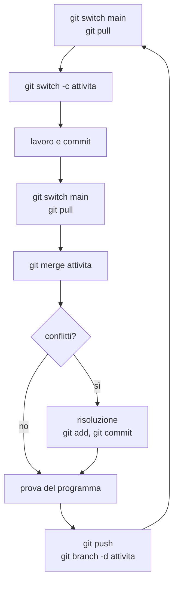

# Lezione 6.5: Sviluppo: integrazione

Contenuto originale. Riferimenti esterni indicati nel testo.

Obiettivi della lezione: unire il lavoro dei membri del gruppo, risolvere i conflitti di Git, revisionare il codice scritto dagli altri.

## 6.5.1 Integrare il lavoro

L'**integrazione** è l'unione delle parti sviluppate da persone diverse in un prodotto unico e funzionante. Più tempo passa tra un'integrazione e l'altra, più le parti divergono e più l'unione diventa difficile: per questo nei progetti professionali si integra spesso, anche più volte al giorno (**integrazione continua**).

Ciclo di lavoro di ogni membro del gruppo:



Il passo "prova del programma" dopo ogni merge è essenziale: due modifiche corrette singolarmente possono produrre un programma che non funziona una volta unite.

## 6.5.2 Merge automatico

Quando due persone modificano file diversi, o parti diverse dello stesso file, Git unisce le modifiche automaticamente. Esempio verificato: Anna modifica il titolo in `index.html`, Bruno aggiunge `dati.js`; Anna esegue `git pull` e Git crea un **commit di merge** che unisce le due linee di sviluppo.

`git log --oneline --graph` mostra la storia come grafo:

```text
*   af885d5 Merge branch 'main' of E:/progetti/quiz
|\
| * 97d9d3e Dati delle domande
* | 350b9e3 Titolo completo
|/
* ceb15f5 Struttura iniziale
```

Ogni `*` è un commit; le linee mostrano da quali commit deriva. Il commit di merge ha due genitori.

## 6.5.3 Conflitti

Un **conflitto** si verifica quando due persone modificano in modo diverso **la stessa riga** dello stesso file: Git non può sapere quale versione tenere e chiede di decidere.

Esempio verificato: Bruno cambia il titolo in `<h1>Quiz di Bruno</h1>` e invia; Anna, senza aver scaricato quella modifica, lo cambia in `<h1>Quiz della 4B</h1>` ed esegue `git pull`:

```text
Auto-merging index.html
CONFLICT (content): Merge conflict in index.html
Automatic merge failed; fix conflicts and then commit the result.
```

`git status` elenca il file tra quelli in conflitto (con `UU` nella forma breve `git status --short`). Nel file Git inserisce entrambe le versioni tra **marcatori di conflitto**:

```text
<<<<<<< HEAD
<h1>Quiz della 4B</h1>
=======
<h1>Quiz di Bruno</h1>
>>>>>>> ebf6a6b...
```

- tra `<<<<<<< HEAD` e `=======`: la versione locale (di chi sta eseguendo il merge)
- tra `=======` e `>>>>>>>`: la versione in arrivo
- dopo `>>>>>>>`: l'identificativo del commit o il nome del branch da cui proviene

Risoluzione:

1. Parlarsi: decidere insieme la versione corretta, che può essere una delle due o una combinazione.
2. Modificare il file lasciando solo il contenuto definitivo ed eliminando **tutti** i marcatori.
3. Provare il programma.
4. Registrare la risoluzione:

```powershell
git add index.html
git commit -m "Risolto conflitto sul titolo"
git push
```

VS Code evidenzia i conflitti nei file e propone pulsanti come "Accept Current Change" (tieni la versione locale), "Accept Incoming Change" (tieni quella in arrivo), "Accept Both Changes" (tieni entrambe); il risultato va comunque controllato e provato. Per annullare un merge in corso e tornare alla situazione precedente: `git merge --abort`.

Riferimento: Pro Git, "Basic Branching and Merging", sezione sui conflitti, https://git-scm.com/book/it/v2/Git-Branching-Basic-Branching-and-Merging

Come ridurre i conflitti:

- integrare spesso, con branch di breve durata
- dividere il lavoro per file o per funzioni (lezione 6.2)
- `git pull` prima di iniziare e prima di ogni `git push`
- non riformattare interi file (rientri, spazi) insieme a modifiche di contenuto: ogni riga toccata è una possibile fonte di conflitto

## 6.5.4 Revisione del codice

Nella **revisione del codice** (code review) un membro del gruppo legge le modifiche di un altro prima che vengano unite a `main`. Serve a trovare errori, a mantenere uno stile uniforme e a diffondere la conoscenza del codice nel gruppo: nessuna parte del progetto deve essere conosciuta da una sola persona.

Per vedere le modifiche di un branch rispetto a `main`:

```powershell
git diff main..interazione     # differenze tra main e il branch interazione
git log main..interazione      # commit presenti nel branch e non ancora in main
```

Lista di controllo per la revisione:

- il codice realizza il requisito indicato nel piano e rispetta i criteri di accettazione?
- i nomi di variabili e funzioni sono chiari? Sono presenti i commenti necessari?
- le regole di calcolo stanno in `logica.js` e sono coperte da test?
- sono gestiti i casi limite e gli input non validi?
- testo inserito nella pagina con `textContent`, non con `innerHTML` (lezione 5.1)?
- accessibilità: pulsanti veri, etichette, focus, informazioni non affidate solo al colore?
- sono rimaste stampe di controllo (`console.log`) da eliminare?

Le osservazioni riguardano il codice, non la persona: si descrive il problema e, se possibile, si propone una soluzione.

## 6.5.5 Laboratorio

Tempo indicativo: 50 minuti.

1. **Esercitazione sui conflitti** (15 minuti, a coppie, su un repository di prova): entrambi modificano la stessa riga di un file, uno invia, l'altro esegue `git pull`, legge i marcatori e risolve il conflitto. Poi si invertono i ruoli.
2. **Integrazione del progetto**: ogni membro unisce a `main` i propri branch seguendo il ciclo della sezione 6.5.1; dopo ogni merge il programma viene provato.
3. **Revisione incrociata**: ogni membro revisiona le modifiche di un compagno con la lista di controllo e annota in `PIANO.md` le correzioni da fare, come nuove attività.
4. Al termine, `main` contiene l'MVP completo e funzionante; `git log --oneline --graph --all` mostra la storia del progetto.

### Esercizi

1. Spiegare perché Git non segnala un conflitto quando due persone modificano righe diverse dello stesso file, e in quale caso un merge senza conflitti può comunque produrre un programma che non funziona.
2. Risolvere su carta il conflitto seguente, sapendo che il gruppo ha deciso di tenere entrambe le domande:

```text
<<<<<<< HEAD
  { testo: "Che cos'è un array?", opzioni: ["...", "..."], corretta: 0 },
=======
  { testo: "Che cos'è una funzione?", opzioni: ["...", "..."], corretta: 1 },
>>>>>>> dati-nuove-domande
```
