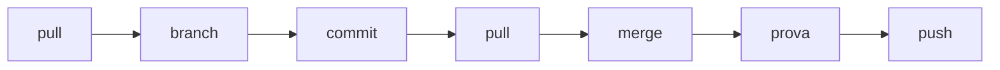

## Contenuti

- Ciclo di integrazione
- Merge automatico
- Conflitti
- Ridurre i conflitti
- Revisione del codice
- Laboratorio 6.5

## Ciclo di integrazione



- Integrare spesso: **integrazione continua**
- Provare il programma dopo ogni merge

## Merge automatico

```text
*   af885d5 Merge branch 'main' of E:/progetti/quiz
|\
| * 97d9d3e Dati delle domande
* | 350b9e3 Titolo completo
|/
* ceb15f5 Struttura iniziale
```

File diversi o righe diverse: Git unisce da solo

## Conflitti

```text
<<<<<<< HEAD
<h1>Quiz della 4B</h1>
=======
<h1>Quiz di Bruno</h1>
>>>>>>> ebf6a6b...
```

1. Decidere insieme
2. Eliminare tutti i marcatori
3. Provare
4. `git add`, `git commit`, `git push`

`git merge --abort` annulla il merge

## Ridurre i conflitti

- Branch brevi, integrazione frequente
- Lavoro diviso per file e funzioni
- `git pull` prima di iniziare e prima di `git push`
- Niente riformattazioni di interi file

## Revisione del codice

```powershell
git diff main..interazione
git log main..interazione
```

- Requisiti e criteri rispettati?
- Nomi, commenti, logica in `logica.js` con test?
- Casi limite, `textContent`, accessibilità?
- Osservazioni sul codice, non sulla persona

## Laboratorio 6.5

- Esercitazione sui conflitti a coppie
- Integrazione di tutti i branch
- Revisione incrociata
- MVP completo in `main`
