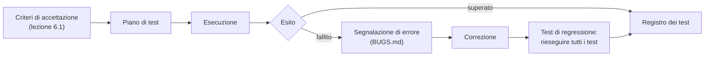

# Lezione 6.6: Test e revisione

Contenuto originale. Riferimenti esterni indicati nel testo.

Obiettivi della lezione: verificare in modo sistematico che il prodotto rispetti i requisiti, documentare gli errori trovati, correggerli senza introdurne di nuovi.

## 6.6.1 Tipi di verifica

| Verifica | Che cosa controlla | Come | Nel progetto |
|---|---|---|---|
| Test unitari automatici | singole funzioni | codice di test eseguito dopo ogni modifica | `test.html` della lezione 6.3 |
| Test funzionali (di accettazione) | che i requisiti siano soddisfatti | casi di prova ricavati dai criteri di accettazione, eseguiti a mano | piano di test di questa lezione |
| Test esplorativo | comportamenti imprevisti | uso libero, tentando di "rompere" il programma | 10 minuti per tester |
| Verifica di accessibilità | uso con tastiera e tecnologie assistive | strumenti automatici e prove manuali (lezione 4.2) | Lighthouse, Accessibility Inspector, sola tastiera |
| Verifica di compatibilità | browser e dimensioni dello schermo | prova su browser diversi e in modalità dispositivo (lezione 4.4) | almeno due browser, uno schermo stretto |



## 6.6.2 Il piano di test

Un **caso di prova** funzionale ha: identificativo, requisito di riferimento, precondizioni, passi da eseguire, risultato atteso. Durante l'esecuzione si annotano il risultato ottenuto e l'esito.

Estratto del piano di test del quiz d'esempio (file `TEST.md` nel repository):

| Id | Requisito | Passi | Risultato atteso | Esito |
|---|---|---|---|---|
| T1 | US1 | aprire la pagina | compare "Domanda 1 di 5" con testo e 4 opzioni | |
| T2 | US2 | scegliere l'opzione corretta | opzione evidenziata in verde con "(corretta)"; messaggio "Risposta corretta."; pulsante Avanti visibile | |
| T3 | US2 | scegliere un'opzione errata | opzione scelta con "(scelta errata)", opzione corretta evidenziata; messaggio con la risposta corretta | |
| T4 | US2 | dopo una risposta, fare clic su un'altra opzione | nessun cambiamento: le opzioni sono disattivate | |
| T5 | US3 | rispondere correttamente a 3 domande su 5 | "Punteggio: 3 su 5 (superato)" | |
| T6 | US3 | rispondere correttamente a 2 domande su 5 | "Punteggio: 2 su 5 (da ripassare)" | |
| T7 | US4 | premere Ricomincia tre volte, annotando la prima domanda | la prima domanda non è sempre la stessa | |
| T8 | US5 | completare il quiz usando solo `Tab`, `Invio` e `Spazio` | tutte le azioni sono possibili, il focus è sempre visibile | |
| T9 | US5 | analisi Lighthouse, categoria Accessibility | nessun problema segnalato | |

Osservazioni:

- T5 e T6 verificano il **valore al confine** del 60%, come i test automatici della lezione 6.3
- T7 riguarda un comportamento casuale: si verifica su più ripetizioni
- ogni requisito ha almeno un caso di prova; un requisito senza casi di prova non è verificabile

## 6.6.3 Segnalare un errore

Una buona **segnalazione di errore** (bug report) permette a chiunque di riprodurre il problema senza chiedere altro all'autore. Modello per il file `BUGS.md` del repository:

```markdown
## B3: il punteggio non compare dopo l'ultima domanda

- Trovato da: Carlo, durante il test T5
- Gravità: alta (requisito Must US3 non soddisfatto)
- Ambiente: Firefox, Windows 11, finestra 1280 x 720
- Passi per riprodurre:
  1. aprire index.html con Live Preview
  2. rispondere a tutte e 5 le domande
  3. premere Avanti dopo l'ultima risposta
- Risultato atteso: compare "Punteggio: N su 5 (giudizio)"
- Risultato ottenuto: la pagina resta sull'ultima domanda; in console:
  "TypeError: Cannot read properties of undefined (reading 'testo')" in app.js:31
- Stato: aperto (assegnato a Bruno)
```

Campi essenziali:

- **titolo** che descrive il problema, non la causa ipotizzata
- **passi per riprodurre**, numerati e completi
- **risultato atteso e risultato ottenuto**
- **ambiente**: browser, sistema, dimensione della finestra
- **gravità**: alta (funzione principale non utilizzabile), media (funzione secondaria o problema aggirabile), bassa (aspetto grafico, testo)
- **stato**: aperto, in correzione, risolto, verificato

Il messaggio di errore dell'esempio indica un problema tipico: l'indice ha superato l'ultima domanda (lezione 3.6).

Dopo ogni correzione si eseguono di nuovo **tutti** i test, automatici e manuali principali: è il **test di regressione**, che verifica che la correzione non abbia rotto altre parti. Si aggiunge anche un test che avrebbe individuato l'errore corretto.

## 6.6.4 Laboratorio

Tempo indicativo: 55 minuti.

1. **Piano di test** (15 minuti): il referente qualità, con il gruppo, scrive `TEST.md` con almeno un caso di prova per ogni requisito Must e Should, compresi accessibilità e schermo stretto.
2. **Test incrociato** (20 minuti): i gruppi si scambiano i computer. Ogni gruppo esegue il piano di test dell'altro progetto, compila la colonna Esito, poi dedica 5 minuti al test esplorativo. Gli errori trovati vengono scritti nel `BUGS.md` del progetto provato, con il modello della sezione 6.6.3.
3. **Correzione** (20 minuti): ogni gruppo ordina i propri errori per gravità, li corregge su branch dedicati, esegue i test di regressione, integra in `main` e aggiorna lo stato in `BUGS.md`.

### Esercizi

1. Scrivere tre casi di prova per il progetto "convertitore", compreso uno con input non valido.
2. Riscrivere questa segnalazione in modo che sia utilizzabile: "Il gioco non va, sistematelo".
3. Spiegare la differenza tra un test automatico e un caso di prova manuale, e indicare per quali requisiti del quiz un test automatico non è sufficiente.
