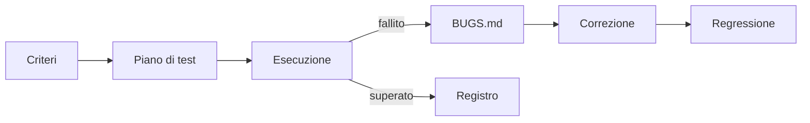

## Lezione 6.6: Test e revisione

Modulo 6: Progetto di gruppo. Sviluppo Software e Coding Laboratoriale

---

## Tipi di verifica

| Verifica | Come |
|---|---|
| Test unitari automatici | `test.html` |
| Test funzionali | casi di prova dai criteri di accettazione |
| Test esplorativo | uso libero |
| Accessibilità | strumenti e sola tastiera |
| Compatibilità | due browser, schermo stretto |

---

## Dal criterio all'errore

---

## Piano di test (estratto)

| Id | Requisito | Passi | Atteso |
|---|---|---|---|
| T4 | US2 | dopo la risposta, clic su un'altra opzione | nessun cambiamento |
| T5 | US3 | 3 corrette su 5 | "3 su 5 (superato)" |
| T8 | US5 | solo `Tab`, `Invio`, `Spazio` | tutto possibile, focus visibile |

---

## Segnalare un errore

- Titolo che descrive il problema
- Passi per riprodurre, numerati
- Atteso e ottenuto
- Ambiente
- Gravità e stato

Dopo la correzione: **test di regressione** e un nuovo test

---

## Laboratorio 6.6

- `TEST.md`: un caso per ogni requisito Must e Should
- **Test incrociato** tra gruppi, test esplorativo
- `BUGS.md` compilato dai tester
- Correzione per gravità, regressione, merge
