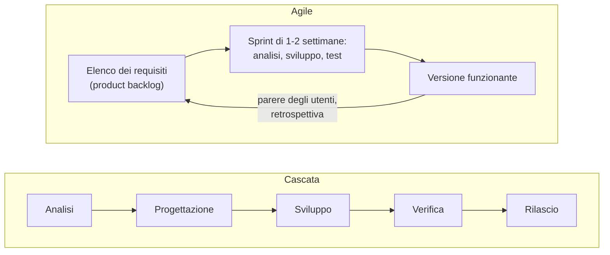

# Lezione 7.1: Ruoli e processi nello sviluppo software

Contenuto originale. Fonti indicate nel testo.

La lezione si svolge prevalentemente in forma di discussione. I materiali forniscono le definizioni e i riferimenti; il docente guida il confronto a partire dalle esperienze del corso, in particolare dal progetto di gruppo del modulo 6.

## 7.1.1 Il ciclo di vita del software

Il **ciclo di vita del software** è l'insieme delle fasi attraversate da un prodotto software, dall'idea al ritiro:

- **analisi dei requisiti**: che cosa deve fare il software, per chi (lezione 6.1)
- **progettazione**: come sarà costruito: architettura, dati, interfaccia
- **sviluppo**: scrittura del codice
- **verifica**: test e revisione (lezioni 3.5, 6.6)
- **rilascio** (deploy): messa a disposizione degli utenti
- **manutenzione**: correzione di errori, adeguamenti, nuove funzioni; spesso è la fase più lunga e costosa, perché un software in uso resta attivo per anni

Due modi principali di organizzare le fasi:

- **modello a cascata** (waterfall): le fasi si svolgono una dopo l'altra, ciascuna completata prima della successiva; adatto quando i requisiti sono stabili e ben noti, per esempio in alcuni sistemi regolamentati
- **metodi agili** (agile, per esempio Scrum): il prodotto cresce per cicli brevi, di una o due settimane (**sprint**); ogni ciclo attraversa tutte le fasi e produce una versione funzionante, che permette di raccogliere presto il parere degli utenti e di adattare i requisiti

Il progetto del modulo 6 ha seguito, in piccolo, un metodo agile: requisiti con priorità, piano a bacheca, versioni funzionanti a ogni lezione, retrospettiva. I metodi di gestione dei progetti sono approfonditi nel corso "Informatica per l'Impresa e Soft Skills Digitale".

## 7.1.2 Ruoli professionali

| Ruolo | Attività principali | Collegamento con il corso |
|---|---|---|
| Sviluppatore front-end | interfacce web e app: HTML, CSS, JavaScript, framework (React, Angular, Vue) | moduli 4, 5 |
| Sviluppatore back-end | logica lato server, database, interfacce di programmazione (API) | modulo 3; corso "Reti, Cloud e Gestione dei Dati" |
| Sviluppatore full-stack | front-end e back-end insieme | moduli 3-5 |
| Sviluppatore mobile | app per telefono (Android, iOS) | moduli 3, 5 |
| Tester, QA engineer | piani di test, test automatici, qualità del prodotto | lezioni 3.5, 6.6 |
| DevOps engineer | automazione di compilazione, test e rilascio; infrastruttura cloud | lezione 6.5; corso "Reti, Cloud e Gestione dei Dati" |
| Data analyst, data scientist | analisi dei dati, statistica, modelli di apprendimento automatico | modulo 2 |
| Specialista di sicurezza | difesa di sistemi e applicazioni, analisi delle vulnerabilità | lezione 5.1 (XSS); corso "Cybersecurity ed Ethical Hacking" |
| UX / UI designer | studio dell'esperienza d'uso, progetto grafico delle interfacce | lezione 4.2 |
| Analista, product owner | requisiti, priorità, rapporto con clienti e utenti | lezione 6.1 |
| Scrum master, project manager | organizzazione del lavoro del gruppo, tempi, rischi | lezioni 6.1, 6.7 |
| Amministratore di sistemi e reti | server, reti, servizi, continuità operativa | corso "Reti, Cloud e Gestione dei Dati" |

I confini tra i ruoli variano molto da un'azienda all'altra: in una piccola impresa una sola persona può svolgere più ruoli; in una grande azienda ogni ruolo può essere a sua volta specializzato.

## 7.1.3 Un riferimento europeo: e-CF e profili ICT

Per descrivere in modo uniforme le competenze informatiche esiste uno standard europeo:

- **e-CF** (European e-Competence Framework, norma EN 16234-1): classifica **40 competenze** dei professionisti ICT, organizzate in 5 aree e collegate ai livelli del Quadro europeo delle qualifiche (EQF). È una delle fonti usate per la classificazione europea delle professioni **ESCO**. Scheda ESCO: https://esco.ec.europa.eu/en/about-esco/escopedia/escopedia/european-e-competence-framework-e-cf
- **Profili professionali ICT europei** (documento CEN CWA 16458-1:2018): **30 profili** costruiti sulle competenze e-CF, tra cui Developer, Test Specialist, DevOps Expert, Scrum Master, Product Owner, Business Analyst, Systems Analyst, Systems Architect, Data Scientist, Information Security Specialist, Systems Administrator, Network Specialist. Testo del documento (in inglese): https://www.myecole.it/biblio/wp-content/uploads/2020/11/CWA_Part_1_EU_ICT_PROFESSIONAL_ROLE_PROFILES.pdf

Questi profili sono usati da aziende, scuole e università per descrivere posizioni lavorative e percorsi formativi, e permettono di confrontare qualifiche di Paesi diversi.

## 7.1.4 Dove si lavora

- **software house**: aziende che sviluppano prodotti software propri o su commissione
- **società di consulenza e system integrator**: progetti presso clienti diversi, integrazione di sistemi esistenti
- **reparti informatici** di aziende di altri settori (banche, industria, commercio, sanità), che sviluppano e gestiscono i sistemi interni
- **Pubblica Amministrazione**: servizi digitali per i cittadini
- **startup**: piccole imprese nuove, con prodotti innovativi e ruoli poco definiti
- **libera professione** (freelance): progetti per più clienti, con partita IVA
- **progetti open source**: contributi a software libero, talvolta retribuiti da aziende o fondazioni; anche come volontariato, sono un modo per farsi conoscere

Il lavoro da remoto, totale o parziale, è diffuso nel settore più che in altri.

## 7.1.5 Competenze tecniche e trasversali

Punti per la discussione:

- le tecnologie cambiano rapidamente: più di un linguaggio specifico conta la capacità di imparare, leggere documentazione (lezione 1.1) e risolvere problemi con metodo (modulo 2, lezione 3.6)
- l'inglese tecnico è indispensabile: documentazione, strumenti, comunità e molti gruppi di lavoro usano l'inglese
- competenze trasversali richieste: comunicare con chiarezza (segnalazioni di errore, presentazioni), lavorare in gruppo, organizzare il proprio lavoro, accettare e dare critiche sul codice
- lo sviluppo software è un lavoro prevalentemente di gruppo, non solitario
- nel settore la presenza femminile è ancora bassa: secondo il Rapporto AlmaLaurea 2026 la quota di donne nelle discipline STEM è del 40,5%, con valori particolarmente bassi in informatica e tecnologie ICT e in ingegneria industriale e dell'informazione (https://www.almalaurea.it/news/rapporto-almalaurea-2026)

## 7.1.6 Attività

Tempo indicativo: 40 minuti.

### Analisi di un annuncio di lavoro

Annuncio di esempio, costruito per l'esercizio:

> **Sviluppatore web junior**. Software house di Bologna, 25 persone, cerca sviluppatore da inserire in un gruppo che realizza applicazioni web per aziende. Requisiti: conoscenza di HTML, CSS, JavaScript; uso di Git; nozioni di database relazionali; inglese tecnico. Graditi: esperienza con un framework front-end, test automatici, progetti personali pubblicati. Si valutano diplomati ITS o laureati in informatica o ingegneria informatica, anche senza esperienza. Lavoro ibrido, 2 giorni a settimana da remoto.

A gruppi:

1. Classificare i requisiti in competenze tecniche e trasversali, obbligatorie e gradite.
2. Per ogni requisito indicare in quale modulo del corso è stato affrontato, e quali mancano.
3. Individuare il ruolo della tabella 7.1.2 e il profilo europeo corrispondente.
4. Cercare su un portale di annunci pubblico (senza registrarsi) due annunci reali per profili junior nel settore, e ripetere l'analisi.

### Intervista a un professionista

Se possibile, il docente invita un professionista del settore, oppure gli studenti intervistano un conoscente che lavora nell'informatica. Domande di partenza:

- che cosa ha fatto ieri, dall'inizio alla fine della giornata lavorativa?
- con quali altri ruoli lavora ogni giorno?
- quale percorso di studio ha seguito? Lo rifarebbe?
- che cosa impara ancora oggi, e come?
- quale parte del lavoro è più diversa da come la immaginava a 17 anni?

### Domande per la discussione

- Quali attività del progetto di gruppo sono risultate più interessanti? A quale ruolo corrispondono?
- Quali ruoli richiedono soprattutto capacità tecniche, e quali soprattutto capacità di relazione e organizzazione?
- Quali professioni informatiche potrebbero cambiare di più con la diffusione dell'intelligenza artificiale nella scrittura del codice, e quali competenze resteranno comunque necessarie?
