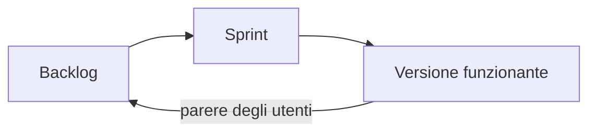

## Contenuti

- Ciclo di vita del software
- Ruoli professionali
- Riferimenti europei
- Dove si lavora
- Competenze
- Attività

## Ciclo di vita del software

- Analisi, progettazione, sviluppo, verifica, rilascio, **manutenzione**
- **Cascata**: fasi in sequenza, requisiti stabili
- **Agile** (Scrum): sprint di 1-2 settimane, versione funzionante a ogni ciclo

## Ruoli professionali

- Sviluppatore front-end, back-end, full-stack, mobile
- Tester, QA engineer; DevOps engineer
- Data analyst, data scientist; specialista di sicurezza
- UX / UI designer
- Analista, product owner; Scrum master, project manager
- Amministratore di sistemi e reti

Confini diversi tra piccole e grandi aziende

## Riferimenti europei

- **e-CF** (EN 16234-1): 40 competenze ICT, 5 aree, livelli EQF
- **30 profili ICT europei** (CEN CWA 16458-1:2018): Developer, Test Specialist, DevOps Expert, Scrum Master, Product Owner, Data Scientist, ...
- Classificazione europea delle professioni **ESCO**

## Dove si lavora

- Software house; consulenza e system integrator
- Reparti informatici di banche, industria, sanità
- Pubblica Amministrazione; startup
- Libera professione; progetti open source
- Lavoro da remoto diffuso

## Competenze

- Imparare continuamente; leggere documentazione; metodo
- Inglese tecnico
- Comunicazione, lavoro di gruppo, organizzazione
- Presenza femminile ancora bassa: donne 40,5% nelle discipline STEM (AlmaLaurea 2026)

## Attività

- Analisi di un annuncio: competenze tecniche e trasversali, obbligatorie e gradite
- Collegamento con i moduli del corso
- Annunci reali per profili junior
- Intervista a un professionista
- Quali professioni cambieranno con l'intelligenza artificiale?
