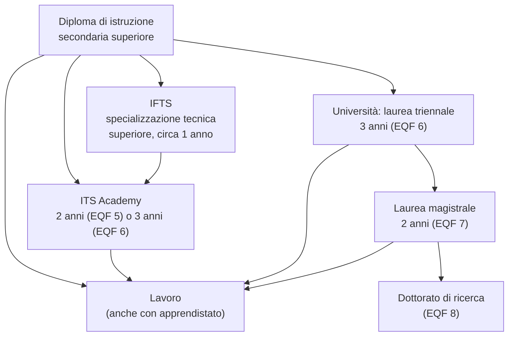

# Lezione 7.2: Percorsi di studio e di ingresso nel lavoro

Contenuto originale. Fonti indicate nel testo; dati verificati a settembre 2026. Regole e numeri cambiano nel tempo: prima di una scelta vanno controllati sui siti ufficiali.

La lezione si svolge prevalentemente in forma di discussione e si conclude con una scheda personale, da completare con il docente tutor.

## 7.2.1 Mappa dei percorsi dopo il diploma



I livelli **EQF** (European Qualifications Framework) permettono di confrontare i titoli di studio dei diversi Paesi europei: il diploma di scuola superiore corrisponde al livello 4, la laurea triennale al 6, la magistrale al 7.

## 7.2.2 ITS Academy

Gli **ITS Academy** (Istituti Tecnologici Superiori) sono scuole di alta specializzazione tecnologica, riordinate dalla Legge 99/2022. Sono fondazioni che riuniscono scuole, università, imprese ed enti locali.

Caratteristiche principali (fonte: Ministero del Lavoro, portale Cliclavoro, https://www.cliclavoro.gov.it/focus-on/formazione/istututi-tecnologici-superiori):

- **percorsi di quinto livello EQF**: 4 semestri, almeno 1800 ore
- **percorsi di sesto livello EQF**: 6 semestri, almeno 3000 ore
- **tirocini** in azienda per almeno il 35% delle ore
- almeno il 60% delle ore di docenza svolto da professionisti provenienti dal mondo del lavoro
- accesso con il diploma di scuola superiore, oppure con un diploma professionale quadriennale e un certificato di specializzazione tecnica superiore (IFTS)

Gli ITS sono organizzati in 10 **aree tecnologiche**. L'area 10, **Tecnologie dell'informazione, della comunicazione e dei dati**, comprende quattro ambiti: architetture software e gestione dei dati; architetture e sistemi; trasformazione digitale; contenuti digitali e creativi. Fonte: allegato al decreto ministeriale sulle aree tecnologiche e le figure nazionali, pubblicato dalla Regione Sardegna, https://files.regione.sardegna.it/squidex/api/assets/redazionaleras/427733a4-adb3-4124-abb1-4ddad9052d61/all-1-aree-tecnologiche-its-repertorio-figure-19-10-2023-signed.pdf

Esempi di percorsi offerti da un singolo ITS nell'area 10 (bando 2024/2025 dell'ITS Academy "Adriano Olivetti"): sviluppatore software con orientamento Cloud e DevOps, sviluppatore software web e analisi dei dati, amministratore di sistemi e reti, specialista di cybersecurity, data manager, specialista di realtà aumentata e virtuale, digital media designer per videogiochi. Fonte: https://itsolivetti.it/wp-content/uploads/2024/11/AVVISO-AREA-ICT_def.pdf . Ogni ITS ha la propria offerta: va consultata sul sito dell'istituto.

Il monitoraggio nazionale degli ITS Academy è curato da INDIRE, che pubblica ogni anno i dati sull'occupazione dei diplomati a 12 mesi dal diploma: https://www.indire.it/progetto/its-istituti-tecnologici-superiori/monitoraggio-nazionale/

## 7.2.3 Università

I corsi di laurea sono raggruppati in **classi**: tutti i corsi della stessa classe hanno obiettivi formativi comuni e rilasciano titoli con lo stesso valore legale. Classi più direttamente collegate allo sviluppo software:

| Livello | Classe | Nome |
|---|---|---|
| Triennale | L-31 | Scienze e tecnologie informatiche |
| Triennale | L-8 | Ingegneria dell'informazione |
| Triennale professionalizzante | L-P03 | Professioni tecniche industriali e dell'informazione |
| Magistrale | LM-18 | Informatica |
| Magistrale | LM-32 | Ingegneria informatica |

Differenze orientative, da verificare sui piani di studio dei singoli corsi:

- **informatica** (L-31, LM-18): fondamenti teorici dell'informatica, algoritmi, linguaggi, sistemi software
- **ingegneria dell'informazione e informatica** (L-8, LM-32): maggiore peso di matematica, fisica ed elettronica; progettazione di sistemi
- **lauree professionalizzanti** (L-P): percorsi triennali con ampio tirocinio pratico, collegati agli ordini professionali; la classe L-P03 prepara, tra l'altro, alle professioni di perito industriale nel settore dell'informazione. Informazioni: Consiglio nazionale dei periti industriali, https://cnpi.eu/lauree-professionalizzanti/

Altri corsi che portano al lavoro nell'informatica: matematica, fisica, statistica, ingegneria elettronica e delle telecomunicazioni, data science, informatica applicata ad altri ambiti (per esempio informatica umanistica, bioinformatica).

Ricerca dei corsi per classe, sede e tipo: portale ministeriale Universitaly, https://www.universitaly.it/it/cerca-corsi

Dati sull'occupazione dei laureati: il **Rapporto AlmaLaurea 2026** indica, per il complesso dei laureati, un tasso di occupazione a un anno dal titolo dell'81,2% per i laureati triennali e dell'80,8% per i magistrali, e a cinque anni del 91,7% e del 94,4%. Fonte e definizioni: https://www.almalaurea.it/news/rapporto-almalaurea-2026 . Il sito AlmaLaurea permette di consultare i dati per classe di laurea e per singolo corso.

## 7.2.4 La domanda delle imprese

Il Sistema informativo **Excelsior** di Unioncamere rileva ogni anno le assunzioni previste dalle imprese italiane e le competenze richieste. Secondo il rapporto 2025 sulle competenze digitali, a circa la metà (48,8%) delle entrate previste sono richieste competenze nell'uso di linguaggi e metodi matematici e informatici, e il rapporto dedica un'analisi alle difficoltà delle imprese nel trovare profili con competenze digitali. Fonte: https://excelsior.unioncamere.net/pubblicazioni/2025/le-competenze-digitali

## 7.2.5 Opportunità già durante la scuola

- **Campionati Italiani di Informatica** (fino all'edizione precedente "Olimpiadi Italiane di Informatica"): gare di programmazione algoritmica per gli studenti delle scuole superiori, gratuite, con selezione scolastica, territoriale e nazionale; l'iscrizione avviene tramite la scuola. Sito: https://www.olimpiadi-informatica.it/
- **CyberChallenge.IT**: programma nazionale gratuito di formazione in cybersicurezza per giovani dai 16 ai 24 anni, con un periodo di formazione e gare locali e nazionali, organizzato dal Laboratorio nazionale di cybersecurity del CINI con le università. Sito: https://cyberchallenge.it/
- **Certificazioni**: alcune aziende del settore offrono corsi e certificazioni riconosciuti dalle imprese (per esempio su reti, cloud, sicurezza). Prima di iscriversi occorre verificare costi dell'esame, età minima e necessità di un account personale.
- **Portfolio**: i progetti realizzati (come il gioco di digitazione e il progetto di gruppo di questo corso), con un README chiaro e una storia Git ordinata, dimostrano competenze concrete. La pubblicazione su servizi online richiede un account, da creare solo nel rispetto dell'età minima prevista dal servizio.
- **E-Portfolio orientativo**: nella Piattaforma Unica del Ministero ogni studente del triennio documenta con il docente tutor il proprio percorso e sceglie un "capolavoro"; un progetto del corso può essere uno dei documenti proposti.

## 7.2.6 Attività: scheda di orientamento personale

Tempo indicativo: 45 minuti. Da completare individualmente e poi discutere con il docente tutor.

```markdown
# Scheda di orientamento personale

## Che cosa mi è piaciuto nel corso
- attività più interessante:
- attività meno interessante:
- ruolo svolto nel progetto di gruppo e come mi sono trovato:

## Punti di forza e da migliorare
- punti di forza (tecnici e trasversali):
- aspetti da migliorare:

## Percorsi che voglio approfondire
| Percorso | Perché mi interessa | Informazioni da raccogliere | Dove |
|---|---|---|---|
|  |  |  |  |

## Prossimi passi (entro la fine dell'anno scolastico)
- [ ] visitare il sito di almeno un ITS Academy dell'area 10 e di un corso di laurea
- [ ] partecipare a un open day o a una lezione aperta
- [ ] parlare con uno studente o un professionista del percorso che interessa
- [ ] valutare la partecipazione ai Campionati di Informatica o a CyberChallenge.IT
- [ ] scegliere un lavoro del corso da inserire nell'E-Portfolio
```

Indicazioni per la ricerca:

1. Su Universitaly cercare due corsi delle classi L-31 o L-8 in atenei raggiungibili; confrontare piani di studio, requisiti di accesso (test d'ingresso, numero programmato), servizi.
2. Individuare un ITS Academy dell'area 10 nella propria regione; annotare figure offerte, ore di tirocinio, aziende partner.
3. Presentare in 2 minuti alla classe il percorso più interessante trovato.

## 7.2.7 Domande per la discussione

- Che differenza c'è tra un percorso ITS e una laurea triennale nel modo di imparare? Quali persone possono trovarsi meglio nell'uno o nell'altro?
- Quanto conta il titolo di studio rispetto a ciò che si sa fare e si può dimostrare?
- Quali fonti di informazione sono affidabili quando si sceglie un percorso, e quali vanno prese con cautela (pubblicità, classifiche, social network)?
- Come potrebbe cambiare il lavoro nell'informatica nei prossimi cinque anni, e come ci si può preparare?
