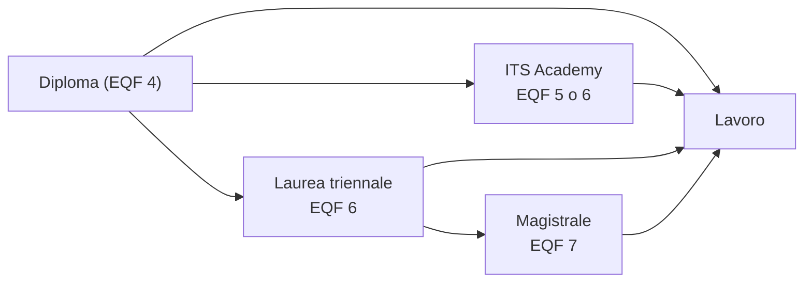

## Contenuti

- Dopo il diploma
- ITS Academy
- Università
- Dati
- Durante la scuola
- Scheda di orientamento personale
- Discussione

## Dopo il diploma

## ITS Academy

- 4 semestri (almeno 1800 ore, EQF 5) o 6 semestri (almeno 3000 ore, EQF 6)
- Tirocini: almeno il 35% delle ore
- Almeno il 60% della docenza dal mondo del lavoro
- Area 10: **Tecnologie dell'informazione, della comunicazione e dei dati**
- Esempi: sviluppatore Cloud e DevOps, sistemista, specialista di cybersecurity, data manager

## Università

| Classe | Nome |
|---|---|
| L-31 | Scienze e tecnologie informatiche |
| L-8 | Ingegneria dell'informazione |
| L-P03 | Professioni tecniche industriali e dell'informazione |
| LM-18 | Informatica |
| LM-32 | Ingegneria informatica |

Ricerca: https://www.universitaly.it/it/cerca-corsi

## Dati

- AlmaLaurea 2026: occupati a 1 anno 81,2% (triennali), 80,8% (magistrali); a 5 anni 91,7% e 94,4%
- Excelsior 2025: competenze matematiche e informatiche richieste nel 48,8% delle entrate previste
- Dati per singolo corso: sito AlmaLaurea

## Durante la scuola

- **Campionati Italiani di Informatica** (ex Olimpiadi): gratuiti, tramite la scuola
- **CyberChallenge.IT**: 16-24 anni, gratuito
- Certificazioni: verificare costi, età minima, account
- **Portfolio** e **E-Portfolio** con il docente tutor

## Scheda di orientamento personale

- Che cosa mi è piaciuto; ruolo nel progetto
- Punti di forza e da migliorare
- Percorsi da approfondire e informazioni da raccogliere
- Prossimi passi: siti, open day, contatti, gare

## Discussione

- ITS o laurea: due modi diversi di imparare
- Titolo di studio e competenze dimostrabili
- Fonti affidabili e fonti da prendere con cautela
- Come prepararsi ai cambiamenti dei prossimi anni
