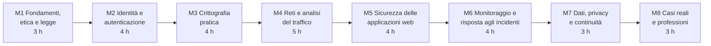

# Cybersecurity ed Ethical Hacking

Versione del 30/09/2026, ore 11:12. Modifiche rispetto alla versione precedente: righe delle lezioni 4.4 e 6.2 (le attività anomale nel traffico e nei log sono trattate a livello concettuale, con collegamenti a trattazioni esterne; l'analisi pratica dei log usa registri prodotti dagli studenti).


## Dati generali

- Tipo di percorso: percorso di orientamento per le classi terze, quarte e quinte della scuola secondaria di secondo grado, con il coordinamento del docente tutor.
- Durata: 30 ore, suddivise in unità didattiche di circa un'ora, componibili in sessioni da 2 o 3 ore.
- Destinatari: studenti del triennio di istituto tecnico a indirizzo informatico e di liceo scientifico (16-18 anni).
- Prerequisiti: comprensione di programmi brevi (10-20 righe) in un qualsiasi linguaggio; uso di base del PC (file, cartelle, browser).
- Approccio: orientato alla **difesa**. Le tecniche di attacco sono trattate a livello concettuale (principio, condizioni che le rendono possibili, impatto, contromisure), senza istruzioni operative. Le attività in aula riguardano protezione, configurazione, analisi di dati e log, riconoscimento degli attacchi. Gli aspetti orientativi sono trattati soprattutto a voce, a partire da brevi elenchi di punti inseriti nei materiali.

## Obiettivi di apprendimento

Al termine del percorso lo studente:

- descrive i principi della sicurezza informatica (riservatezza, integrità, disponibilità) e il concetto di rischio
- conosce i limiti etici e legali dell'attività di sicurezza e il quadro normativo italiano ed europeo
- applica buone pratiche di autenticazione: password robuste, gestori di password, autenticazione a più fattori
- spiega il funzionamento di hashing, cifratura simmetrica e asimmetrica, firme e certificati, e li sperimenta con strumenti didattici
- legge il traffico di rete registrato e riconosce protocolli, anomalie e informazioni esposte
- riconosce le principali categorie di vulnerabilità delle applicazioni web e applica le contromisure nel codice
- analizza log per individuare comportamenti sospetti e descrive le fasi di risposta a un incidente
- conosce gli obblighi di protezione dei dati personali e le strategie di backup e continuità
- conosce i ruoli professionali della sicurezza informatica e i percorsi di formazione

## Regole di sicurezza del laboratorio

- Ogni attività si svolge solo su file, programmi e sistemi propri o forniti dal docente per l'esercizio.
- Non si analizzano, non si scansionano e non si sollecitano sistemi di terzi, compresa la rete della scuola, senza autorizzazione scritta.
- Le piattaforme esterne di esercitazione si usano solo se consentite dai loro termini per l'età degli studenti, oppure tramite l'account del docente.
- Le regole vengono illustrate e sottoscritte nella lezione 1.2, insieme ai riferimenti di legge.

## Strumenti software

Tutti gli strumenti sono gratuiti, funzionano su un laptop Windows con 8 GB di RAM, senza macchine virtuali, e non richiedono account personali.

| Tipologia | Strumento consigliato | Alternative | Note |
|---|---|---|---|
| Laboratorio di crittografia e codifiche | CyberChef (GCHQ, licenza Apache 2.0): https://github.com/gchq/CyberChef | comandi di Python | Pagina HTML scaricabile, funziona offline nel browser |
| Analisi del traffico di rete | Wireshark, versione portatile Windows x64 PortableApps: https://www.wireshark.org/download.html | nessuna con pari diffusione professionale | Solo analisi di catture già registrate; la cattura dal vivo richiede diritti di amministratore |
| Gestore di password | KeePassXC, versione portatile | Bitwarden (richiede account) | Archivio cifrato locale |
| Programmazione ed esercizi di difesa | Python, installazione per utente senza diritti di amministratore | WinPython (portatile) | Hashing, analisi di log, validazione degli input |
| Editor e browser | Visual Studio Code portatile e DevTools del browser (come nel Corso 1) | VSCodium | Già usati nel Corso 1 |

Piattaforme esterne, da proporre solo come approfondimento facoltativo:

| Piattaforma | Uso | Condizioni verificate |
|---|---|---|
| OverTheWire Bandit, https://overthewire.org/wargames/bandit/ | esercizi sulla riga di comando Linux, via SSH | nessuna registrazione |
| CyberChallenge.IT, https://cyberchallenge.it/ | programma nazionale di formazione e gare | età 16-24 anni, gratuito |
| Hack The Box | laboratori guidati | dai 13 anni, con consenso firmato dai genitori per i minorenni: https://help.hackthebox.com/en/articles/9456556-parental-consent-and-approval-for-users-under-18 |
| TryHackMe | laboratori guidati | nessuna età minima esplicita nei termini: https://tryhackme.com/legal/terms-of-use ; da usare tramite l'account del docente |

## Struttura del corso

Struttura a tre livelli: modulo, lezione (circa un'ora), sezione. Una directory per modulo (`modNN_...`), con un file indice (`modNN_00_indice_modulo.md`) e una sottodirectory per lezione (`lezNN_...`). Ogni directory di lezione contiene tre file con lo stesso prefisso `modNN_lezNN_...`: la lezione (`.md`), la presentazione Marp (`_marp.md`), la presentazione pandoc reveal.js (`_prezpdoc.md`).



```text
corso02_cybersecurity/
    corso02_00_syllabus_AAAA-MM-GG_hhmm.md (data e ora della versione)
    mod01_fondamenti_etica_legge/
        lez01_sicurezza_e_rischio/
        lez02_etica_e_legge/
        lez03_minacce_e_attori/
    mod02_identita_autenticazione/
        lez01_password_robuste/
        lez02_lab_hashing_password/
        lez03_mfa_e_gestori_password/
        lez04_account_e_privilegi/
    mod03_crittografia_pratica/
        lez01_cifratura_simmetrica/
        lez02_cifratura_asimmetrica_e_firme/
        lez03_certificati_e_https/
        lez04_lab_cyberchef/
    mod04_reti_analisi_traffico/
        lez01_protocolli_e_superficie_esposta/
        lez02_firewall_e_regole/
        lez03_wireshark_primi_passi/
        lez04_lab_analisi_catture/
        lez05_wifi_e_segmentazione/
    mod05_sicurezza_applicazioni_web/
        lez01_owasp_top10/
        lez02_validazione_degli_input/
        lez03_configurazione_e_intestazioni/
        lez04_lab_correzione_codice/
    mod06_monitoraggio_incidenti/
        lez01_log_e_monitoraggio/
        lez02_lab_analisi_log/
        lez03_phishing_e_ingegneria_sociale/
        lez04_risposta_agli_incidenti/
    mod07_dati_privacy_continuita/
        lez01_gdpr_e_dati_personali/
        lez02_classificazione_e_protezione_dati/
        lez03_backup_e_continuita/
    mod08_casi_reali_professioni/
        lez01_casi_reali_parte1/
        lez02_casi_reali_parte2/
        lez03_professioni_della_sicurezza/
```

### Modulo 1: Fondamenti, etica e legge (3 ore)

Directory: `mod01_fondamenti_etica_legge/`

| Lezione | Contenuti | Attività pratica |
|---|---|---|
| 1.1 Sicurezza e rischio | Riservatezza, integrità, disponibilità; asset, minaccia, vulnerabilità, rischio; misure preventive, rilevative, correttive | Analisi del rischio di un caso scolastico (registro elettronico) |
| 1.2 Etica e legge | Hacker etico e divulgazione responsabile; accesso abusivo (art. 615-ter c.p.) e altri reati informatici; NIS2, Agenzia per la Cybersicurezza Nazionale, CSIRT Italia | Lettura e sottoscrizione delle regole del laboratorio |
| 1.3 Minacce e attori | Categorie di minacce (malware, ransomware, phishing, attacchi alla disponibilità) a livello concettuale; motivazioni degli attaccanti | Classificazione di notizie reali per tipo di minaccia e di impatto |

### Modulo 2: Identità e autenticazione (4 ore)

Directory: `mod02_identita_autenticazione/`

| Lezione | Contenuti | Attività pratica |
|---|---|---|
| 2.1 Password robuste | Entropia; perché le password brevi o riutilizzate sono deboli (concetti); passphrase; raccomandazioni correnti | Calcolo dell'entropia in Python |
| 2.2 Laboratorio: hashing delle password | Funzioni di hash; salt; funzioni lente per password | Memorizzazione sicura di password di prova in Python |
| 2.3 Autenticazione a più fattori e gestori di password | Fattori di autenticazione; codici temporanei; chiavi di accesso (passkey) | Archivio KeePassXC con password generate |
| 2.4 Account e privilegi | Minimo privilegio; separazione dei ruoli; account amministrativi | Analisi dei permessi su cartelle di prova |

### Modulo 3: Crittografia pratica (4 ore)

Directory: `mod03_crittografia_pratica/`

| Lezione | Contenuti | Attività pratica |
|---|---|---|
| 3.1 Cifratura simmetrica | Cifrari storici; AES come concetto; gestione delle chiavi | Cifrari storici e codifiche in CyberChef |
| 3.2 Cifratura asimmetrica e firme | Coppie di chiavi; scambio di chiavi; firma digitale; integrità | Verifica di impronte (hash) di file scaricati |
| 3.3 Certificati e HTTPS | Autorità di certificazione; catena di fiducia; lucchetto del browser | Ispezione dei certificati di siti reali nel browser |
| 3.4 Laboratorio con CyberChef | Codifica e cifratura a confronto; Base64 non è cifratura | Esercizi guidati di codifica, hash, cifratura e decifratura |

### Modulo 4: Reti e analisi del traffico (5 ore)

Directory: `mod04_reti_analisi_traffico/`

| Lezione | Contenuti | Attività pratica |
|---|---|---|
| 4.1 Protocolli e superficie esposta | Modello TCP/IP; porte e servizi; superficie di attacco (concetto) | Elenco dei servizi in ascolto sul proprio PC |
| 4.2 Firewall e regole | Filtraggio dei pacchetti; regole e loro ordine; negazione predefinita | Progetto e verifica di un insieme di regole con un simulatore in Python |
| 4.3 Wireshark: primi passi | Pacchetti, protocolli, filtri di visualizzazione | Apertura di catture di esempio |
| 4.4 Laboratorio: analisi di catture | Protocolli in chiaro e cifrati; dati esposti; traffico anomalo (a livello concettuale, con indicatori e collegamenti al catalogo MITRE ATT&CK) | Individuazione di credenziali in chiaro in catture fornite, con Wireshark e con uno script Python |
| 4.5 Wi-Fi e segmentazione | Protezione delle reti senza fili; reti ospiti; segmentazione | Progetto della rete di una piccola scuola |

### Modulo 5: Sicurezza delle applicazioni web (4 ore)

Directory: `mod05_sicurezza_applicazioni_web/`

| Lezione | Contenuti | Attività pratica |
|---|---|---|
| 5.1 OWASP Top 10 | Categorie di vulnerabilità a livello concettuale; perché gli errori di programmazione diventano vulnerabilità | Associazione di casi descritti alle categorie |
| 5.2 Validazione degli input | Input non fidato; iniezione (concetto) e query parametriche; codifica dell'output | Correzione di funzioni Python e JavaScript con test |
| 5.3 Configurazione e intestazioni di sicurezza | Intestazioni HTTP di sicurezza; cookie sicuri; aggiornamenti e dipendenze | Analisi delle intestazioni di siti reali con i DevTools |
| 5.4 Laboratorio: correzione di codice vulnerabile | Revisione del codice orientata alla sicurezza | Revisione e correzione di una piccola applicazione fornita, con test |

### Modulo 6: Monitoraggio e risposta agli incidenti (4 ore)

Directory: `mod06_monitoraggio_incidenti/`

| Lezione | Contenuti | Attività pratica |
|---|---|---|
| 6.1 Log e monitoraggio | Che cosa registrare; formati di log; SIEM e SOC (concetti) | Lettura dei registri eventi di Windows |
| 6.2 Laboratorio: analisi di log | Indicatori di tentativi di accesso ripetuti e di altre anomalie (a livello concettuale, con collegamenti al catalogo MITRE ATT&CK) | Analisi con uno script Python del registro prodotto dagli studenti usando l'applicazione del laboratorio 5.4 |
| 6.3 Phishing e ingegneria sociale | Tecniche di manipolazione (concetti); segnali di riconoscimento | Analisi di messaggi di esempio e delle intestazioni di un'email |
| 6.4 Risposta agli incidenti | Fasi: preparazione, rilevazione, contenimento, eradicazione, ripristino, lezioni apprese; notifiche obbligatorie | Esercitazione a tavolino su uno scenario di ransomware |

### Modulo 7: Dati, privacy e continuità (3 ore)

Directory: `mod07_dati_privacy_continuita/`

| Lezione | Contenuti | Attività pratica |
|---|---|---|
| 7.1 GDPR e dati personali | Principi, basi giuridiche, diritti degli interessati; violazione dei dati e notifica | Analisi dell'informativa privacy di un servizio usato dagli studenti |
| 7.2 Classificazione e protezione dei dati | Livelli di classificazione; cifratura dei dati a riposo; minimizzazione e pseudonimizzazione | Pseudonimizzazione di un file di dati in Python |
| 7.3 Backup e continuità | Regola 3-2-1; ripristino; continuità operativa | Piano di backup per un piccolo ufficio, con prova di ripristino |

### Modulo 8: Casi reali e professioni (3 ore)

Directory: `mod08_casi_reali_professioni/`

| Lezione | Contenuti | Attività pratica |
|---|---|---|
| 8.1 Casi reali, parte 1 | Incidenti noti: causa, impatto, errori, contromisure | Analisi a gruppi con schema comune |
| 8.2 Casi reali, parte 2 | Incidenti in Italia e nel settore pubblico; lezioni apprese | Presentazione dei casi e discussione |
| 8.3 Professioni della sicurezza | Ruoli (analista SOC, penetration tester, responsabile della sicurezza, consulente privacy); percorsi di studio; CyberChallenge.IT | Scheda di orientamento personale |

## Composizione delle sessioni

Le lezioni sono unità da circa un'ora. Sessioni da 2 ore: 15 sessioni. Sessioni da 3 ore: 10 sessioni, con la terza ora dedicata al laboratorio più lungo o alla lezione successiva.

## Verifica degli apprendimenti

- Osservazione delle attività di laboratorio e dei prodotti realizzati (script, analisi, piani).
- Esercizi e quiz di fine lezione.
- Analisi di un caso reale presentata dal gruppo (modulo 8).

## Fonti, licenze e attribuzioni

- Microsoft, "Security-101", https://github.com/microsoft/Security-101 . Licenza CC0 1.0 (pubblico dominio): parti concettuali riutilizzabili liberamente, indicate comunque nelle lezioni con l'URL della fonte.
- ISECOM, "Hacker Highschool", https://www.hackerhighschool.org/ . Uso gratuito non commerciale secondo i termini di ISECOM: solo come riferimento, senza riproduzione di testo.
- MDN Web Docs e OWASP: citati tramite link.
- Le fonti di ciascuna lezione sono indicate nella lezione stessa; per ogni lezione viene verificata l'esistenza di materiali open source riutilizzabili.
