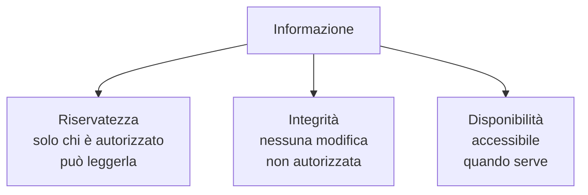
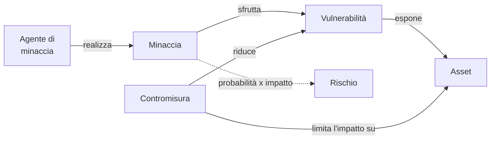

# Lezione 1.1: Sicurezza e rischio

> Fonte: adattamento, tradotto e riscritto, delle lezioni "The CIA triad and other key concepts" e "Understanding risk management" del corso Microsoft "Security-101", https://github.com/microsoft/Security-101 . Licenza CC0 1.0 (pubblico dominio). Esempi e attività sono contenuto originale.

## 1.1.1 Che cos'è la sicurezza informatica

La **sicurezza informatica** (cybersecurity) è l'insieme delle misure tecniche, organizzative e umane che proteggono sistemi, reti, dispositivi e dati da eventi dannosi, intenzionali o accidentali. Riguarda tutti: le aziende e la Pubblica Amministrazione, ma anche la scuola e ogni persona con uno smartphone.

La sicurezza non è uno stato raggiungibile una volta per tutte, ma un **processo continuo**: nuove vulnerabilità vengono scoperte ogni giorno, i sistemi cambiano, cambiano le persone che li usano.

## 1.1.2 La triade RID (CIA)

Le proprietà che la sicurezza deve garantire alle informazioni sono tre, indicate in inglese come **triade CIA** e in italiano come **RID**:

- **Riservatezza** (Confidentiality): solo chi ne ha diritto può accedere all'informazione. Esempio: i voti di uno studente sono visibili a lui, alla famiglia e ai docenti, non agli altri studenti.
- **Integrità** (Integrity): l'informazione non viene modificata senza autorizzazione, e le modifiche non autorizzate sono rilevabili. Esempio: un voto non può essere cambiato da chi non ne ha il diritto.
- **Disponibilità** (Availability): l'informazione e i servizi sono accessibili quando servono. Esempio: il registro elettronico funziona durante lo scrutinio.

Proprietà collegate:

- **Autenticità**: l'informazione e chi la invia sono davvero quelli che dichiarano di essere.
- **Non ripudio**: chi ha compiuto un'azione (per esempio firmare un documento) non può negare di averla compiuta.
- **Privacy**: controllo delle persone sui propri dati personali: come vengono raccolti, conservati, condivisi (modulo 7).

Le proprietà possono entrare in conflitto: un sistema chiuso in una cassaforte è molto riservato ma poco disponibile. Progettare la sicurezza significa trovare un equilibrio adatto al contesto.

## 1.1.3 Asset, minacce, vulnerabilità, rischio

Concetti di base per ragionare sulla sicurezza:

- **Asset** (bene): ciò che ha valore e va protetto: dati, sistemi, servizi, reputazione, persone.
- **Minaccia**: evento potenziale che può causare un danno a un asset: un attacco, un guasto, un errore umano, un incendio.
- **Agente di minaccia**: chi o che cosa può realizzare la minaccia: una persona, un gruppo, un programma automatico, un evento naturale.
- **Vulnerabilità**: debolezza di un sistema (nel progetto, nella realizzazione o nella configurazione) che una minaccia può sfruttare. Esempio: una password predefinita mai cambiata.
- **Rischio**: possibilità che una minaccia sfrutti una vulnerabilità causando un danno; si valuta combinando **probabilità** e **impatto**.
- **Contromisura** (controllo): misura che riduce il rischio.

Senza vulnerabilità una minaccia non produce danni; senza minaccia una vulnerabilità resta un rischio teorico. Per questo la difesa lavora su entrambi i fronti: ridurre le vulnerabilità e limitare le conseguenze di un attacco riuscito.

## 1.1.4 Tipi di contromisure

Classificazione per **funzione**:

- **preventive**: impediscono l'evento (autenticazione, cifratura, aggiornamenti)
- **rilevative**: segnalano l'evento quando accade (log, sistemi di allarme, monitoraggio: modulo 6)
- **correttive**: limitano il danno e ripristinano la situazione (backup, piani di risposta: moduli 6 e 7)

Classificazione per **natura**:

- **tecniche**: firewall, cifratura, controllo degli accessi
- **organizzative** (amministrative): regole, procedure, formazione del personale
- **fisiche**: serrature, controllo degli accessi ai locali, protezione dagli incendi

Una difesa efficace combina più livelli di contromisure, in modo che il fallimento di una non comprometta tutto: è il principio della **difesa in profondità**.

## 1.1.5 Valutare e trattare il rischio

**Valutazione del rischio**, in forma semplificata:

1. elencare gli asset
2. per ciascuno, individuare minacce e vulnerabilità
3. stimare **probabilità** e **impatto** (bassa, media, alta)
4. ricavare il livello di rischio da una matrice
5. ordinare i rischi per livello, dal più alto

Matrice del rischio:

| Probabilità / Impatto | Basso | Medio | Alto |
|---|---|---|---|
| **Alta** | medio | alto | alto |
| **Media** | basso | medio | alto |
| **Bassa** | basso | basso | medio |

**Trattamento del rischio**: per ogni rischio si sceglie una strategia:

- **mitigare**: ridurre probabilità o impatto con contromisure
- **trasferire**: affidare parte delle conseguenze ad altri, per esempio con un'assicurazione o un fornitore specializzato
- **accettare**: consapevolmente, quando il rischio è basso o il costo delle contromisure è superiore al danno atteso
- **evitare**: rinunciare all'attività che genera il rischio

Il **rischio residuo** è quello che rimane dopo le contromisure: non è mai zero. Le valutazioni vanno ripetute periodicamente, perché minacce e sistemi cambiano.

## 1.1.6 Attività: analisi del rischio del registro elettronico

Tempo indicativo: 30 minuti, a gruppi.

Scenario: il registro elettronico di una scuola, usato da docenti, studenti e famiglie via web e app.

1. Elencare almeno 4 asset (per esempio: voti, assenze, dati anagrafici, disponibilità del servizio durante gli scrutini).
2. Per ciascun asset indicare quale proprietà RID è più importante e perché.
3. Compilare la tabella per almeno 5 rischi:

| Asset | Minaccia | Vulnerabilità | Probabilità | Impatto | Rischio | Contromisura proposta | Tipo di contromisura |
|---|---|---|---|---|---|---|---|
| voti | modifica non autorizzata | password del docente debole | media | alto | alto | password robusta e autenticazione a più fattori | preventiva, tecnica |
|  |  |  |  |  |  |  |  |

4. Ordinare i rischi e indicare per ciascuno la strategia di trattamento.
5. Confrontare le tabelle dei gruppi: quali rischi sono stati valutati diversamente, e perché?

### Esercizi

1. Classificare come preventiva, rilevativa o correttiva: antivirus che blocca un file, registro degli accessi, copia di backup settimanale, formazione sul phishing, allarme su accessi notturni.
2. Per ciascuna proprietà RID descrivere un esempio della propria vita quotidiana in cui viene violata.
3. Spiegare perché "il nostro sistema è sicuro al 100%" è un'affermazione da non fare mai.

## 1.1.7 Aspetti orientativi (discussione)

- L'analisi del rischio è il lavoro quotidiano di figure come il risk manager, il consulente di sicurezza e il responsabile della sicurezza delle informazioni (CISO).
- La sicurezza non è solo tecnica: molte contromisure sono organizzative e richiedono capacità di comunicare con persone non esperte.
- Domanda: quali asset digitali personali (account, foto, dati) hanno più valore per ciascuno, e come sono protetti oggi?
