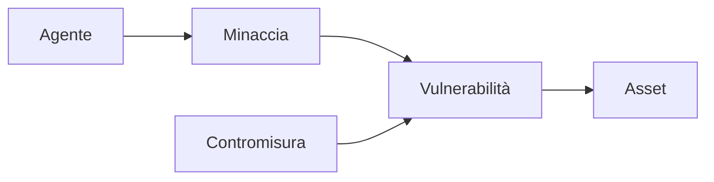

## Contenuti

- La triade RID (CIA)
- Asset, minacce, vulnerabilità, rischio
- Contromisure
- Matrice e trattamento del rischio
- Attività: il registro elettronico
- Aspetti orientativi

Fonte: adattamento da Microsoft, "Security-101", licenza CC0, https://github.com/microsoft/Security-101

## La triade RID (CIA)

- **Riservatezza**: solo chi è autorizzato accede
- **Integrità**: nessuna modifica non autorizzata
- **Disponibilità**: accessibile quando serve
- Collegate: autenticità, non ripudio, privacy

Sicurezza: processo continuo, non stato definitivo

## Asset, minacce, vulnerabilità, rischio

- **Rischio** = probabilità x impatto
- Senza vulnerabilità la minaccia non produce danni

## Contromisure

- Per funzione: **preventive**, **rilevative**, **correttive**
- Per natura: **tecniche**, **organizzative**, **fisiche**
- **Difesa in profondità**: più livelli

## Matrice e trattamento del rischio

| Probabilità / Impatto | Basso | Medio | Alto |
|---|---|---|---|
| **Alta** | medio | alto | alto |
| **Media** | basso | medio | alto |
| **Bassa** | basso | basso | medio |

Mitigare, trasferire, accettare, evitare; **rischio residuo** mai zero

## Attività: il registro elettronico

- Asset e proprietà RID più importanti
- Tabella dei rischi: minaccia, vulnerabilità, probabilità, impatto, contromisura
- Ordinamento e strategia di trattamento
- Confronto tra gruppi

## Aspetti orientativi

- Risk manager, consulente di sicurezza, CISO
- Molte contromisure sono organizzative
- Quali asset digitali personali hanno più valore?
