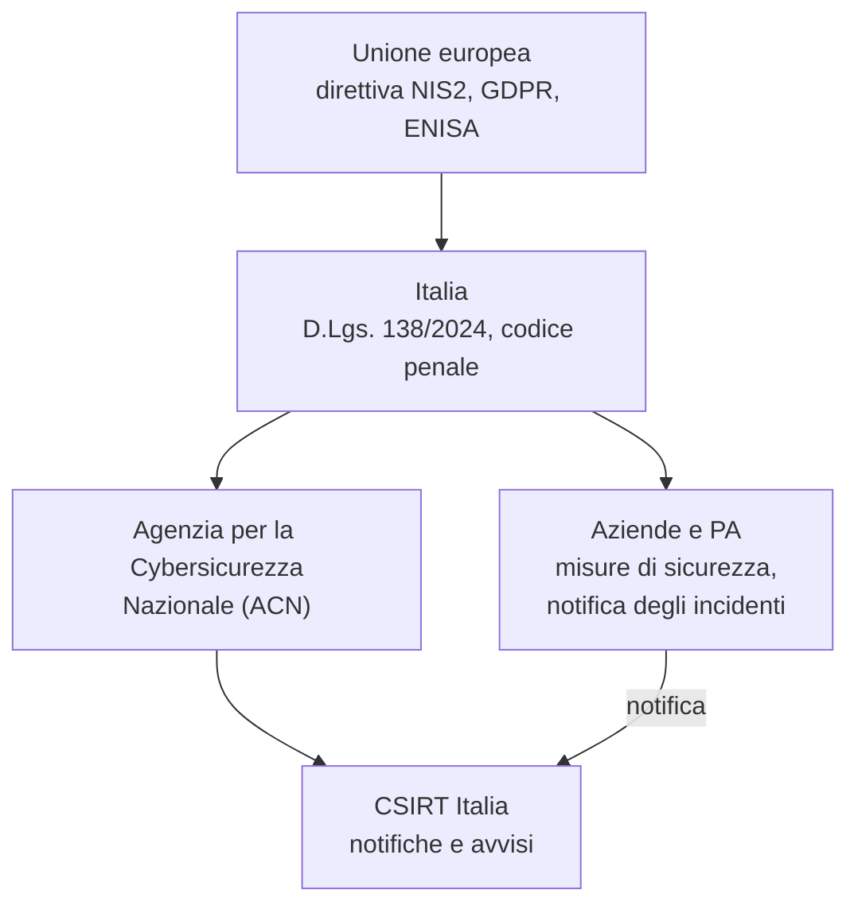

# Lezione 1.2: Etica e legge

Contenuto originale. Fonti normative indicate nel testo. Le informazioni hanno scopo didattico e non sostituiscono una consulenza legale.

## 1.2.1 Hacker ed ethical hacker

In origine **hacker** indicava una persona appassionata che esplora a fondo il funzionamento dei sistemi per capirli e migliorarli. Nel linguaggio comune il termine è diventato sinonimo di criminale informatico; nel settore si distingue tra:

- chi agisce con **autorizzazione**, per migliorare la sicurezza (ethical hacker, penetration tester, ricercatore di sicurezza)
- chi agisce **senza autorizzazione**, qualunque sia l'intenzione dichiarata

Il criterio che separa le due attività non è la tecnica usata, spesso identica, ma l'**autorizzazione**.

Un'attività di ethical hacking professionale ha sempre:

- **autorizzazione scritta** del proprietario del sistema
- **perimetro** definito: quali sistemi, in quale periodo, con quali tecniche ammesse
- **riservatezza** su ciò che viene scoperto
- **rapporto finale** con vulnerabilità trovate, rischi e contromisure proposte
- attenzione a **non causare danni**: nessuna interruzione dei servizi, nessuna modifica o sottrazione di dati

## 1.2.2 Divulgazione coordinata delle vulnerabilità

Chi scopre una vulnerabilità in un sistema altrui, per esempio notando un errore mentre usa un sito, non deve verificarla con prove sul sistema né divulgarla. La prassi corretta è la **divulgazione coordinata** (coordinated vulnerability disclosure): si segnala il problema al responsabile, o a un coordinatore nazionale, e lo si rende pubblico solo dopo che è stata resa disponibile una correzione.

Riferimento: ENISA, agenzia dell'Unione europea per la cibersicurezza, "Vulnerability disclosure", https://www.enisa.europa.eu/topics/vulnerability-disclosure . ENISA gestisce anche la banca dati europea delle vulnerabilità (EUVD).

Molte organizzazioni pubblicano una **politica di segnalazione** con i contatti e le regole da seguire; alcune offrono premi a chi segnala vulnerabilità (bug bounty), sempre entro regole precise.

## 1.2.3 I reati informatici

Il codice penale italiano punisce diversi comportamenti informatici. Il più rilevante per chi studia sicurezza è l'**accesso abusivo a un sistema informatico o telematico** (art. 615-ter c.p.): è punito chi si introduce abusivamente in un sistema protetto da misure di sicurezza, o vi si mantiene contro la volontà espressa o tacita di chi ha il diritto di escluderlo.

Elementi da notare:

- basta l'**accesso**: il reato sussiste anche senza danni, furti o modifiche
- basta che il sistema sia **protetto da misure di sicurezza**, anche semplici come una password
- anche chi è autorizzato commette reato se **resta** nel sistema o lo usa oltre i limiti dell'autorizzazione
- la pena base è la reclusione fino a tre anni; nei casi aggravati, per esempio se dal fatto derivano la distruzione o il danneggiamento dei dati o l'interruzione del sistema, è la reclusione da due a dieci anni, e aumenta ancora per i sistemi di interesse pubblico (militari, sanitari, di ordine pubblico, di protezione civile). Le pene dei casi aggravati sono state inasprite dalla Legge 90/2024 sulla cybersicurezza.

Testo e commento: Brocardi, art. 615-ter c.p., https://www.brocardi.it/codice-penale/libro-secondo/titolo-xii/capo-iii/sezione-iv/art615ter.html

Altri reati informatici, tra cui:

- detenzione e diffusione abusiva di codici e mezzi atti all'accesso a sistemi informatici (art. 615-quater c.p.): anche procurarsi o diffondere password altrui è reato
- danneggiamento di informazioni, dati e programmi informatici (art. 635-bis c.p.)
- frode informatica (art. 640-ter c.p.)
- intercettazione illecita di comunicazioni informatiche (art. 617-quater c.p.)

**Minorenni**: in Italia chi ha compiuto 14 anni può essere ritenuto penalmente responsabile, se il giudice ne riconosce la capacità di intendere e di volere (art. 98 c.p.); la pena è ridotta. Uno "scherzo" come entrare nell'account di un compagno o nel registro elettronico ha quindi conseguenze legali reali, oltre a quelle disciplinari e civili (risarcimento dei danni).

## 1.2.4 Il quadro istituzionale

- **Agenzia per la Cybersicurezza Nazionale (ACN)**: istituita con il decreto-legge 82/2021, convertito dalla legge 109/2021; è l'autorità nazionale per la cybersicurezza.
- **CSIRT Italia**: il gruppo nazionale di risposta agli incidenti informatici, operante all'interno di ACN; riceve le notifiche degli incidenti e pubblica avvisi sulle vulnerabilità.
- **Direttiva NIS2**, recepita con il D.Lgs. 138/2024, in vigore dal 16 ottobre 2024: impone a molti soggetti pubblici e privati (energia, sanità, trasporti, infrastrutture digitali e altri settori) misure di gestione del rischio, formazione del personale e notifica degli incidenti significativi. Sintesi: https://www.cybersecitalia.it/pubblicato-in-gazzetta-il-testo-del-decreto-di-recepimento-della-direttiva-nis2/39223/
- **GDPR**: regolamento europeo sulla protezione dei dati personali (modulo 7).

Scheda enciclopedica su ACN e CSIRT Italia: https://it.wikipedia.org/wiki/Agenzia_per_la_cybersicurezza_nazionale

## 1.2.5 Le regole del laboratorio del corso

Regole valide per tutto il corso, da leggere, discutere e sottoscrivere:

1. Ogni attività si svolge solo su file, programmi e sistemi propri o forniti dal docente per l'esercizio.
2. Non si analizzano, non si scansionano e non si sollecitano sistemi di terzi, compresa la rete della scuola e i dispositivi dei compagni, senza autorizzazione scritta del proprietario.
3. Le credenziali (password, codici) di altre persone non si chiedono, non si usano e non si conservano, nemmeno per prova.
4. Le piattaforme esterne di esercitazione si usano solo se consentite dai loro termini per l'età dello studente, oppure tramite l'account del docente.
5. Chi nota un possibile problema di sicurezza, in un sistema della scuola o altrove, lo segnala al docente senza verificarlo.
6. Le tecniche viste nel corso servono a capire come difendersi; usarle fuori dalle regole è un illecito disciplinare e può costituire reato.

Dichiarazione: "Ho letto e compreso le regole del laboratorio e i riferimenti di legge presentati nella lezione 1.2, e mi impegno a rispettarli." Nome, classe, data, firma.

## 1.2.6 Attività: legale o no?

Tempo indicativo: 25 minuti, a gruppi. Per ogni situazione stabilire se il comportamento è lecito, illecito o dipende da qualcosa, e che cosa si dovrebbe fare invece.

1. Uno studente indovina la password di un compagno e ne legge i messaggi, senza modificare nulla.
2. Una studentessa, usando normalmente il sito della scuola, si accorge per caso che una pagina le mostra i dati di un altro utente. Che cosa deve fare, e che cosa non deve fare?
3. Un tecnico, incaricato per iscritto da un'azienda, verifica la sicurezza dei server nel periodo concordato.
4. Un ragazzo si collega alla rete Wi-Fi del vicino, protetta da una password scritta su un biglietto trovato per caso.
5. Uno studente scarica da un forum un elenco di password rubate "solo per vedere se c'è anche la sua".
6. Un'impresa paga un premio a chi segnala vulnerabilità nel proprio sito seguendo le regole pubblicate.

### Esercizi

1. Spiegare con parole proprie la differenza tra ethical hacker e criminale informatico.
2. Elencare i passi corretti da seguire se, usando un servizio online, ci si accorge di un possibile errore di sicurezza.
3. Indicare quali soggetti del proprio territorio (ospedali, aziende di trasporto, fornitori di energia) rientrano probabilmente negli obblighi NIS2.

## 1.2.7 Aspetti orientativi (discussione)

- Penetration tester, red teamer, ricercatore di vulnerabilità lavorano sempre con contratti e autorizzazioni scritte; la fiducia e la riservatezza sono requisiti professionali tanto quanto le competenze tecniche.
- La normativa crea professioni: esperti di conformità (compliance), consulenti NIS2 e privacy, auditor.
- Domanda: perché una reputazione di affidabilità è così importante per chi lavora nella sicurezza?
