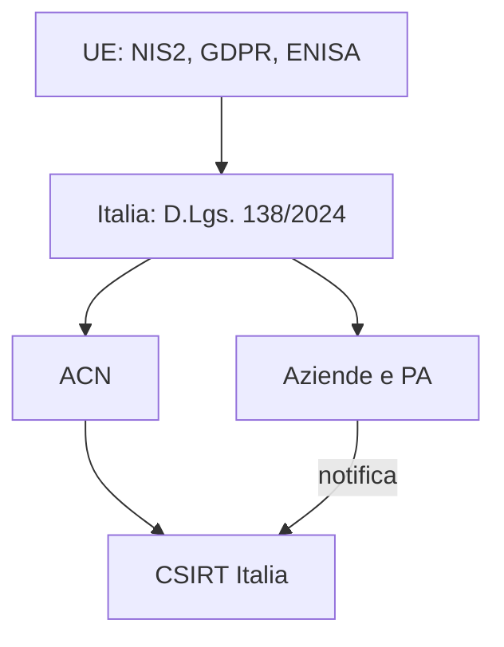

## Contenuti

- Ethical hacking
- Divulgazione coordinata
- Reati informatici
- Quadro istituzionale
- Regole del laboratorio
- Attività: legale o no?
- Aspetti orientativi

## Ethical hacking

- La differenza non è la tecnica, ma l'**autorizzazione**
- Autorizzazione scritta, perimetro definito
- Riservatezza, rapporto finale
- Nessun danno ai servizi e ai dati

## Divulgazione coordinata

- Segnalare al responsabile, senza verificare e senza divulgare
- Pubblicazione dopo la correzione
- Politiche di segnalazione, bug bounty
- ENISA e banca dati europea delle vulnerabilità (EUVD)

## Reati informatici

- **Accesso abusivo** (art. 615-ter c.p.): basta l'accesso a un sistema protetto, o il restarvi contro la volontà del titolare
- Fino a 3 anni; da 2 a 10 anni nei casi aggravati (inaspriti dalla L. 90/2024)
- Anche: codici di accesso altrui (615-quater), danneggiamento di dati (635-bis), frode informatica (640-ter), intercettazione (617-quater)
- Dai 14 anni si può essere penalmente responsabili (art. 98 c.p.)

## Quadro istituzionale

## Regole del laboratorio

1. Solo sistemi propri o forniti dal docente
2. Nessun sistema di terzi senza autorizzazione scritta
3. Nessuna credenziale altrui
4. Piattaforme esterne solo se consentite per l'età
5. Problemi notati: segnalarli al docente, senza verificarli
6. Le tecniche servono a difendersi

## Attività: legale o no?

- Password del compagno indovinata
- Dati di un altro utente visti per caso sul sito della scuola
- Verifica autorizzata per iscritto
- Wi-Fi del vicino
- Elenco di password rubate
- Bug bounty

## Aspetti orientativi

- Penetration tester, red teamer, ricercatore: sempre con contratto e autorizzazione
- Compliance, consulenti NIS2 e privacy, auditor
- Perché l'affidabilità è essenziale in questo lavoro?
