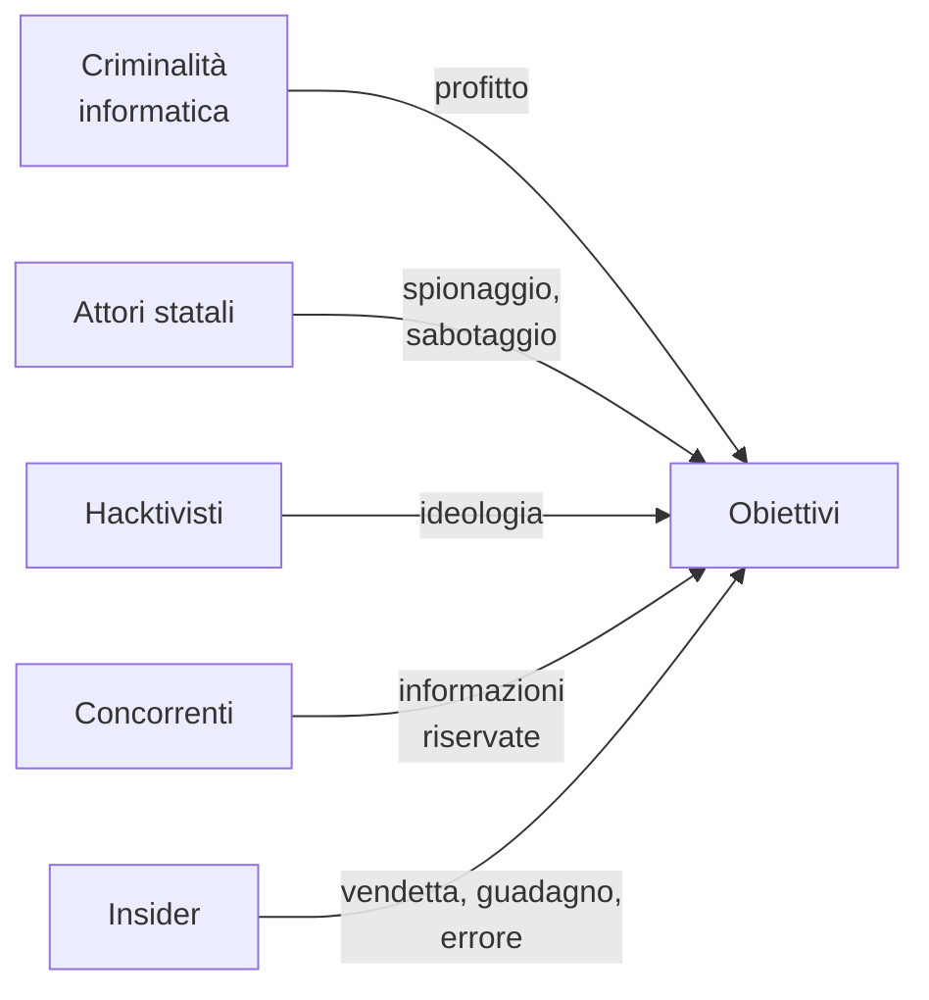

# Lezione 1.3: Minacce e attori

> Fonte: adattamento, tradotto e riscritto, della lezione "Common cybersecurity threats" del corso Microsoft "Security-101", https://github.com/microsoft/Security-101 . Licenza CC0 1.0 (pubblico dominio). Classificazioni, esempi e attività sono contenuto originale.

Le minacce sono descritte a livello concettuale: che cosa sono, quali condizioni le rendono possibili, quale impatto hanno, quali contromisure le contrastano. Gli approfondimenti tecnici, sempre dal punto di vista della difesa, sono nei moduli successivi.

## 1.3.1 Categorie di minacce

| Minaccia | Che cos'è | Condizioni che la favoriscono | Impatto principale (RID) | Contromisure principali | Modulo |
|---|---|---|---|---|---|
| **Malware** | software malevolo: virus, worm, trojan, spyware | programmi da fonti non affidabili, sistemi non aggiornati | tutte | aggiornamenti, antivirus, privilegi minimi | 2, 6 |
| **Ransomware** | malware che cifra i dati e chiede un riscatto; spesso sottrae anche i dati | accessi deboli, assenza di backup separati | disponibilità, riservatezza | backup 3-2-1, autenticazione a più fattori, segmentazione | 6, 7 |
| **Phishing** | messaggi ingannevoli per ottenere credenziali o far eseguire azioni | fretta, fiducia, messaggi credibili | riservatezza | formazione, autenticazione a più fattori, filtri | 6 |
| **Ingegneria sociale** | manipolazione psicologica delle persone | autorità apparente, urgenza, curiosità | tutte | procedure di verifica, formazione | 6 |
| **Attacchi alle credenziali** | tentativi di indovinare o riutilizzare password | password deboli o riutilizzate | riservatezza, integrità | password robuste, gestori di password, MFA | 2 |
| **Negazione del servizio** (DoS, DDoS) | sovraccarico di un servizio per renderlo inutilizzabile | risorse limitate, assenza di protezioni | disponibilità | servizi di protezione, ridondanza | 4 |
| **Vulnerabilità delle applicazioni** | errori di programmazione sfruttabili, per esempio iniezione e XSS | input non validati, codice non revisionato | tutte | sviluppo sicuro, test, aggiornamenti | 5 |
| **Zero-day** | vulnerabilità sconosciuta al produttore, quindi senza correzione | software complesso | tutte | difesa in profondità, monitoraggio | 6 |
| **Attacchi alla catena di fornitura** (supply chain) | compromissione di un fornitore o di un componente usato da molti | fiducia nei fornitori, dipendenze software | tutte | valutazione dei fornitori, verifica dei componenti | 5, 8 |
| **Errori e guasti** | eventi non intenzionali: cancellazioni, guasti, incendi | assenza di procedure e copie | disponibilità, integrità | backup, procedure, ridondanza | 7 |

Due osservazioni:

- molti attacchi combinano più categorie: un messaggio di phishing può installare un malware che poi cifra i dati (ransomware)
- il fattore umano è coinvolto nella maggior parte degli incidenti: per questo la formazione è una contromisura di primo livello

## 1.3.2 Gli attori

Chi sono gli **agenti di minaccia** e che cosa li muove:

- **criminalità informatica**: motivazione economica; ransomware, frodi, vendita di dati. Spesso organizzata come un'impresa, con servizi offerti ad altri criminali.
- **attori statali**: spionaggio, sabotaggio, influenza politica; grandi risorse e attacchi prolungati nel tempo.
- **hacktivisti**: motivazione politica o ideologica; spesso attacchi dimostrativi alla disponibilità dei siti.
- **concorrenti**: spionaggio industriale.
- **minacce interne** (insider): persone dell'organizzazione, che agiscono per vendetta o guadagno, oppure, più spesso, per errore o disattenzione.

Conoscere motivazioni e metodi degli attori aiuta a stabilire le priorità della difesa: una piccola azienda è raramente bersaglio di uno stato, ma è un bersaglio frequente di ransomware e phishing, che colpiscono in modo opportunistico chi ha difese deboli.

## 1.3.3 La conoscenza al servizio della difesa

I difensori condividono informazioni sulle minacce per anticiparle:

- **avvisi di sicurezza**: bollettini di CSIRT Italia e dei produttori di software sulle nuove vulnerabilità e sulle correzioni disponibili
- **banche dati delle vulnerabilità**: ogni vulnerabilità nota riceve un identificativo pubblico (CVE); in Europa ENISA gestisce la banca dati EUVD (lezione 1.2)
- **basi di conoscenza sulle tecniche degli attaccanti**, come MITRE ATT&CK, usate dai difensori per verificare quali comportamenti sono in grado di rilevare

L'attività di raccolta e analisi di queste informazioni si chiama **threat intelligence**.

## 1.3.4 Attività: classificare le notizie

Tempo indicativo: 30 minuti, a gruppi.

1. Ogni gruppo cerca su fonti giornalistiche affidabili due notizie recenti di incidenti informatici in Italia o in Europa.
2. Per ciascuna compila la scheda:

| Campo | Contenuto |
|---|---|
| Vittima e settore | |
| Tipo di minaccia (tabella 1.3.1) | |
| Probabile attore e motivazione | |
| Proprietà RID colpite | |
| Impatto su persone e servizi | |
| Contromisure che avrebbero potuto ridurre il danno | |
| Fonti (URL) | |

3. Presentazione in 3 minuti per gruppo; confronto finale: quali minacce ricorrono più spesso?

Attenzione alle fonti: preferire testate giornalistiche note, comunicati ufficiali delle organizzazioni coinvolte e avvisi istituzionali; diffidare di post anonimi e titoli sensazionalistici.

### Esercizi

1. Spiegare perché il ransomware moderno colpisce sia la disponibilità sia la riservatezza.
2. Indicare quale attore è più probabile per ciascun caso: il sito di un ministero reso irraggiungibile per protesta; i progetti di un'azienda meccanica copiati; i file di uno studio medico cifrati con richiesta di pagamento.
3. Per la scuola, individuare le tre minacce più probabili e una contromisura per ciascuna.

## 1.3.5 Aspetti orientativi (discussione)

- Analista di threat intelligence, analista di un centro operativo di sicurezza (SOC), specialista di risposta agli incidenti: professioni che partono dalla conoscenza delle minacce per organizzare la difesa.
- La sicurezza richiede aggiornamento continuo: le minacce cambiano ogni anno.
- Domanda: perché la formazione delle persone è considerata una delle contromisure più efficaci?
