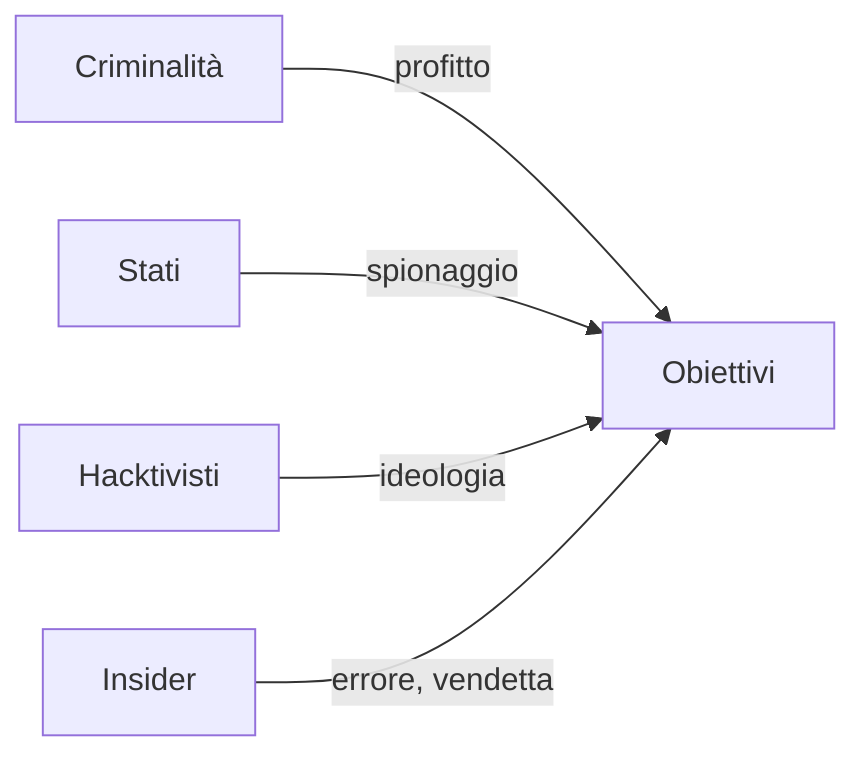

## Lezione 1.3: Minacce e attori

Modulo 1: Fondamenti, etica e legge. Cybersecurity ed Ethical Hacking

Fonte: adattamento da Microsoft, "Security-101", licenza CC0
https://github.com/microsoft/Security-101

---

## Categorie di minacce

| Minaccia | Contromisure principali |
|---|---|
| Malware, ransomware | aggiornamenti, backup 3-2-1, privilegi minimi |
| Phishing, ingegneria sociale | formazione, MFA, procedure di verifica |
| Attacchi alle credenziali | password robuste, gestori di password, MFA |
| Negazione del servizio | protezioni, ridondanza |
| Vulnerabilità applicative, zero-day | sviluppo sicuro, test, monitoraggio |
| Catena di fornitura | valutazione dei fornitori |
| Errori e guasti | backup, procedure |

---

## Gli attori

Attacchi opportunistici: bersaglio chi ha difese deboli

---

## Conoscenza per la difesa

- Avvisi di CSIRT Italia e dei produttori
- Identificativi CVE, banca dati europea EUVD
- MITRE ATT&CK
- **Threat intelligence**

---

## Attività: classificare le notizie

- Due notizie recenti per gruppo
- Vittima, minaccia, attore, proprietà RID, impatto, contromisure, fonti
- Solo fonti affidabili

---

## Aspetti orientativi

- Analista di threat intelligence, analista SOC, incident responder
- Aggiornamento continuo
- Perché la formazione delle persone è così efficace?
