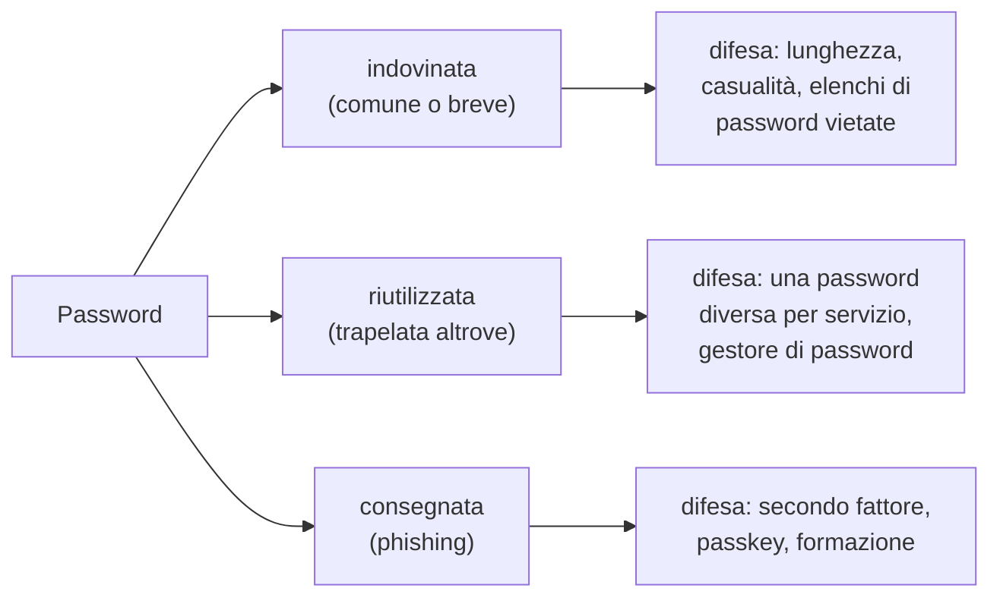

# Lezione 2.1: Password robuste

Contenuto originale. Riferimenti: NIST SP 800-63B, revisione 4 (agosto 2025); documentazione di Python. Gli script del laboratorio sono nella cartella `laboratorio` di questa lezione.

## 2.1.1 Identità, autenticazione, fattori

- **Identità digitale**: l'insieme delle informazioni che rappresentano una persona (o un dispositivo, un programma) in un sistema: per esempio un nome utente con i suoi attributi.
- **Autenticazione**: verifica che chi si presenta sia davvero il titolare dell'identità dichiarata. Risponde alla domanda "chi sei?".
- **Autorizzazione**: stabilisce che cosa può fare un'identità già autenticata (lezione 2.4). Risponde alla domanda "che cosa puoi fare?".

L'autenticazione si basa su uno o più **fattori**:

| Fattore | Esempi |
|---|---|
| qualcosa che si **conosce** | password, PIN, passphrase |
| qualcosa che si **possiede** | telefono con app di autenticazione, chiave di sicurezza, smart card |
| qualcosa che si **è** | impronta digitale, riconoscimento del volto |

La password è il fattore più diffuso e anche il più debole: può essere indovinata, riutilizzata, rubata, ceduta con l'inganno. Questa lezione tratta le password; la lezione 2.3 i fattori aggiuntivi.

## 2.1.2 Perché le password vengono compromesse

Le modalità principali, descritte a livello concettuale:

- **tentativi di indovinare in linea**: prove ripetute direttamente sulla pagina di accesso. Sono lente e rilevabili: un servizio ben progettato limita il numero di tentativi e segnala gli accessi sospetti.
- **tentativi fuori linea**: se un attaccante sottrae l'archivio delle password di un servizio, può provare combinazioni sul proprio computer, senza limiti di numero e senza essere visto. Qui contano la robustezza della password e il modo in cui il servizio la conserva (lezione 2.2).
- **password comuni e prevedibili**: gli attaccanti provano per prime le password più diffuse (`123456`, `password`, nomi, date, parole del dizionario con piccole variazioni) perché sono molto frequenti.
- **riuso** (credential stuffing): le coppie nome utente e password sottratte a un servizio vengono provate automaticamente su altri servizi. Una password robusta ma riutilizzata è debole quanto il servizio meno protetto in cui è stata usata.
- **phishing e ingegneria sociale**: la password viene consegnata dall'utente stesso, ingannato da un messaggio o da una pagina falsa (modulo 6). Contro questo la robustezza della password non serve: serve un secondo fattore resistente al phishing (lezione 2.3).



## 2.1.3 Entropia

L'**entropia** misura, in bit, quanto è imprevedibile un segreto. Un segreto con *H* bit di entropia richiede, nel caso peggiore, 2^*H* tentativi per essere indovinato provando tutte le combinazioni; in media la metà.

Se una password di lunghezza *L* è **generata a caso** scegliendo ogni simbolo tra *N* simboli possibili:

*H* = *L* · log₂ *N*

Per una **passphrase** di *k* parole scelte a caso da una lista di *W* parole:

*H* = *k* · log₂ *W*

| Segreto generato a caso | Simboli o parole disponibili | Entropia |
|---|---|---|
| 8 cifre | 10 | 26,6 bit |
| 8 lettere minuscole | 26 | 37,6 bit |
| 8 lettere e cifre | 62 | 47,6 bit |
| 12 lettere e cifre | 62 | 71,5 bit |
| 16 lettere e cifre | 62 | 95,3 bit |
| 5 parole da una lista di 7776 | 7776 | 64,6 bit |
| 6 parole da una lista di 7776 | 7776 | 77,5 bit |

Osservazioni:

- ogni bit in più **raddoppia** il numero di combinazioni: la lunghezza conta più della varietà dei simboli
- le formule valgono **solo per segreti generati a caso**. Una password inventata da una persona, per esempio `Estate2024!`, rispetta le regole "maiuscola, cifra, simbolo" ma segue schemi prevedibili (parola, anno, punto esclamativo finale) che gli attaccanti provano per primi: la sua entropia reale è molto più bassa di quella calcolata con la formula
- una passphrase di parole casuali è lunga, quindi robusta, e più facile da ricordare di una stringa di simboli casuali

## 2.1.4 Raccomandazioni attuali

Le linee guida del NIST (National Institute of Standards and Technology, Stati Uniti), riferimento internazionale per l'autenticazione, nella revisione 4 del documento SP 800-63B (agosto 2025) stabiliscono tra l'altro che i servizi:

- richiedano almeno **15 caratteri** per le password usate come unico fattore, e almeno 8 se usate insieme ad altri fattori
- accettino password lunghe, almeno 64 caratteri, e tutti i caratteri stampabili, compreso lo spazio
- **non impongano regole di composizione** (obbligo di maiuscole, cifre, simboli), che portano a password prevedibili
- **non impongano cambi periodici** della password, ma la facciano cambiare se ci sono indizi di compromissione
- confrontino le nuove password con un **elenco di password vietate**: comuni, prevedibili o già trapelate
- permettano l'uso dei **gestori di password** e dell'incolla

Testo (in inglese): https://pages.nist.gov/800-63-4/sp800-63b.html

Buone pratiche per l'utente:

- una password **diversa per ogni servizio**, generata a caso e conservata in un gestore di password (lezione 2.3)
- per le poche password da ricordare (gestore di password, account principale del telefono), una **passphrase** di parole casuali
- attivare il **secondo fattore** dove disponibile, a partire da posta elettronica e account principali
- non comunicare mai la password, nemmeno a chi dichiara di essere un tecnico o un docente

## 2.1.5 Laboratorio: entropia e generazione

Tempo indicativo: 30 minuti. Cartella di lavoro `C:\corso-cyber\lab21`, con i file della cartella `laboratorio` di questa lezione.

Python si installa dal sito ufficiale, https://www.python.org/downloads/windows/ . Sui PC senza diritti di amministratore si può usare l'installazione per il solo utente corrente oppure il pacchetto ZIP "embeddable", da scompattare in una cartella come gli strumenti del Corso 1.

### Parte 1: calcolo dell'entropia

Il file `entropia.py` contiene:

```python
import math

def entropia_casuale(n_simboli, lunghezza):
    """Bit di entropia di una password di `lunghezza` simboli scelti a caso tra `n_simboli`."""
    return lunghezza * math.log2(n_simboli)

def entropia_passphrase(n_parole, dimensione_lista):
    """Bit di entropia di `n_parole` parole scelte a caso da una lista di `dimensione_lista` parole."""
    return n_parole * math.log2(dimensione_lista)

def anni_per_esaurire(bit, tentativi_al_secondo):
    """Anni necessari, in media, per trovare il segreto provando tutte le combinazioni."""
    secondi = (2 ** bit / 2) / tentativi_al_secondo
    return secondi / (365 * 24 * 3600)
```

- `math.log2(x)` calcola il logaritmo in base 2.
- `2 ** bit / 2`: numero di combinazioni diviso 2, cioè il numero medio di tentativi.

Eseguire nel terminale:

```powershell
python entropia.py
```

Output (le due password generate cambiano a ogni esecuzione):

```text
Password casuali
  8 cifre                  26.6 bit
  8 lettere minuscole      37.6 bit
  8 lettere e cifre        47.6 bit
  12 lettere e cifre       71.5 bit
  16 lettere e cifre       95.3 bit
Passphrase casuali (lista di 7776 parole)
  4 parole                 51.7 bit
  5 parole                 64.6 bit
  6 parole                 77.5 bit
Anni per esaurire 40 bit e 80 bit, con 10 miliardi di tentativi al secondo
  40 bit: 55 secondi
  80 bit: 1.92e+06 anni
Esempi generati: K0Wf4TB3eW31bzUv tavolo-neve-domino-sedia-isola
```

Il valore di 10 miliardi di tentativi al secondo è un ordine di grandezza realistico per tentativi fuori linea su un archivio conservato con una funzione di hash veloce (lezione 2.2). Passare da 40 a 80 bit porta il tempo da meno di un minuto a quasi due milioni di anni.

### Parte 2: generazione sicura

```python
import secrets
import string

def genera_password(lunghezza=16, alfabeto=string.ascii_letters + string.digits):
    """Password casuale generata con il modulo secrets."""
    return "".join(secrets.choice(alfabeto) for _ in range(lunghezza))

def genera_passphrase(n_parole=5, lista=PAROLE, separatore="-"):
    """Passphrase di parole scelte a caso dalla lista."""
    return separatore.join(secrets.choice(lista) for _ in range(n_parole))
```

- Il modulo `secrets` produce numeri casuali adatti alla sicurezza. Il modulo `random`, usato per simulazioni e giochi, **non va usato** per generare segreti: i suoi valori sono prevedibili conoscendone lo stato interno. Documentazione: https://docs.python.org/3/library/secrets.html
- `string.ascii_letters + string.digits` è la stringa delle 52 lettere maiuscole e minuscole e delle 10 cifre.
- La lista `PAROLE` del file contiene 32 parole a scopo dimostrativo: una passphrase di 5 parole da questa lista ha solo 25 bit di entropia. Le liste usate in pratica contengono migliaia di parole.

Attività:

1. In console Python (`python`, poi `from entropia import *`) calcolare l'entropia di: un PIN di 6 cifre; una password di 20 caratteri scelti tra 94 simboli stampabili; una passphrase di 5 parole dalla lista del file. Confrontare i risultati.
2. Calcolare quante parole deve avere una passphrase dalla lista di 32 parole per raggiungere 64 bit.
3. Modificare `genera_passphrase` in modo che aggiunga alla fine una cifra casuale, e calcolare di quanto aumenta l'entropia.

### Parte 3 (facoltativa, con il docente): password trapelate

Il file `password_compromessa.py` verifica se una password compare negli elenchi di password trapelate raccolti dal servizio pubblico Pwned Passwords. Il servizio usa la tecnica della **k-anonimity**: il programma calcola l'impronta SHA-1 della password e invia al servizio solo i primi 5 caratteri; il servizio restituisce l'elenco di tutte le impronte che iniziano così, circa 800, e il confronto completo avviene sul computer dell'utente. La password non lascia mai il PC. Documentazione: https://haveibeenpwned.com/API/v3#PwnedPasswords

```powershell
python password_compromessa.py
```

Si usano solo password di prova, per esempio `password123`, che risulta presente milioni di volte. Anche su un PC personale è buona pratica non digitare le proprie password reali in programmi di cui non si è letto il codice. È lo stesso controllo che, secondo le linee guida NIST, i servizi dovrebbero fare quando un utente sceglie una nuova password.

### Esercizi

1. Spiegare perché `Estate2024!` è una password debole anche se contiene maiuscole, cifre e simboli.
2. Un servizio limita i tentativi di accesso a 10 all'ora. Calcolare quanto tempo serve, in media, per indovinare un PIN di 4 cifre scelto a caso. Perché lo stesso PIN sarebbe inadeguato se l'archivio del servizio venisse sottratto?
3. Scrivere una funzione `valuta(password, vietate)` che restituisce un elenco di problemi: meno di 15 caratteri, presenza nell'elenco `vietate`, password composta da un solo carattere ripetuto.

## 2.1.6 Aspetti orientativi (discussione)

- La gestione delle identità e degli accessi (IAM, Identity and Access Management) è un settore professionale specifico, con figure dedicate in tutte le organizzazioni medie e grandi.
- Le raccomandazioni cambiano con l'evoluzione delle tecniche: le regole di composizione e i cambi periodici, obbligatori per anni, oggi sono sconsigliati. Chi lavora nella sicurezza deve aggiornarsi continuamente sulle fonti ufficiali.
- Domanda: quante password diverse usa ciascuno, e quante sono riutilizzate su più servizi?
