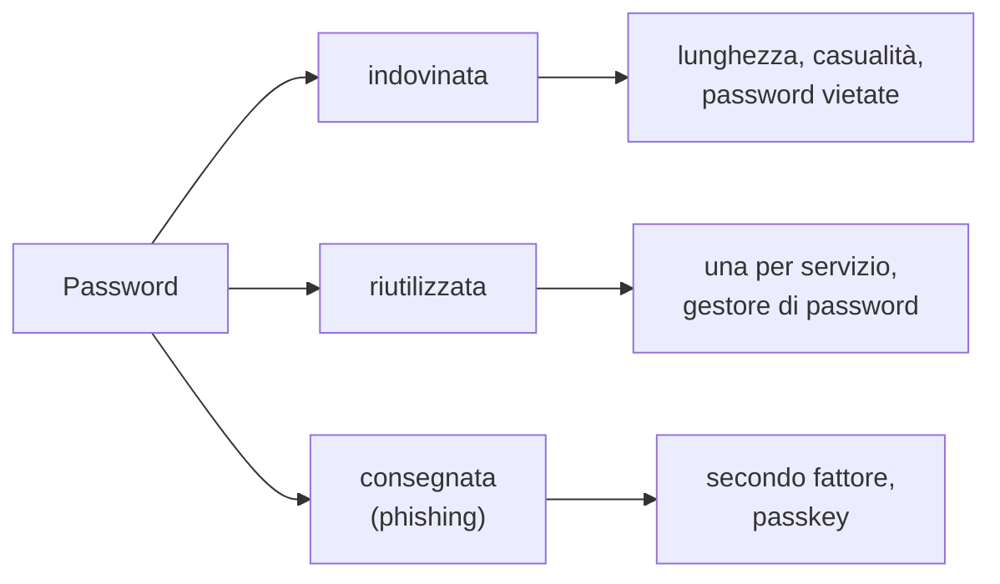

## Lezione 2.1: Password robuste

Modulo 2: Identità e autenticazione. Cybersecurity ed Ethical Hacking

---

## Identità, autenticazione, fattori

- **Autenticazione**: chi sei? **Autorizzazione**: che cosa puoi fare?
- Fattori: qualcosa che si **conosce**, si **possiede**, si **è**
- La password: il fattore più diffuso e il più debole

---

## Perché le password vengono compromesse



Tentativi in linea (limitabili) e fuori linea (dopo il furto di un archivio)

---

## Entropia

*H* = *L* · log₂ *N*    passphrase: *H* = *k* · log₂ *W*

| Generato a caso | Entropia |
|---|---|
| 8 lettere e cifre | 47,6 bit |
| 16 lettere e cifre | 95,3 bit |
| 6 parole su 7776 | 77,5 bit |

- Ogni bit raddoppia le combinazioni: conta la lunghezza
- Valida solo per segreti **casuali**: `Estate2024!` è debole

---

## Raccomandazioni NIST SP 800-63B (2025)

- Almeno **15 caratteri** se la password è l'unico fattore
- Nessuna regola di composizione obbligatoria
- Nessun cambio periodico obbligatorio
- Confronto con elenchi di password **vietate** o trapelate
- Gestori di password e incolla consentiti

---

## Laboratorio

```python
def entropia_casuale(n_simboli, lunghezza):
    return lunghezza * math.log2(n_simboli)

def genera_password(lunghezza=16, alfabeto=string.ascii_letters + string.digits):
    return "".join(secrets.choice(alfabeto) for _ in range(lunghezza))
```

- 40 bit: 55 secondi; 80 bit: quasi 2 milioni di anni (10^10 tentativi/s)
- `secrets`, non `random`
- Facoltativo: Pwned Passwords, solo 5 caratteri dell'impronta inviati

---

## Aspetti orientativi

- Gestione delle identità e degli accessi (IAM): settore professionale specifico
- Le raccomandazioni cambiano: aggiornarsi sulle fonti ufficiali
- Quante password riutilizzate usa ciascuno?
