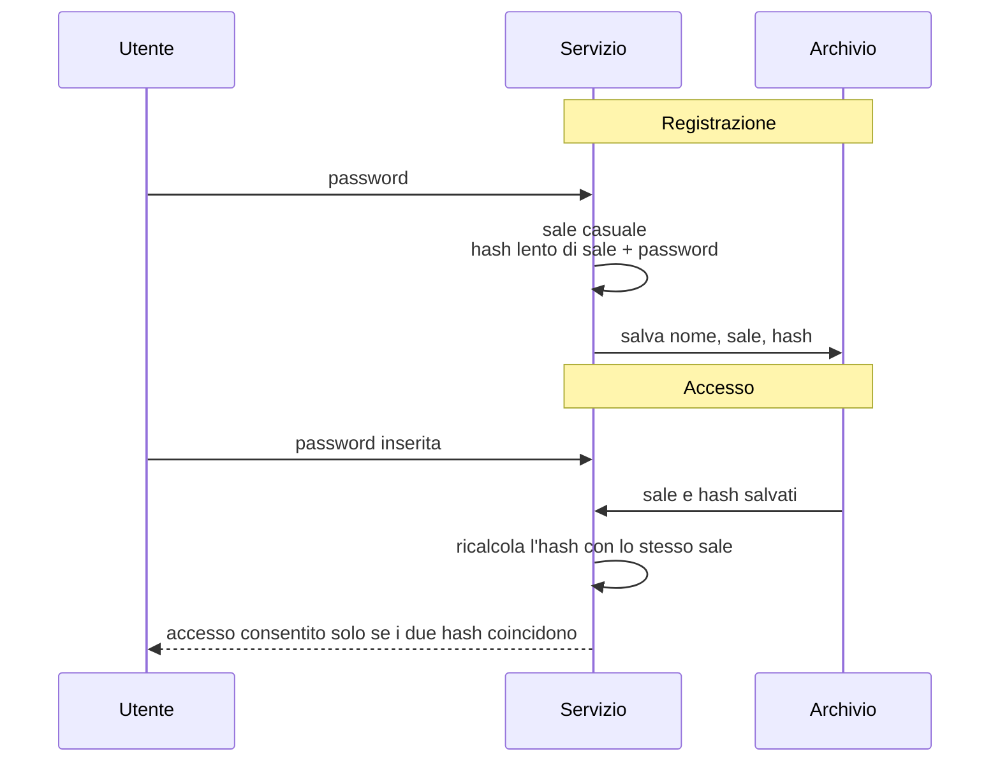

# Lezione 2.2: Laboratorio: hashing delle password

Contenuto originale. Riferimenti: OWASP Password Storage Cheat Sheet; documentazione del modulo `hashlib` di Python. Gli script sono nella cartella `laboratorio` di questa lezione.

Obiettivo: capire come un servizio deve conservare le password dei propri utenti, e realizzarne una versione corretta in Python, verificata con test automatici.

## 2.2.1 Il problema: conservare una password senza conservarla

Per verificare una password al momento dell'accesso, un servizio deve confrontarla con qualcosa di salvato. Salvare le password **in chiaro** è l'errore più grave: chi sottrae l'archivio, o chi lo amministra, le conosce tutte, e molti utenti le riutilizzano su altri servizi (lezione 2.1).

Soluzione: salvare non la password, ma il risultato di una **funzione di hash**.

## 2.2.2 Funzioni di hash

Una **funzione di hash crittografica** trasforma dati di qualunque lunghezza in un valore di lunghezza fissa, detto **hash**, **impronta** o **digest**, con queste proprietà:

- **deterministica**: lo stesso input produce sempre lo stesso hash
- **unidirezionale**: dall'hash non si può risalire all'input, se non provando input diversi
- **resistente alle collisioni**: è impraticabile trovare due input con lo stesso hash
- **effetto valanga**: una minima modifica dell'input cambia completamente l'hash

```python
import hashlib
hashlib.sha256(b"ciao").hexdigest()
# 'b133a0c0e9bee3be20163d2ad31d6248db292aa6dcb1ee087a2aa50e0fc75ae2'
hashlib.sha256(b"Ciao").hexdigest()
# un valore completamente diverso
```

SHA-256 produce impronte di 256 bit (64 cifre esadecimali). Le funzioni di hash si usano anche per verificare l'integrità dei file scaricati (lezione 3.2).

Accesso con password salvate come hash:



## 2.2.3 Perché SHA-256 da solo non basta

Due problemi, entrambi rilevanti in caso di furto dell'archivio:

1. **Stessa password, stesso hash**: senza altri accorgimenti, due utenti con la stessa password hanno lo stesso hash. Chi sottrae l'archivio vede subito quali utenti condividono la password, e può usare **tabelle precalcolate** con gli hash di milioni di password comuni: un solo calcolo fatto in anticipo serve per tutti gli archivi.
2. **Velocità**: SHA-256 è progettata per essere veloce, e un computer con una scheda grafica ne calcola miliardi al secondo. Per chi prova password fuori linea, una funzione veloce è un vantaggio.

Contromisure:

- **sale** (salt): valore casuale diverso per ogni utente, salvato in chiaro accanto all'hash e combinato con la password prima del calcolo. Due password uguali producono hash diversi e le tabelle precalcolate diventano inutili. Il sale non è segreto: il suo scopo è rendere unico ogni calcolo.
- **funzione lenta**: funzioni di derivazione progettate per richiedere molto tempo e, in alcuni casi, molta memoria per ogni calcolo. Per l'utente che accede una volta, un tempo di qualche decimo di secondo è irrilevante; per chi deve provare miliardi di password diventa un ostacolo enorme.

Algoritmi raccomandati dall'OWASP, in ordine di preferenza (https://cheatsheetseries.owasp.org/cheatsheets/Password_Storage_Cheat_Sheet.html):

| Algoritmo | Parametri minimi raccomandati | Note |
|---|---|---|
| Argon2id | 19 MiB di memoria, 2 iterazioni, parallelismo 1 | vincitore della Password Hashing Competition (2015) |
| scrypt | N = 2^17 (128 MiB), r = 8, p = 1 | se Argon2id non è disponibile |
| bcrypt | fattore di costo almeno 10 | solo per sistemi esistenti; massimo 72 byte di input |
| PBKDF2-HMAC-SHA256 | 600.000 iterazioni | richiesto per la conformità FIPS-140 |

Nel laboratorio si usa PBKDF2, disponibile nella libreria standard di Python senza installare altro. Nei progetti reali si preferisce Argon2id, con una libreria dedicata.

## 2.2.4 Laboratorio, parte 1: il confronto

Tempo indicativo: 15 minuti. Cartella `C:\corso-cyber\lab22`, con i file della cartella `laboratorio` di questa lezione.

```powershell
python confronto_hash.py
```

Output di esempio (sali, valori e tempi cambiano a ogni esecuzione e da un computer all'altro):

```text
1. SHA-256 senza sale: la stessa password dà sempre lo stesso valore
   anna: bc1139de6898addd36a86b12608b445e0f3132c074a49cbdbc1523c3552a05dd
   bruno: bc1139de6898addd36a86b12608b445e0f3132c074a49cbdbc1523c3552a05dd
2. Con un sale casuale diverso per ogni utente i valori sono diversi
   anna: sale 78f7e0f86974...  valore de031cab93164d211f25ab7a...
   bruno: sale c457e0dddc82...  valore 7273c95b518fca18f734c48e...
3. Costo di un singolo calcolo
   SHA-256:                      0.51 microsecondi
   PBKDF2 con 600000 iterazioni: 171 millisecondi
   rapporto: circa 337.205 volte più lento
```

Con PBKDF2 a 600.000 iterazioni ogni tentativo costa circa 300.000 volte di più che con SHA-256: una prova che richiederebbe un giorno con SHA-256 ne richiederebbe circa 900 anni. Sul proprio computer l'utente attende solo qualche decimo di secondo al momento dell'accesso.

## 2.2.5 Laboratorio, parte 2: un archivio di utenti corretto

Il file `archivio_password.py`:

```python
import hashlib
import hmac
import json
import secrets

ALGORITMO = "pbkdf2_sha256"
ITERAZIONI = 600_000      # valore raccomandato da OWASP per PBKDF2-HMAC-SHA256
LUNGHEZZA_SALE = 16       # byte


def deriva(password, sale, iterazioni=ITERAZIONI):
    """Valore derivato dalla password con PBKDF2-HMAC-SHA256."""
    return hashlib.pbkdf2_hmac("sha256", password.encode("utf-8"), sale, iterazioni)


def crea_record(password):
    """Record da salvare al posto della password: algoritmo, iterazioni, sale, valore derivato."""
    sale = secrets.token_bytes(LUNGHEZZA_SALE)
    return {
        "algoritmo": ALGORITMO,
        "iterazioni": ITERAZIONI,
        "sale": sale.hex(),
        "hash": deriva(password, sale).hex(),
    }


def verifica_password(password, record):
    """True se la password corrisponde al record salvato."""
    if record["algoritmo"] != ALGORITMO:
        raise ValueError("algoritmo non supportato")
    sale = bytes.fromhex(record["sale"])
    calcolato = deriva(password, sale, record["iterazioni"])
    # confronto a tempo costante: non rivela quanti byte iniziali coincidono
    return hmac.compare_digest(calcolato, bytes.fromhex(record["hash"]))
```

Scelte di progetto:

- `hashlib.pbkdf2_hmac("sha256", password, sale, iterazioni)` applica ripetutamente HMAC-SHA256 per il numero di iterazioni indicato. La password va convertita in byte con `encode("utf-8")`. Documentazione: https://docs.python.org/3/library/hashlib.html
- `secrets.token_bytes(16)` genera un sale casuale di 16 byte, come raccomanda la documentazione di Python.
- `.hex()` e `bytes.fromhex(...)` convertono i byte in testo esadecimale e viceversa, per salvarli in un file JSON.
- nel record sono salvati anche **algoritmo e numero di iterazioni**: quando in futuro si vorrà aumentare il costo o cambiare algoritmo, i record vecchi resteranno verificabili e potranno essere aggiornati al successivo accesso di ciascun utente.
- `hmac.compare_digest(a, b)` confronta i due valori in un tempo che non dipende dal punto in cui differiscono. Un confronto normale con `==` si ferma al primo byte diverso, e il tempo di risposta potrebbe dare indizi a chi misura molte risposte.

La classe `Archivio` dello stesso file salva gli utenti in un file JSON e offre i metodi `registra(nome, password)` e `login(nome, password)`. Per un utente inesistente `login` restituisce `False` come per una password errata: rispondere in modo diverso ("utente inesistente") permetterebbe di scoprire quali nomi utente esistono.

Contenuto del file `utenti.json` dopo una registrazione: non contiene la password.

```json
{
  "anna": {
    "algoritmo": "pbkdf2_sha256",
    "iterazioni": 600000,
    "sale": "3f9c0e...",
    "hash": "a41d77..."
  }
}
```

### Test automatici

```powershell
python test_archivio_password.py
```

```text
OK      password corretta accettata
OK      password errata rifiutata
OK      stessa password, sali diversi
OK      stessa password, valori salvati diversi
OK      il record non contiene la password
OK      login corretto
OK      login con password errata
OK      login di utente inesistente
OK      login dopo la riapertura del file
OK      registrazione doppia rifiutata
Test superati: 10, falliti: 0
```

L'esecuzione richiede qualche secondo: ogni verifica esegue 600.000 iterazioni.

### Attività

Tempo indicativo: 30 minuti.

1. Eseguire i test, poi aprire `utenti.json` creato da una prova in console:

```python
from archivio_password import Archivio
a = Archivio("utenti.json")
a.registra("anna", "tavolo-razzo-neve-gatto")
a.login("anna", "tavolo-razzo-neve-gatto")    # True
a.login("anna", "tavolo")                     # False
```

2. Registrare due utenti con la stessa password e verificare nel file che sali e hash siano diversi.
3. Portare temporaneamente `ITERAZIONI` a 1.000 e poi a 2.000.000, misurando ogni volta il tempo di `login` con il modulo `time`. Discutere: come si sceglie il valore? Chi paga il costo?
4. Aggiungere a `Archivio` il metodo `cambia_password(nome, vecchia, nuova)`, che cambia la password solo se la vecchia è corretta, con due test.
5. Aggiungere un test che verifichi che `verifica_password` rifiuti un record con algoritmo sconosciuto.

### Approfondimento: scrypt

La libreria standard offre anche scrypt, preferibile a PBKDF2 perché richiede molta memoria per ogni calcolo e quindi rende costosi i tentativi in parallelo con hardware specializzato. Con i parametri minimi OWASP occorre alzare il limite di memoria predefinito di Python (32 MiB):

```python
import hashlib, secrets
sale = secrets.token_bytes(16)
valore = hashlib.scrypt(b"password di prova", salt=sale, n=2**17, r=8, p=1,
                        maxmem=256 * 1024 * 1024, dklen=32)
```

Esercizio: realizzare una seconda versione di `deriva` basata su scrypt, con `"scrypt"` come valore di `algoritmo` nel record, in modo che l'archivio possa contenere record dei due tipi.

## 2.2.6 Aspetti orientativi (discussione)

- Gli errori nella conservazione delle password sono tra le cause più frequenti di danni gravi dopo il furto di un database: la sicurezza dipende anche da scelte di programmazione apparentemente semplici.
- Lo sviluppo sicuro (secure coding) è una competenza richiesta a tutti gli sviluppatori, non solo agli specialisti di sicurezza; alcune aziende hanno figure dedicate alla revisione del codice dal punto di vista della sicurezza (application security engineer).
- Domanda: se un servizio invia per email la password dimenticata, invece di un collegamento per crearne una nuova, che cosa si può dedurre sul modo in cui conserva le password?
