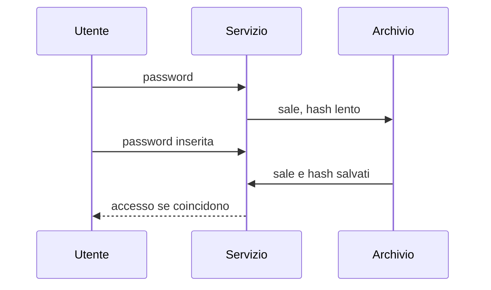

## Lezione 2.2: Laboratorio: hashing delle password

Modulo 2: Identità e autenticazione. Cybersecurity ed Ethical Hacking

---

## Funzioni di hash

- Deterministiche, unidirezionali, resistenti alle collisioni
- Effetto valanga: `ciao` e `Ciao` danno impronte completamente diverse
- SHA-256: impronta di 256 bit

Mai salvare le password in chiaro

---

## Registrazione e accesso



---

## Perché SHA-256 da solo non basta

- Stessa password, stesso hash: tabelle precalcolate
- Troppo veloce: miliardi di tentativi al secondo

Contromisure: **sale** casuale per utente, funzione **lenta**

| Algoritmo (OWASP) | Parametri minimi |
|---|---|
| Argon2id | 19 MiB, 2 iterazioni |
| scrypt | N = 2^17, r = 8, p = 1 |
| PBKDF2-HMAC-SHA256 | 600.000 iterazioni |

---

## Il confronto

- SHA-256: circa 0,5 microsecondi
- PBKDF2 a 600.000 iterazioni: circa 0,2 secondi
- Circa 300.000 volte più lento per chi prova password fuori linea

---

## Archivio corretto in Python

```python
sale = secrets.token_bytes(16)
valore = hashlib.pbkdf2_hmac("sha256", password.encode("utf-8"), sale, 600_000)
# record: algoritmo, iterazioni, sale, hash
hmac.compare_digest(calcolato, salvato)   # confronto a tempo costante
```

- Stessa risposta per utente inesistente e password errata
- 10 test automatici

---

## Aspetti orientativi

- Conservazione delle password: errori frequenti con danni gravi
- Sviluppo sicuro, application security engineer
- Un servizio che invia la password dimenticata per email: che cosa se ne deduce?
