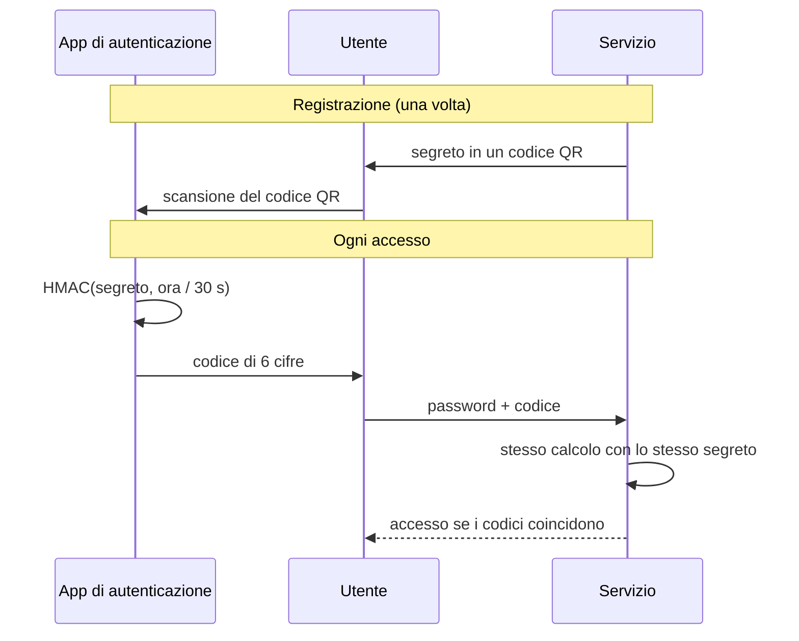

# Lezione 2.3: Autenticazione a più fattori e gestori di password

Contenuto originale. Riferimenti: RFC 6238 (TOTP), FIDO Alliance (passkey), documentazione di KeePassXC. Gli script sono nella cartella `laboratorio` di questa lezione.

## 2.3.1 Autenticazione a più fattori

L'**autenticazione a più fattori** (MFA, Multi-Factor Authentication; con due fattori si parla di 2FA) richiede elementi appartenenti ad almeno due categorie diverse tra conoscenza, possesso e inerenza (lezione 2.1). Una password rubata non basta più: serve anche, per esempio, il telefono dell'utente.

Due password, o una password e una domanda segreta, non sono MFA: sono entrambe "qualcosa che si conosce".

Metodi più diffusi, dal meno al più sicuro:

| Metodo | Come funziona | Limiti |
|---|---|---|
| Codice via SMS | il servizio invia un codice al numero di telefono | l'SMS può essere intercettato o dirottato con il trasferimento fraudolento del numero su un'altra SIM (SIM swapping); il codice può essere consegnato a una pagina di phishing |
| Codice temporaneo (TOTP) da app | un'app calcola un codice che cambia ogni 30 secondi | il codice può ancora essere digitato su una pagina di phishing, entro pochi secondi |
| Notifica da approvare sull'app | il servizio invia una richiesta, l'utente la approva | l'utente può approvare per distrazione o per sfinimento se riceve molte richieste (MFA fatigue): servono numeri da confrontare e segnalazione delle richieste non attese |
| Chiave di sicurezza fisica o **passkey** | crittografia a chiave pubblica legata al sito | resistente al phishing |

Anche il metodo meno sicuro della tabella è molto più sicuro della sola password: la raccomandazione è attivare comunque un secondo fattore, scegliendo il migliore disponibile.

## 2.3.2 Come funziona un codice TOTP

Il **TOTP** (Time-based One-Time Password, RFC 6238) è l'algoritmo delle app di autenticazione.

1. **Registrazione**: il servizio genera un **segreto** casuale e lo mostra come codice QR; l'app lo legge e lo conserva. È l'unico momento in cui il segreto viaggia.
2. **Accesso**: app e servizio calcolano, ciascuno per conto proprio, `codice = HMAC(segreto, numero di intervalli di 30 secondi trascorsi dal 1° gennaio 1970)`, ridotto a 6 cifre. Se gli orologi sono sincronizzati, ottengono lo stesso codice.



Testo della specifica: https://datatracker.ietf.org/doc/html/rfc6238

Il codice cambia ogni 30 secondi e non può essere ricavato dai codici precedenti senza conoscere il segreto. Per questo il segreto va protetto come una password: chi lo possiede può generare codici validi.

## 2.3.3 Passkey

Le **passkey** sostituiscono la password con una coppia di chiavi crittografiche (cifratura asimmetrica, lezione 3.2):

- la **chiave privata** resta sul dispositivo dell'utente (telefono, computer, chiave di sicurezza) ed è sbloccata con impronta, volto o PIN locale
- il servizio conserva solo la **chiave pubblica**: un furto del suo archivio non rivela segreti utilizzabili
- ogni passkey è legata al dominio del sito: una pagina di phishing con un indirizzo diverso non può ottenere una firma valida

Sono definite dagli standard della FIDO Alliance e supportate dai principali sistemi operativi e browser. Riferimento: https://fidoalliance.org/passkeys/

## 2.3.4 Gestori di password

Un **gestore di password** è un programma che conserva le credenziali in un archivio cifrato, protetto da un'unica **password principale** (master password), e genera password casuali diverse per ogni servizio. È lo strumento che rende praticabile la regola "una password lunga e diversa per ogni servizio".

Caratteristiche da valutare:

- cifratura robusta dell'archivio e funzione di derivazione lenta per la password principale (lezione 2.2)
- generatore di password e passphrase
- compilazione automatica nel browser solo sul dominio corretto: anche questo aiuta contro il phishing
- possibilità di proteggere l'archivio con un secondo fattore
- modalità di **recupero**: se si dimentica la password principale, in genere l'archivio non è recuperabile; servono una passphrase memorizzata con cura e una copia di sicurezza dell'archivio

Tipi:

- **locali**, come KeePassXC: l'archivio è un file sul proprio dispositivo; il controllo è totale, ma copie di sicurezza e sincronizzazione sono a carico dell'utente
- **in cloud**: sincronizzazione automatica tra dispositivi, con un account presso il fornitore
- **integrati** nel browser o nel sistema operativo

**KeePassXC** è gratuito e open source (licenza GPLv3), disponibile per Windows anche come ZIP portatile. L'archivio è un file `.kdbx` cifrato; la password principale è trasformata con la funzione di derivazione Argon2; supporta generatore di password e passphrase, file chiave aggiuntivo e codici TOTP. Download: https://keepassxc.org/download/ ; guida: https://keepassxc.org/docs/KeePassXC_UserGuide

## 2.3.5 Laboratorio

Tempo indicativo: 35 minuti. Cartella `C:\corso-cyber\lab23`.

### Parte 1: un archivio KeePassXC

1. Scaricare da https://keepassxc.org/download/ la versione **Portable ZIP (64-bit)** per Windows e scompattarla in `C:\strumenti\KeePassXC`; avviare `KeePassXC.exe`.
2. Nella schermata iniziale, pulsante per creare un nuovo database. Nome: `archivio-di-prova`; "Continue".
3. Impostazioni di cifratura: lasciare i valori predefiniti (formato KDBX 4, derivazione Argon2) e osservare il cursore del tempo di decifratura: più tempo richiede ogni tentativo di sblocco, più costosi sono i tentativi di indovinare la password principale (lezione 2.2). "Continue".
4. Come password principale, generare una passphrase con il pulsante del generatore accanto al campo della password, scheda "Passphrase", almeno 6 parole. Annotarla su carta **solo per questo esercizio** e distruggerla al termine. "Done".
5. Salvare il file in `C:\corso-cyber\lab23\archivio-di-prova.kdbx`.
6. Creare tre voci di prova (servizi inventati, per esempio "biblioteca-di-prova"), generando per ciascuna una password casuale di almeno 20 caratteri.
7. Chiudere e riaprire l'archivio. Aprire il file `.kdbx` con un editor di testo: il contenuto è illeggibile, perché cifrato.

L'archivio di prova non va usato per credenziali reali. Per l'uso personale le stesse operazioni si ripetono sul proprio dispositivo, curando una copia di sicurezza del file su un supporto separato.

### Parte 2: codici TOTP a confronto

Il file `totp.py` implementa l'algoritmo della RFC 6238 con la libreria standard di Python:

```python
import hashlib, hmac, struct, time

PASSO = 30      # secondi di validità di ogni codice
CIFRE = 6

def hotp(segreto, contatore, cifre=CIFRE, algoritmo=hashlib.sha1):
    """Codice HOTP (RFC 4226) per il contatore indicato."""
    messaggio = struct.pack(">Q", contatore)                 # contatore su 8 byte
    digest = hmac.new(segreto, messaggio, algoritmo).digest()
    inizio = digest[-1] & 0x0F                                # "troncamento dinamico"
    numero = struct.unpack(">I", digest[inizio:inizio + 4])[0] & 0x7FFFFFFF
    return str(numero % 10 ** cifre).zfill(cifre)

def totp(segreto, istante=None, cifre=CIFRE, algoritmo=hashlib.sha1):
    """Codice TOTP: HOTP con contatore = numero di intervalli di 30 s dal 1° gennaio 1970."""
    if istante is None:
        istante = time.time()
    return hotp(segreto, int(istante // PASSO), cifre, algoritmo)
```

- `hmac.new(chiave, messaggio, algoritmo)` calcola un **HMAC**: un'impronta che dipende sia dal messaggio sia da una chiave segreta. Senza la chiave non si può calcolare.
- `struct.pack(">Q", contatore)` scrive il contatore come intero di 8 byte; `">I"` legge 4 byte come intero.
- il **troncamento dinamico** usa gli ultimi 4 bit dell'impronta per scegliere quali 4 byte trasformare nel numero finale.
- `numero % 10 ** cifre` conserva le ultime 6 cifre; `zfill` aggiunge gli zeri iniziali.

Verifica con i vettori di prova ufficiali della RFC:

```powershell
python test_totp.py
```

```text
OK      t=59: atteso 94287082, ottenuto 94287082
OK      t=1111111109: atteso 07081804, ottenuto 07081804
OK      t=1111111111: atteso 14050471, ottenuto 14050471
OK      t=1234567890: atteso 89005924, ottenuto 89005924
OK      t=2000000000: atteso 69279037, ottenuto 69279037
OK      t=20000000000: atteso 65353130, ottenuto 65353130
OK      conversione da Base32
Test falliti: 0
```

Confronto con KeePassXC:

1. Eseguire `python totp.py`: il programma genera un **segreto di prova** in formato Base32 (il formato contenuto nei codici QR) e mostra il codice corrente, aggiornato ogni secondo.
2. In KeePassXC, su una delle voci di prova: clic destro, TOTP, "Set up TOTP...", incollare il segreto e confermare con OK.
3. Visualizzare il codice nel pannello di anteprima della voce oppure con clic destro, TOTP: il codice di KeePassXC e quello del programma devono coincidere e cambiare nello stesso istante.
4. Chiudere il programma con `Ctrl` + `C`.

Il confronto dimostra che i codici non vengono trasmessi da un server: due programmi indipendenti, con lo stesso segreto e lo stesso orologio, calcolano lo stesso codice.

### Esercizi

1. Spostare in avanti di 2 minuti l'orologio passato a `totp()` (argomento `istante=time.time() + 120`) e spiegare perché il codice non corrisponde più. Molti servizi accettano anche il codice dell'intervallo precedente e di quello successivo: perché?
2. Spiegare perché conservare segreti TOTP e password nello stesso archivio riduce in parte il beneficio del secondo fattore, e in quali casi può comunque essere una scelta accettabile.
3. Per i tre account personali più importanti (posta, telefono, social network), verificare a casa quale secondo fattore è disponibile e se è attivo.

## 2.3.6 Aspetti orientativi (discussione)

- La diffusione di MFA e passkey è uno degli interventi con il miglior rapporto tra costo ed efficacia nella sicurezza delle organizzazioni; progettarla e introdurla è compito degli specialisti IAM.
- La sicurezza deve tenere conto dell'usabilità: un sistema troppo scomodo spinge gli utenti a cercare scorciatoie.
- Domanda: perché le passkey sono resistenti al phishing, mentre i codici TOTP non lo sono?
