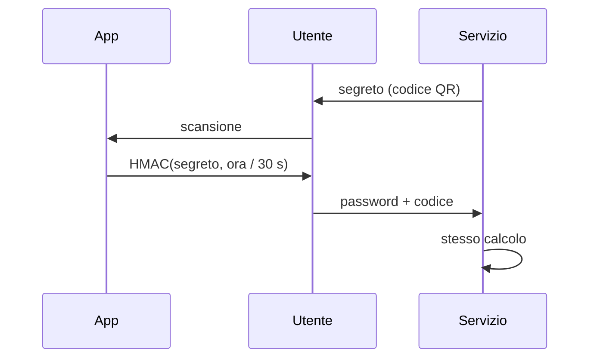

## Lezione 2.3: Autenticazione a più fattori e gestori di password

Modulo 2: Identità e autenticazione. Cybersecurity ed Ethical Hacking

---

## Autenticazione a più fattori

| Metodo | Limiti |
|---|---|
| SMS | SIM swapping, phishing |
| TOTP da app | phishing entro pochi secondi |
| Notifica da approvare | MFA fatigue |
| Chiave fisica, passkey | resistente al phishing |

Anche il metodo più debole è molto meglio della sola password

---

## TOTP (RFC 6238)



Il segreto va protetto come una password

---

## Passkey

- Chiave privata sul dispositivo, sbloccata con impronta, volto o PIN
- Il servizio conserva solo la chiave pubblica
- Legata al dominio: inutile su una pagina di phishing
- Standard FIDO Alliance

---

## Gestori di password

- Archivio cifrato, una password principale
- Generatore di password e passphrase
- Compilazione solo sul dominio corretto
- Copia di sicurezza: senza password principale l'archivio non si recupera
- **KeePassXC**: gratuito, open source, ZIP portatile, Argon2, TOTP

---

## Laboratorio

- Archivio KeePassXC di prova con passphrase generata
- `totp.py`: vettori di prova della RFC superati
- Stesso segreto in `totp.py` e in KeePassXC: stessi codici

```python
digest = hmac.new(segreto, struct.pack(">Q", contatore), hashlib.sha1).digest()
```

---

## Aspetti orientativi

- MFA e passkey: ottimo rapporto tra costo ed efficacia
- Sicurezza e usabilità
- Perché le passkey resistono al phishing e i TOTP no?
