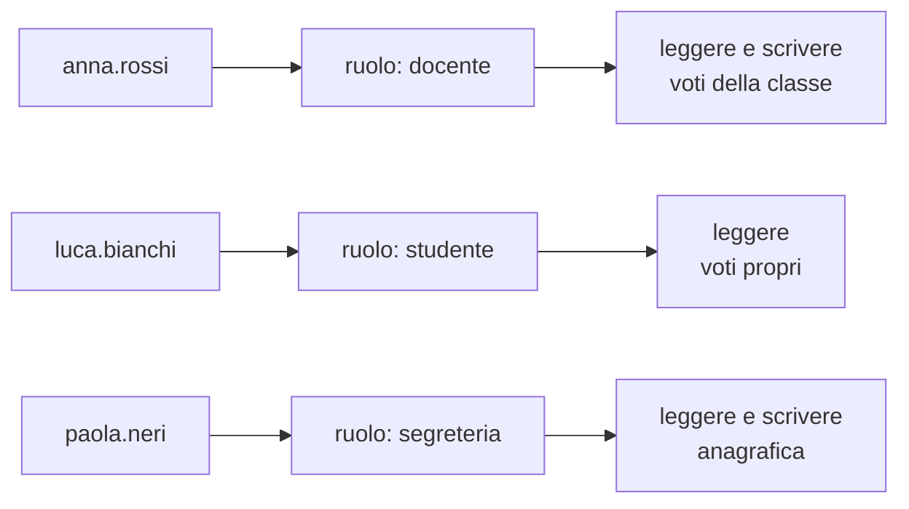

# Lezione 2.4: Account e privilegi

> Fonte: le sezioni 2.4.1 e 2.4.2 adattano, traducendole e riscrivendole, parti della lezione "IAM key concepts" del corso Microsoft "Security-101", https://github.com/microsoft/Security-101 . Licenza CC0 1.0 (pubblico dominio). Attività e codice sono contenuto originale; lo script è nella cartella `laboratorio` di questa lezione.

## 2.4.1 Autorizzazione e controllo degli accessi

Dopo l'autenticazione ("chi sei?"), l'**autorizzazione** stabilisce che cosa un'identità può fare: quali risorse può leggere, modificare, eliminare. L'insieme delle regole e dei meccanismi che applicano queste decisioni si chiama **controllo degli accessi**.

L'area che comprende autenticazione, autorizzazione e gestione degli account si chiama **IAM** (Identity and Access Management).

Modello più diffuso nelle organizzazioni: il **controllo degli accessi basato sui ruoli** (RBAC, Role-Based Access Control).

- I permessi non si assegnano alle singole persone, ma ai **ruoli** (studente, docente, segreteria).
- Ogni utente riceve uno o più ruoli e ottiene l'unione dei loro permessi.
- Quando una persona cambia mansione si cambiano i suoi ruoli, non decine di permessi singoli.



## 2.4.2 Principi

- **Minimo privilegio**: ogni utente e ogni programma riceve solo i permessi indispensabili per il proprio compito, e solo per il tempo necessario. Se un account viene compromesso, il danno resta limitato a ciò che quell'account può fare.
- **Negazione predefinita** (default deny): tutto ciò che non è esplicitamente permesso è vietato.
- **Separazione dei compiti** (segregation of duties): le operazioni critiche sono divise tra più persone, in modo che nessuno possa da solo completarle e nasconderle. Esempio: chi inserisce un pagamento non è la stessa persona che lo approva; chi amministra i log degli accessi non dovrebbe essere anche utente ordinario del sistema controllato.
- **Account amministrativi separati**: chi ha compiti di amministrazione usa un account ordinario per il lavoro quotidiano (posta, navigazione) e un account amministrativo solo quando serve. Un programma malevolo aperto per errore agisce con i privilegi dell'account in uso.
- **Ciclo di vita degli account**: gli account si creano all'ingresso di una persona (joiner), si aggiornano quando cambia mansione (mover) e si disattivano subito quando lascia l'organizzazione (leaver). Account non più usati ma ancora attivi sono un rischio frequente.
- **Revisione periodica** degli accessi: a intervalli regolari si verifica chi ha quali permessi e se ne ha ancora bisogno.

In Windows il **Controllo dell'account utente** (UAC) applica il minimo privilegio anche agli amministratori: i programmi partono con privilegi ordinari e ottengono quelli amministrativi solo dopo una conferma esplicita. La finestra di conferma va letta, non approvata per abitudine.

## 2.4.3 Laboratorio, parte 1: identità e permessi in Windows

Tempo indicativo: 20 minuti. Solo sul proprio account e su cartelle create per l'esercizio.

1. In PowerShell, visualizzare il proprio account e i gruppi a cui appartiene:

```powershell
whoami            # nome del computer o del dominio, e nome utente
whoami /groups    # gruppi dell'utente corrente
```

Nell'elenco dei gruppi, cercare il gruppo `BUILTIN\Administrators`. Se manca, l'account è ordinario. Se compare con l'attributo che ne indica l'uso solo per negazione (nella versione inglese "Group used for deny only"), l'account è amministrativo ma il terminale sta lavorando senza privilegi elevati, per effetto dell'UAC. La voce "Mandatory Label" indica il livello di integrità del processo (per esempio "Medium" per un processo senza privilegi elevati). I nomi degli attributi possono essere tradotti nella versione italiana di Windows.

2. Creare una cartella di prova e visualizzarne i permessi:

```powershell
mkdir C:\corso-cyber\lab24\riservato
icacls C:\corso-cyber\lab24\riservato
```

`icacls` mostra l'**elenco di controllo degli accessi** (ACL, Access Control List) di un file o di una cartella: una riga per ogni utente o gruppo, con i permessi concessi. Documentazione: https://learn.microsoft.com/en-us/windows-server/administration/windows-commands/icacls

| Codice | Permesso |
|---|---|
| F | controllo completo |
| M | modifica |
| RX | lettura ed esecuzione |
| R | sola lettura |
| W | sola scrittura |
| (OI) | ereditato dai file contenuti (object inherit) |
| (CI) | ereditato dalle sottocartelle (container inherit) |
| (I) | permesso ereditato dalla cartella superiore |

3. Confrontare con i permessi di una cartella di sistema, in sola lettura:

```powershell
icacls C:\Windows
```

Rispondere: quali gruppi possono modificare `C:\Windows`? Perché gli utenti ordinari hanno solo lettura ed esecuzione? Che cosa succederebbe se un programma malevolo, eseguito da un utente ordinario, tentasse di sostituire un file di sistema?

## 2.4.4 Laboratorio, parte 2: ruoli e permessi di un registro elettronico

Tempo indicativo: 30 minuti. Il file `permessi.py` simula l'autorizzazione di un registro elettronico con il modello RBAC.

```python
# Permessi di ciascun ruolo: coppie (azione, risorsa)
RUOLI = {
    "studente": {("leggere", "voti_propri"), ("leggere", "compiti")},
    "genitore": {("leggere", "voti_figlio"), ("leggere", "comunicazioni")},
    "docente": {
        ("leggere", "voti_classe"), ("scrivere", "voti_classe"),
        ("scrivere", "compiti"), ("leggere", "compiti"),
    },
    "segreteria": {("leggere", "anagrafica"), ("scrivere", "anagrafica")},
    "amministratore": {("gestire", "account"), ("leggere", "log_accessi")},
}

# Utenti con i loro ruoli (un utente può avere più ruoli)
UTENTI = {
    "luca.bianchi": {"studente"},
    "anna.rossi": {"docente"},
    "marco.verdi": {"genitore"},
    "paola.neri": {"segreteria"},
    "tecnico.it": {"amministratore"},
    "sara.gialli": {"docente", "amministratore"},   # da valutare: separazione dei compiti
    "ex.docente": {"docente"},                      # ha lasciato la scuola a giugno
}


def permessi_di(utente, utenti=UTENTI, ruoli=RUOLI):
    """Insieme dei permessi di un utente: unione dei permessi dei suoi ruoli."""
    risultato = set()
    for ruolo in utenti.get(utente, set()):
        risultato |= ruoli[ruolo]
    return risultato


def puo(utente, azione, risorsa, utenti=UTENTI, ruoli=RUOLI):
    """True se l'utente è autorizzato. Negazione predefinita: ciò che non è concesso è vietato."""
    return (azione, risorsa) in permessi_di(utente, utenti, ruoli)
```

- Un **insieme** (`set`, scritto tra graffe con valori separati da virgole) contiene elementi senza ripetizioni; `in` verifica l'appartenenza.
- `risultato |= ruoli[ruolo]` aggiunge all'insieme `risultato` tutti gli elementi dell'altro insieme (unione).
- `utenti.get(utente, set())` restituisce i ruoli dell'utente, o un insieme vuoto se l'utente non esiste: un utente sconosciuto non ha alcun permesso (negazione predefinita).

Il file contiene anche `utenti_con_permesso(azione, risorsa)`, che elenca chi possiede un permesso, e `conflitti(coppie_incompatibili)`, che trova gli utenti con ruoli da tenere separati.

```powershell
python test_permessi.py
python permessi.py
```

```text
Chi può scrivere i voti: ['anna.rossi', 'ex.docente', 'sara.gialli']
Chi può leggere i log degli accessi: ['sara.gialli', 'tecnico.it']
Conflitti docente/amministratore: [('sara.gialli', 'docente', 'amministratore')]
Lo studente può scrivere i voti? False
```

### Attività: revisione degli accessi

Il gruppo svolge la revisione periodica degli accessi del registro simulato.

1. Individuare, a partire dall'output, almeno due problemi di sicurezza negli account (suggerimento: ciclo di vita, separazione dei compiti) e proporre la correzione.
2. Applicare le correzioni modificando `UTENTI`: per la docente con compiti tecnici, creare due account distinti (`sara.gialli` con ruolo docente e `sara.gialli.admin` con ruolo amministratore).
3. Aggiungere un ruolo `coordinatore` che, oltre ai permessi del docente, può leggere le comunicazioni; verificarlo con un test.
4. Scrivere una funzione `account_inattivi(ultimo_accesso, oggi, giorni=90)` che, dato un dizionario `nome -> data dell'ultimo accesso` (oggetti `datetime.date`), restituisce gli account non usati da più di 90 giorni; aggiungere i test.
5. Rieseguire tutti i test.

### Esercizi

1. Spiegare la differenza tra autenticazione e autorizzazione con un esempio della vita quotidiana (biglietto del cinema, badge aziendale).
2. Un tecnico usa sempre l'account amministratore per comodità. Descrivere lo scenario peggiore se apre per errore l'allegato di un messaggio di phishing.
3. Per la segreteria della scuola, indicare due operazioni che dovrebbero essere soggette a separazione dei compiti.

## 2.4.5 Aspetti orientativi (discussione)

- Amministratori di sistema, specialisti IAM, auditor verificano ogni giorno account e privilegi; le revisioni degli accessi sono richieste da molte norme e certificazioni (per esempio ISO/IEC 27001) e dalla direttiva NIS2 (lezione 1.2).
- Molti incidenti gravi iniziano da un account con privilegi eccessivi o da un account di un ex dipendente mai disattivato: errori organizzativi, non tecnici.
- Domanda: quali account personali di ciascuno hanno "privilegi" eccessivi, per esempio app con accesso a contatti, posizione o fotocamera senza reale necessità?
