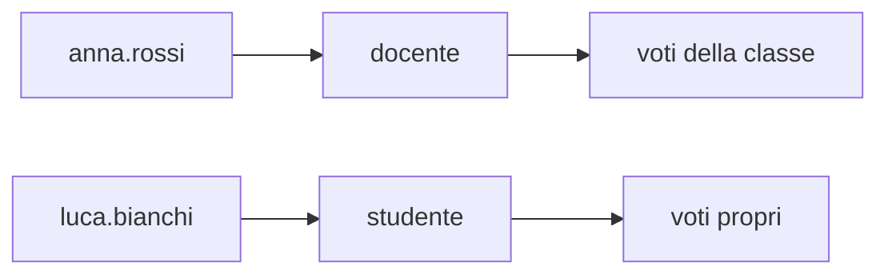

## Lezione 2.4: Account e privilegi

Modulo 2: Identità e autenticazione. Cybersecurity ed Ethical Hacking

Fonte: adattamento parziale da Microsoft, "Security-101", licenza CC0
https://github.com/microsoft/Security-101

---

## Controllo degli accessi e RBAC



- Permessi ai **ruoli**, ruoli agli utenti
- IAM: Identity and Access Management

---

## Principi

- **Minimo privilegio**
- **Negazione predefinita**
- **Separazione dei compiti**
- Account amministrativi separati; UAC
- Ciclo di vita: ingresso, cambio di mansione, uscita
- Revisione periodica degli accessi

---

## Laboratorio: Windows

```powershell
whoami /groups
mkdir C:\corso-cyber\lab24\riservato
icacls C:\corso-cyber\lab24\riservato
icacls C:\Windows
```

F, M, RX, R, W; (OI), (CI), (I)

---

## Laboratorio: revisione degli accessi

```python
def puo(utente, azione, risorsa):
    return (azione, risorsa) in permessi_di(utente)
```

```text
Chi può scrivere i voti: ['anna.rossi', 'ex.docente', 'sara.gialli']
Conflitti docente/amministratore: [('sara.gialli', 'docente', 'amministratore')]
```

Individuare i problemi, correggere, aggiungere test

---

## Aspetti orientativi

- Amministratori di sistema, specialisti IAM, auditor
- Revisioni degli accessi richieste da ISO/IEC 27001 e NIS2
- Account di ex dipendenti: errori organizzativi
- App con permessi eccessivi sul proprio telefono?
