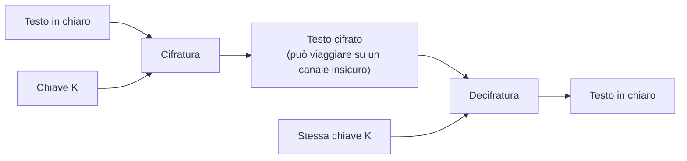

# Lezione 3.1: Cifratura simmetrica

> Fonte della sezione 3.1.1: adattamento da Microsoft, "Security-101", lezione "Networking key concepts", sezione sulla cifratura dei dati a riposo e in transito, licenza CC0 1.0, https://github.com/microsoft/Security-101/blob/main/3.1%20Networking%20key%20concepts.md . Il resto della lezione è contenuto originale. Gli script sono nella cartella `laboratorio` di questa lezione.

Obiettivo: comprendere i concetti di chiave, cifrario e spazio delle chiavi attraverso i cifrari storici, il funzionamento generale della cifratura simmetrica moderna (AES) e i problemi di gestione delle chiavi.

## 3.1.1 Terminologia

- **Testo in chiaro** (plaintext)
  il messaggio o il dato leggibile.
- **Testo cifrato** (ciphertext)
  il risultato della cifratura, incomprensibile senza la chiave.
- **Cifrario**
  l'algoritmo che trasforma il testo in chiaro in testo cifrato (**cifratura**) e viceversa (**decifratura**).
- **Chiave**
  il parametro segreto che determina il risultato del cifrario; con chiavi diverse lo stesso testo produce cifrati diversi.
- **Crittografia e crittoanalisi**
  la crittografia progetta i sistemi di cifratura; la crittoanalisi studia come violarli, ed è il modo in cui se ne verifica la robustezza.
- **Cifratura simmetrica**
  la stessa chiave serve per cifrare e per decifrare; mittente e destinatario devono quindi condividerla.

La cifratura protegge i dati in due situazioni:

- **dati a riposo** (at rest): dati memorizzati su dischi, chiavette, server, archivi di backup; esempi: cifratura del disco con BitLocker, archivio di KeePassXC (lezione 2.3)
- **dati in transito** (in transit): dati che viaggiano su una rete; esempi: HTTPS per il web e, più in generale, il protocollo TLS (lezione 3.3), che impediscono a chi intercetta il traffico di leggerlo o modificarlo

Codifica e cifratura non vanno confuse: una **codifica** (Base64, esadecimale) cambia la rappresentazione dei dati secondo regole pubbliche e non usa chiavi, quindi chiunque può invertirla. Il confronto è l'argomento della lezione 3.4.

Diagramma: cifratura simmetrica.



## 3.1.2 Cifrari storici

I cifrari storici non hanno oggi alcun valore di protezione, ma mostrano in forma semplice i concetti che valgono anche per i sistemi moderni.

### Cifrario di Cesare

Ogni lettera viene sostituita da quella che si trova un numero fisso di posizioni più avanti nell'alfabeto; con spostamento 3, A diventa D, B diventa E, Z diventa C. La chiave è lo spostamento. Riferimento: https://it.wikipedia.org/wiki/Cifrario_di_Cesare

```text
chiaro:  APPUNTAMENTO IN BIBLIOTECA
cifrato: DSSXQWDPHQWR LQ ELEOLRWHFD   (spostamento 3)
```

Con l'alfabeto di 26 lettere esistono solo 25 chiavi utili: provarle tutte richiede pochi secondi anche a mano. L'insieme delle chiavi possibili si chiama **spazio delle chiavi**; se è piccolo, il cifrario si viola per **ricerca esaustiva** (forza bruta). Il cifrario ROT13 è un Cesare con spostamento 13, usato ancora oggi per nascondere, non proteggere, soluzioni di indovinelli o anticipazioni di trame.

### Sostituzione monoalfabetica e analisi delle frequenze

Se ogni lettera viene sostituita da un'altra secondo una tabella qualsiasi, le chiavi possibili sono le permutazioni dell'alfabeto: 26! (circa 4 x 10^26), troppe per provarle tutte. Il cifrario si viola comunque con l'**analisi delle frequenze**: in italiano le lettere E, A, I, O sono le più frequenti (ciascuna tra il 9% e il 12% circa delle lettere di un testo), e la sostituzione conserva queste frequenze, spostandole su altre lettere. Il metodo è descritto già nel IX secolo dal matematico arabo al-Kindi.

Conseguenza: uno spazio delle chiavi grande è necessario ma non sufficiente; il cifrato non deve conservare regolarità del testo in chiaro.

### Cifrario di Vigenère

Cifrario **polialfabetico**: lo spostamento cambia a ogni lettera, secondo una parola chiave ripetuta. Con la chiave SOLE, la prima lettera si sposta di S (18 posizioni), la seconda di O (14), la terza di L (11), la quarta di E (4), poi si ricomincia. Una stessa lettera del testo in chiaro diventa quindi lettere diverse, e l'analisi delle frequenze semplice non funziona. Descritto da Giovan Battista Bellaso nel 1553 e attribuito in seguito a Blaise de Vigenère, fu considerato "indecifrabile" per circa tre secoli; nel 1863 Friedrich Kasiski pubblicò un metodo per trovare la lunghezza della chiave e ridurre il problema a più cifrari di Cesare. Riferimento: https://it.wikipedia.org/wiki/Cifrario_di_Vigen%C3%A8re

### Principio di Kerckhoffs

Formulato da Auguste Kerckhoffs nel 1883: un sistema crittografico deve restare sicuro anche se tutto, tranne la chiave, è pubblico. Gli algoritmi moderni sono pubblicati e analizzati apertamente per anni; la segretezza riguarda solo la chiave. Un sistema che basa la propria sicurezza sul segreto dell'algoritmo ("security through obscurity") è considerato debole. Riferimento: https://it.wikipedia.org/wiki/Principio_di_Kerckhoffs

## 3.1.3 Cifratura simmetrica moderna

I cifrari moderni operano su **byte**, non su lettere, e combinano sostituzioni e permutazioni ripetute molte volte, in modo che il cifrato non conservi alcuna regolarità del testo in chiaro.

### L'operazione XOR

L'operazione **XOR** (o esclusivo) tra due bit vale 1 se i bit sono diversi, 0 se sono uguali. Proprietà fondamentale: applicare due volte lo XOR con la stessa chiave restituisce il dato originale, cioè `(M XOR K) XOR K = M`. La stessa operazione cifra e decifra.

| M | K | M XOR K |
|---|---|---|
| 0 | 0 | 0 |
| 0 | 1 | 1 |
| 1 | 0 | 1 |
| 1 | 1 | 0 |

Se la chiave è casuale, lunga quanto il messaggio e usata **una sola volta**, lo XOR realizza il **cifrario di Vernam** o **one-time pad**, l'unico cifrario con sicurezza dimostrata: il cifrato non dà alcuna informazione sul messaggio. È però poco pratico, perché richiede di scambiare in anticipo tanto materiale segreto quanti sono i dati da proteggere. Se la stessa chiave viene riusata per due messaggi, lo XOR dei due cifrati è uguale allo XOR dei due messaggi in chiaro, e la chiave scompare dal calcolo: il riuso delle chiavi è uno degli errori più gravi (verificato da un test del laboratorio).

### AES

**AES** (Advanced Encryption Standard) è il cifrario simmetrico più usato al mondo. È stato scelto dal NIST statunitense con un concorso pubblico iniziato nel 1997, a cui parteciparono 15 algoritmi; vinse Rijndael, dei crittografi belgi Joan Daemen e Vincent Rijmen, pubblicato come standard FIPS 197 nel 2001 (https://csrc.nist.gov/pubs/fips/197/final).

- **cifrario a blocchi**: elabora blocchi di 128 bit (16 byte)
- **chiavi** di 128, 192 o 256 bit (AES-128, AES-192, AES-256)
- **spazio delle chiavi** di AES-128: 2^128, circa 3,4 x 10^38 chiavi; provando mille miliardi di chiavi al secondo servirebbero circa 10^19 anni, cioè un tempo di gran lunga superiore all'età dell'universo
- **uso**: HTTPS, Wi-Fi WPA2 e WPA3, cifratura dei dischi (BitLocker, FileVault), archivi compressi cifrati, applicazioni di messaggistica; molti processori hanno istruzioni dedicate che lo rendono molto veloce

Non esistono attacchi pratici contro AES usato correttamente: le violazioni reali derivano da chiavi deboli, rubate o riusate, e da errori di utilizzo.

### Modalità di funzionamento

Un messaggio lungo è formato da molti blocchi; la **modalità di funzionamento** stabilisce come cifrarli.

- **ECB** (Electronic Code Book): ogni blocco è cifrato separatamente; blocchi uguali producono cifrati uguali, e le regolarità dei dati restano visibili. Esempio classico: un'immagine cifrata in ECB mostra ancora i contorni dell'immagine originale. Da non usare.
- **CBC** (Cipher Block Chaining): ogni blocco viene combinato con il cifrato del blocco precedente; il primo con un **vettore di inizializzazione** (IV) casuale, che rende diversi i cifrati di messaggi uguali. L'IV non è segreto, ma non deve essere prevedibile.
- **GCM** (Galois/Counter Mode): cifra e, insieme, calcola un'etichetta di autenticazione (tag) che permette al destinatario di accorgersi di qualsiasi modifica del cifrato. È la modalità più usata in TLS. Richiede un valore unico (nonce) per ogni messaggio cifrato con la stessa chiave.

Riferimento: https://it.wikipedia.org/wiki/Advanced_Encryption_Standard

## 3.1.4 Gestione delle chiavi

Con un algoritmo robusto, la sicurezza dipende interamente dalla chiave. Gli aspetti da governare formano il **ciclo di vita della chiave**:

- **generazione**: le chiavi devono essere casuali, prodotte da un generatore crittograficamente sicuro (in Python il modulo `secrets`, lezione 2.1); una chiave ricavata da una password va derivata con una funzione lenta come PBKDF2 o Argon2 (lezione 2.2)
- **distribuzione**: mittente e destinatario devono condividere la chiave senza che altri la intercettino
- **conservazione**: la chiave va protetta almeno quanto i dati che protegge; strumenti: gestori di password, moduli hardware come il TPM dei PC o gli HSM dei centri dati
- **rotazione e revoca**: le chiavi si sostituiscono periodicamente, e subito in caso di sospetta compromissione
- **distruzione**: le chiavi non più necessarie si eliminano in modo sicuro

Il problema della distribuzione cresce rapidamente con il numero di persone: perché ogni coppia di persone abbia una chiave propria servono n(n-1)/2 chiavi. In una classe di 30 studenti: 30 x 29 / 2 = 435 chiavi, ciascuna da scambiare in modo sicuro. La soluzione è la crittografia asimmetrica, argomento della lezione 3.2.

## 3.1.5 Laboratorio

Tempo indicativo: 40 minuti. Cartella di lavoro `C:\corso-cyber\lab31`, con i file della cartella `laboratorio` di questa lezione.

### CyberChef in versione offline

**CyberChef** è un'applicazione web sviluppata dal GCHQ britannico, con licenza Apache 2.0, che esegue centinaia di operazioni di codifica, cifratura, hash e analisi dei dati (https://github.com/gchq/CyberChef). Funziona interamente nel browser: i dati inseriti non vengono inviati a nessun server. Si usa anche la versione scaricata, un file HTML da aprire nel browser, che funziona senza connessione.

1. Aprire https://gchq.github.io/CyberChef/ e fare clic su **Download CyberChef**, in alto a sinistra.
2. Nella finestra che si apre annotare il valore **SHA256 hash** e scaricare il file ZIP con **Download ZIP file**; il nome del file contiene il codice della versione, per esempio `CyberChef_d0267c3cf7691e9c2ed51e2d5071b9fd6004fcc1.zip`. La verifica dell'impronta è un'attività della lezione 3.2.
3. Estrarre lo ZIP in `C:\strumenti\CyberChef` e aprire con il browser il file `CyberChef_v....html` (per esempio `CyberChef_v11.5.0.html`, versione verificata a settembre 2026).

Interfaccia: a sinistra l'elenco delle operazioni (**Operations**), con una casella di ricerca; al centro la **ricetta** (Recipe), in cui si trascinano le operazioni; a destra **Input** e **Output**. Il risultato si aggiorna a ogni modifica.

### Parte 1: cifrari storici in CyberChef

1. Cercare l'operazione **ROT13** e trascinarla nella ricetta; impostare **Amount** a 3: è il cifrario di Cesare. Scrivere in Input `Appuntamento in biblioteca alle quindici` e verificare l'Output `Dssxqwdphqwr lq eleolrwhfd dooh txlqglfl`.
2. Decifrare lo stesso testo: incollare il cifrato in Input e impostare **Amount** a 23, cioè 26 - 3: avanzare di 23 posizioni equivale a tornare indietro di 3.
3. Sostituire ROT13 con **Vigenère Encode**, chiave `CHIAVE`, e cifrare `Il club di informatica si riunisce in aula dodici alle quindici`. Risultato atteso: `Ks klpf fp qnasttitdgc zq rdyppacz mp hclv hqkqcd ensm qpmpkqcd`. Osservare che la stessa lettera in chiaro (per esempio la `i`) diventa lettere diverse.
4. Decifrare con **Vigenère Decode** e la stessa chiave; poi provare con una chiave sbagliata di una sola lettera.

### Parte 2: gli stessi cifrari in Python

```powershell
python test_cifrari_storici.py
python cifrari_storici.py
```

```text
OK      Cesare con chiave 3
...
OK      riuso della chiave: c1 XOR c2 = m1 XOR m2
Test superati: 14, falliti: 0
```

Il file `cifrari_storici.py` contiene:

- `cesare(testo, chiave)` e `decifra_cesare(testo, chiave)`
- `tutte_le_chiavi_cesare(cifrato)`: le 25 decifrature possibili
- `frequenze(testo)` e `chiave_cesare_probabile(cifrato)`: sceglie la chiave la cui decifratura ha le frequenze delle lettere più simili a quelle dell'italiano
- `vigenere(testo, chiave, decifra=False)`
- `xor_bytes(dati, chiave)` e `chiave_casuale(lunghezza)`

Nucleo del cifrario di Cesare:

```python
def _sposta(carattere, spostamento):
    """Sposta una lettera di 'spostamento' posizioni; gli altri caratteri restano invariati."""
    if carattere.isupper() and carattere in ALFABETO:
        base = ord("A")
    elif carattere.islower() and carattere.upper() in ALFABETO:
        base = ord("a")
    else:
        return carattere
    return chr((ord(carattere) - base + spostamento) % 26 + base)
```

L'operatore `%` (resto della divisione) fa ricominciare l'alfabeto dopo la Z: con spostamento 3, la Y (posizione 24) diventa (24 + 3) % 26 = 1, cioè la B.

### Attività

Tempo indicativo: 20 minuti, a coppie. Tutti i messaggi sono prodotti dagli studenti stessi.

1. Uno studente cifra una frase di almeno 15 parole con Cesare e una chiave scelta a caso; l'altro, senza conoscere la chiave, la trova con `tutte_le_chiavi_cesare` e poi con `chiave_cesare_probabile`. Con quale lunghezza minima del testo l'analisi delle frequenze trova ancora la chiave giusta?
2. Stampare le frequenze di un testo cifrato con Vigenère e confrontarle con quelle dello stesso testo cifrato con Cesare: quale dei due conserva la forma della distribuzione delle lettere?
3. In console, cifrare due messaggi della stessa lunghezza con la stessa chiave XOR e calcolare lo XOR dei due cifrati. Confrontare il risultato con lo XOR dei due messaggi in chiaro e spiegare perché il riuso della chiave è pericoloso.
4. Calcolare quante chiavi servirebbero, con la sola cifratura simmetrica, perché ogni coppia di studenti della scuola possa comunicare in modo riservato.

## 3.1.6 Aspetti orientativi (discussione)

- La crittografia è una disciplina matematica: teoria dei numeri, algebra e probabilità sono alla base degli algoritmi. Chi la progetta ha di solito una formazione in matematica o informatica teorica.
- Nella pratica professionale conta soprattutto l'uso corretto: scegliere algoritmi e librerie collaudate, gestire le chiavi, non inventare cifrari propri.
- La storia della crittografia (Enigma, Bletchley Park, Alan Turing) è anche storia dell'informatica: i primi calcolatori elettronici nacquero in parte per la crittoanalisi.
- Domanda: perché un'azienda dovrebbe preferire un algoritmo pubblico e analizzato da migliaia di esperti a uno segreto sviluppato internamente?
