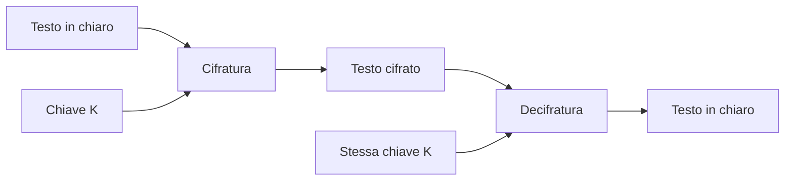

## Contenuti

- Terminologia
- Schema
- Cifrari storici
- XOR e one-time pad
- AES
- Gestione delle chiavi
- Laboratorio: CyberChef offline
- Laboratorio: Python
- Aspetti orientativi

Fonte sezione 3.1.1: Microsoft, "Security-101", licenza CC0 1.0, https://github.com/microsoft/Security-101

## Terminologia

- **Testo in chiaro**, **testo cifrato**, **cifrario**, **chiave**
- **Crittografia** e **crittoanalisi**
- **Cifratura simmetrica**: stessa chiave per cifrare e decifrare
- Dati **a riposo** (dischi, backup) e **in transito** (HTTPS, TLS)
- Codifica (Base64) non è cifratura: nessuna chiave

## Schema



## Cifrari storici

- **Cesare**: spostamento fisso; 25 chiavi, forza bruta immediata
- **Sostituzione monoalfabetica**: 26! chiavi, ma **analisi delle frequenze** (al-Kindi, IX secolo)
- **Vigenère**: spostamento variabile con una parola chiave; violato da Kasiski (1863)
- **Principio di Kerckhoffs**: segreta solo la chiave, algoritmo pubblico

## XOR e one-time pad

| M | K | M XOR K |
|---|---|---|
| 0 | 0 | 0 |
| 0 | 1 | 1 |
| 1 | 0 | 1 |
| 1 | 1 | 0 |

- `(M XOR K) XOR K = M`
- Chiave casuale, lunga quanto il messaggio, usata una volta: sicurezza dimostrata
- Chiave riusata: `C1 XOR C2 = M1 XOR M2`

## AES

- Standard NIST FIPS 197 (2001), algoritmo Rijndael
- Blocchi di 128 bit; chiavi di 128, 192, 256 bit
- 2^128 chiavi: circa 10^19 anni a mille miliardi di prove al secondo
- HTTPS, Wi-Fi WPA2/WPA3, BitLocker, messaggistica

Modalità: **ECB** da evitare; **CBC** con IV casuale; **GCM** cifra e autentica

## Gestione delle chiavi

- Generazione casuale (`secrets`); derivazione lenta da password
- Distribuzione, conservazione (TPM, HSM), rotazione, revoca, distruzione
- Coppie di persone: n(n-1)/2 chiavi; 30 studenti: 435 chiavi

Soluzione alla distribuzione: crittografia asimmetrica (lezione 3.2)

## Laboratorio: CyberChef offline

1. https://gchq.github.io/CyberChef/ , **Download CyberChef**
2. Annotare **SHA256 hash**, **Download ZIP file**
3. Estrazione in `C:\strumenti\CyberChef`, apertura del file HTML

Esercizi: **ROT13** con Amount 3; **Vigenère Encode** e **Decode** con chiave `CHIAVE`

## Laboratorio: Python

```powershell
python test_cifrari_storici.py     # 14 test
python cifrari_storici.py
```

- `cesare`, `tutte_le_chiavi_cesare`, `chiave_cesare_probabile`
- `vigenere`, `xor_bytes`, `chiave_casuale`
- Attività a coppie: forza bruta e analisi delle frequenze su testi propri; riuso della chiave XOR

## Aspetti orientativi

- Crittografia: matematica e informatica teorica
- Nella pratica: uso corretto di algoritmi e librerie collaudate
- Enigma, Bletchley Park, Turing: crittoanalisi e nascita dei calcolatori
- Algoritmo pubblico o segreto: quale scegliere e perché?
