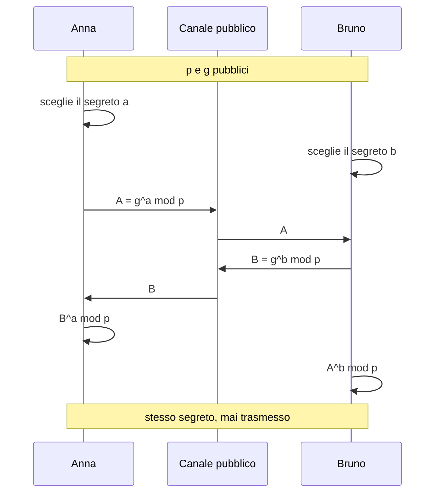
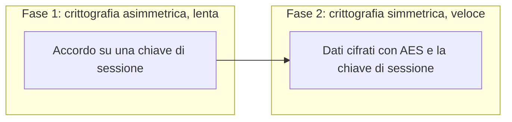
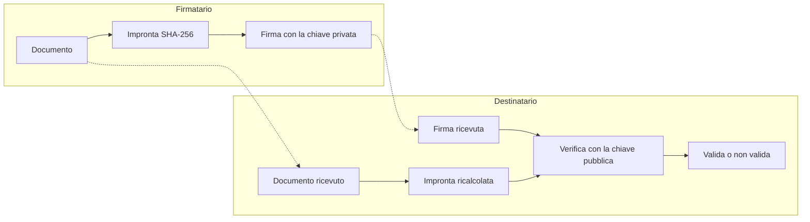

# Lezione 3.2: Cifratura asimmetrica e firme

> Contenuto originale. Riferimenti: pagina "Verifying Signatures" di KeePassXC; documentazione di Microsoft su `Get-FileHash`; pagina Sigstore di python.org; NIST FIPS 203. Gli script sono nella cartella `laboratorio` di questa lezione.

Obiettivo: comprendere come due parti possano concordare un segreto o scambiarsi dati riservati senza essersi mai incontrate, come funziona una firma digitale e come si verifica l'integrità e la provenienza di un file scaricato.

## 3.2.1 Coppie di chiavi

La cifratura simmetrica richiede che le due parti condividano già una chiave segreta (lezione 3.1). La **crittografia asimmetrica**, o **a chiave pubblica**, risolve il problema con una **coppia di chiavi** legate matematicamente:

- **chiave pubblica**
  si distribuisce liberamente, anche pubblicandola su un sito.
- **chiave privata**
  resta solo al proprietario e non viene mai trasmessa.

Ciò che si fa con una chiave della coppia si può verificare o invertire solo con l'altra. Ricavare la chiave privata da quella pubblica richiede la soluzione di un problema matematico considerato impraticabile con le dimensioni usate: per RSA la scomposizione in fattori primi di un numero di oltre 600 cifre decimali (2048 bit), per le curve ellittiche il logaritmo discreto su una curva.

Tappe storiche:

- 1976: Whitfield Diffie e Martin Hellman pubblicano lo scambio di chiavi che porta il loro nome
- 1977: Ron Rivest, Adi Shamir e Leonard Adleman presentano RSA, primo sistema pratico di cifratura e firma a chiave pubblica
- anni 2000: si diffonde la crittografia su **curve ellittiche** (ECC), che ottiene la stessa sicurezza con chiavi molto più corte (256 bit contro 3072 di RSA)

Riferimenti: https://it.wikipedia.org/wiki/Crittografia_asimmetrica , https://it.wikipedia.org/wiki/RSA_(crittografia)

## 3.2.2 Scambio di chiavi

Con lo scambio **Diffie-Hellman** due parti ottengono lo stesso numero segreto scambiandosi solo valori pubblici. Semplificando:

1. si concordano pubblicamente un numero primo `p` e un numero `g`
2. Anna sceglie un segreto `a` e invia `A = g^a mod p`; Bruno sceglie un segreto `b` e invia `B = g^b mod p`
3. Anna calcola `B^a mod p`, Bruno calcola `A^b mod p`: entrambi ottengono `g^(ab) mod p`
4. chi osserva la comunicazione conosce `p`, `g`, `A` e `B`, ma per ottenere il segreto dovrebbe ricavare `a` o `b`, cioè risolvere il problema del logaritmo discreto

Analogia diffusa: ognuno mescola un colore segreto a un colore comune e invia la miscela; aggiungendo il proprio colore segreto alla miscela ricevuta, entrambi ottengono lo stesso colore finale, mentre separare una miscela nei suoi componenti è molto difficile.

Diagramma: scambio di chiavi Diffie-Hellman.



Lo scambio di chiavi da solo non dice **con chi** si sta parlando: un intermediario potrebbe eseguire due scambi separati, uno con Anna e uno con Bruno, fingendosi l'altro (attacco "man in the middle"). Per questo lo scambio si combina con l'autenticazione tramite firme e certificati (lezione 3.3).

## 3.2.3 Cifratura asimmetrica e cifratura ibrida

Con RSA chiunque può cifrare un messaggio con la **chiave pubblica** del destinatario; solo il destinatario, con la **chiave privata**, può decifrarlo.

La crittografia asimmetrica è però centinaia o migliaia di volte più lenta di AES e adatta solo a dati brevi. I sistemi reali usano quindi la **cifratura ibrida**:

1. con la crittografia asimmetrica le parti concordano (o si trasmettono) una **chiave di sessione** simmetrica, casuale e usata una sola volta
2. i dati veri e propri si cifrano con AES e la chiave di sessione

È lo schema di HTTPS, della posta cifrata (OpenPGP, S/MIME) e delle applicazioni di messaggistica con cifratura end-to-end.



## 3.2.4 Firma digitale

Una **firma digitale** usa la coppia di chiavi nel verso opposto:

1. il firmatario calcola l'**impronta** (hash) del documento, per esempio con SHA-256 (lezione 2.2)
2. elabora l'impronta con la propria **chiave privata**: il risultato è la firma, che accompagna il documento
3. chi riceve ricalcola l'impronta del documento e, con la **chiave pubblica** del firmatario, controlla che corrisponda alla firma

Diagramma: firma e verifica.



Proprietà garantite:

- **integrità**: qualsiasi modifica del documento cambia l'impronta, e la firma non risulta più valida
- **autenticità**: solo il possessore della chiave privata può aver prodotto la firma
- **non ripudio**: il firmatario non può negare in seguito di aver firmato, a condizione che la chiave privata sia stata custodita correttamente

In Italia la firma digitale qualificata ha lo stesso valore legale della firma autografa, secondo il Codice dell'amministrazione digitale e il regolamento europeo eIDAS; la corrispondenza tra chiave pubblica e persona è garantita da un certificato rilasciato da un prestatore di servizi fiduciari qualificato. Riferimento: https://it.wikipedia.org/wiki/Firma_digitale

Le firme digitali sono presenti anche in contesti meno visibili: aggiornamenti del sistema operativo, applicazioni per smartphone, driver, pacchetti software, certificati dei siti web.

## 3.2.5 Integrità e provenienza dei file scaricati

Molti progetti pubblicano, accanto ai file da scaricare, informazioni per verificarli. I metodi hanno garanzie diverse, come spiega la pagina di KeePassXC (https://keepassxc.org/verifying-signatures/):

| Metodo | Che cosa si confronta | Che cosa garantisce |
|---|---|---|
| **Impronta** (checksum, file `.DIGEST`, `SHA256SUMS`) | impronta SHA-256 calcolata sul file scaricato con quella pubblicata | il file non si è danneggiato durante lo scaricamento; se impronta e file provengono dallo stesso sito, **non** garantisce la provenienza, perché chi riuscisse a modificare il file sul sito potrebbe modificare anche l'impronta |
| **Firma digitale** (file `.sig`, `.asc`, `.sigstore`) | firma del file con la chiave pubblica dello sviluppatore, ottenuta per una via indipendente | il file proviene dallo sviluppatore ed è integro |
| **Firma del codice** (Authenticode di Windows) | firma incorporata nel programma, verificata dal sistema operativo | nome dell'editore verificato, mostrato nella finestra di controllo dell'account utente |

Esempi reali:

- KeePassXC pubblica per ogni file un'impronta `.DIGEST`, una firma OpenPGP `.sig` e firma con Authenticode l'installatore per Windows
- Python, dalla versione 3.14, firma i file di rilascio solo con **Sigstore**, un sistema di firma legato all'identità dello sviluppatore e registrato in un archivio pubblico (https://www.python.org/download/sigstore/); le pagine di rilascio riportano anche impronte MD5, utili solo contro danneggiamenti accidentali, perché MD5 non è più considerato sicuro contro modifiche intenzionali
- CyberChef mostra l'impronta SHA-256 dello ZIP nella finestra **Download CyberChef** (lezione 3.1)

In PowerShell l'impronta si calcola con `Get-FileHash`, che usa SHA-256 in modo predefinito (https://learn.microsoft.com/en-us/powershell/module/microsoft.powershell.utility/get-filehash):

```powershell
Get-FileHash .\CyberChef_*.zip
```

Il nome dello ZIP di CyberChef contiene il codice della versione del sorgente, per esempio `CyberChef_d0267c3cf7691e9c2ed51e2d5071b9fd6004fcc1.zip`; l'asterisco evita di doverlo digitare. Output per la versione pubblicata il 26/09/2026:

```text
Algorithm       Hash                                                                   Path
---------       ----                                                                   ----
SHA256          29F6FDFBD299F693D7480EA23E57BCE60C89FCB7418149DE3EECB4653E8A9193       C:\...
```

PowerShell stampa l'impronta in maiuscolo: il confronto non dipende da maiuscole e minuscole. Per confrontare automaticamente:

```powershell
(Get-FileHash .\CyberChef_*.zip).Hash -eq "impronta pubblicata"   # True o False
```

L'operatore `-eq` di PowerShell confronta le stringhe senza distinguere maiuscole e minuscole. L'impronta dello ZIP cambia a ogni nuova versione di CyberChef: il valore da usare è quello mostrato nella finestra di download al momento dello scaricamento.

## 3.2.6 Crittografia post-quantistica

Un computer quantistico di grandi dimensioni, oggi non disponibile, potrebbe risolvere in tempi brevi i problemi matematici su cui si basano RSA e le curve ellittiche. Esiste inoltre il rischio "raccogli ora, decifra dopo": traffico cifrato registrato oggi potrebbe essere decifrato in futuro.

- nel 2024 il NIST ha pubblicato i primi standard post-quantistici, tra cui **ML-KEM** (FIPS 203) per lo scambio di chiavi: https://csrc.nist.gov/pubs/fips/203/final
- dalla versione 131 Chrome usa in TLS uno scambio di chiavi **ibrido**, che combina X25519 (curve ellittiche) e ML-KEM: la connessione resta sicura se almeno uno dei due metodi resiste (https://security.googleblog.com/2024/09/a-new-path-for-kyber-on-web.html)

La crittografia simmetrica è molto meno esposta: per AES è sufficiente usare chiavi da 256 bit.

## 3.2.7 Laboratorio

Tempo indicativo: 40 minuti. Cartella di lavoro `C:\corso-cyber\lab32`, con i file della cartella `laboratorio` di questa lezione.

### Parte 1: verifica dello ZIP di CyberChef

1. Aprire PowerShell nella cartella in cui si trova lo ZIP scaricato nella lezione 3.1.
2. Calcolare l'impronta con `Get-FileHash` e confrontarla con il valore annotato dalla finestra **Download CyberChef**.
3. Discutere: se un malintenzionato avesse sostituito lo ZIP sul sito, avrebbe potuto cambiare anche l'impronta mostrata? Che cosa aggiungerebbe una firma digitale?

### Parte 2: quale file è stato modificato?

Il docente, prima della lezione, esegue `python prepara_esercizio.py`: lo script crea la cartella `scaricati` con tre file e il file di impronte `scaricati.DIGEST`, poi modifica un solo carattere di uno dei file, scelto a caso.

Gli studenti individuano il file modificato in due modi:

1. con `Get-FileHash` su ciascun file, confrontando a vista con le righe di `scaricati.DIGEST`
2. con lo script `impronte.py`:

```powershell
python impronte.py --digest .\scaricati\scaricati.DIGEST
```

```text
OK        programma_v1.0.txt
DIVERSA   manuale.txt
OK        dati_esempio.csv
```

Lo script legge i file a blocchi di 1 MiB, quindi funziona anche con file di diversi gigabyte, e accetta il formato dei file di impronte prodotto dal comando `sha256sum` dei sistemi Linux: impronta, spazio, eventuale asterisco, nome del file.

### Parte 3: chiavi giocattolo

Il file `chiavi_giocattolo.py` realizza Diffie-Hellman e RSA con numeri piccoli, per seguire i calcoli. **Non protegge nulla**: i sistemi reali usano numeri di centinaia di cifre, librerie collaudate e schemi di riempimento (padding) qui assenti.

```powershell
python chiavi_giocattolo.py
python test_lab32.py
```

```text
Diffie-Hellman
  Anna invia 868495867, Bruno invia 119172989 (valori visibili a chiunque)
  segreto calcolato da Anna:  343549583
  segreto calcolato da Bruno: 343549583
RSA con p = 61, q = 53
  chiave pubblica (n, e) = (3233, 17), chiave privata (n, d) = (3233, 2753)
  cifratura di 65 con la chiave pubblica: 2790; decifratura con la privata: 65
  firma di 'Voto finale: 8': 410
  verifica del messaggio originale: True
  verifica del messaggio 'Voto finale: 9': False
...
Test superati: 17, falliti: 0
```

I valori di Diffie-Hellman cambiano a ogni esecuzione, perché i segreti sono casuali.

RSA in quattro righe:

```python
n = p * q                    # modulo, parte di entrambe le chiavi
phi = (p - 1) * (q - 1)
d = pow(e, -1, phi)          # esponente privato: inverso di e modulo phi
c = pow(m, e, n)             # cifratura con la chiave pubblica (n, e); decifratura: pow(c, d, n)
```

`pow(base, esponente, modulo)` calcola la potenza modulare in modo efficiente anche con numeri enormi. La sicurezza di RSA dipende dal fatto che, conoscendo solo `n`, non si riescono a trovare `p` e `q`: con `n = 3233` bastano pochi tentativi (61 x 53), con un `n` di 2048 bit nessun computer esistente ci riesce in tempi utili.

### Attività

Tempo indicativo: 20 minuti.

1. Verificare a mano, con la calcolatrice di Python, i passi di Diffie-Hellman con `p = 23`, `g = 5`, `a = 6`, `b = 15`. Quale segreto condiviso si ottiene?
2. Generare una coppia RSA con `rsa_genera(p=67, q=71, e=17)`, cifrare un numero e decifrarlo.
3. Firmare un messaggio con la chiave privata di un compagno e verificare la firma con la propria chiave pubblica: che cosa succede, e perché?
4. Scrivere una funzione `fattorizza(n)` che trovi `p` e `q` provando i divisori da 2 fino alla radice quadrata di `n`, e usarla su `n = 3233`. Stimare perché lo stesso metodo è inutilizzabile con numeri di 600 cifre.

## 3.2.8 Aspetti orientativi (discussione)

- La verifica dell'integrità e della provenienza del software è una pratica quotidiana per amministratori di sistema e sviluppatori; gli attacchi alla catena di distribuzione del software (supply chain) sono tra le minacce più gravi degli ultimi anni.
- La transizione alla crittografia post-quantistica richiederà anni di lavoro su software, dispositivi e protocolli: è un ambito con forte domanda di competenze.
- La firma digitale è uno strumento anche giuridico: la pubblica amministrazione e le professioni (notai, commercialisti, ingegneri) la usano ogni giorno.
- Domanda: se un sito pubblica l'impronta di un programma sulla stessa pagina da cui lo si scarica, contro quali problemi protegge e contro quali no?
