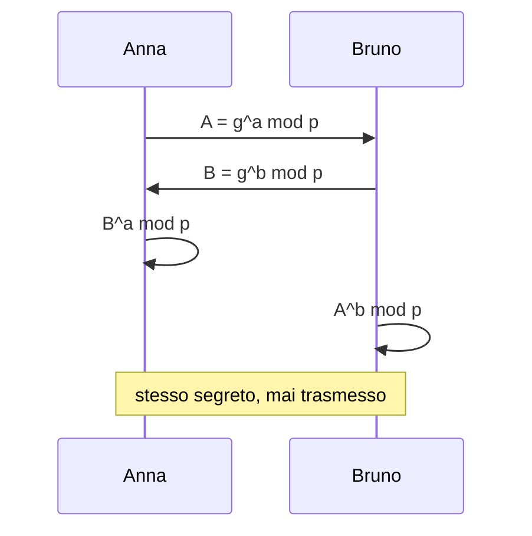
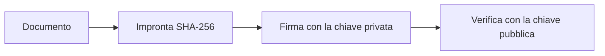

## Contenuti

- Coppie di chiavi
- Scambio di chiavi Diffie-Hellman
- Cifratura ibrida
- Firma digitale
- Verificare un file scaricato
- Post-quantistica
- Laboratorio
- RSA in quattro righe
- Aspetti orientativi

## Coppie di chiavi

- **Chiave pubblica**: distribuita liberamente
- **Chiave privata**: solo al proprietario, mai trasmessa
- 1976 Diffie-Hellman; 1977 RSA; curve ellittiche (ECC)
- Sicurezza basata su problemi matematici difficili: fattorizzazione, logaritmo discreto

## Scambio di chiavi Diffie-Hellman



Da solo non dice con chi si parla: rischio man in the middle

## Cifratura ibrida

- Asimmetrica: lenta, adatta a dati brevi
- Fase 1: accordo su una **chiave di sessione**
- Fase 2: dati cifrati con **AES** e la chiave di sessione
- HTTPS, posta cifrata, messaggistica end-to-end

## Firma digitale



- **Integrità**, **autenticità**, **non ripudio**
- Firma digitale qualificata: valore legale (CAD, eIDAS)

## Verificare un file scaricato

| Metodo | Garantisce |
|---|---|
| Impronta (`.DIGEST`, `SHA256SUMS`) | file non danneggiato; non la provenienza |
| Firma (`.sig`, `.sigstore`) | provenienza e integrità |
| Authenticode | editore verificato da Windows |

```powershell
Get-FileHash .\CyberChef_*.zip
```

## Post-quantistica

- Computer quantistici futuri: rischio per RSA e curve ellittiche
- "Raccogli ora, decifra dopo"
- NIST FIPS 203 (2024): **ML-KEM**
- Chrome 131: scambio ibrido X25519 + ML-KEM
- AES: sufficienti chiavi da 256 bit

## Laboratorio

1. Verifica dello ZIP di CyberChef con `Get-FileHash`
2. `prepara_esercizio.py` (docente): quale file è stato modificato?

```powershell
python impronte.py --digest .\scaricati\scaricati.DIGEST
```

3. `chiavi_giocattolo.py`: Diffie-Hellman e RSA con numeri piccoli, solo didattici; 17 test

## RSA in quattro righe

```python
n = p * q
phi = (p - 1) * (q - 1)
d = pow(e, -1, phi)          # esponente privato
c = pow(m, e, n)             # cifratura; decifratura: pow(c, d, n)
```

- `n = 3233 = 61 x 53`: fattorizzazione immediata
- `n` di 2048 bit: impraticabile

## Aspetti orientativi

- Catena di distribuzione del software (supply chain): minaccia rilevante
- Transizione post-quantistica: anni di lavoro, domanda di competenze
- Firma digitale nella pubblica amministrazione e nelle professioni
- Impronta sulla stessa pagina del download: contro che cosa protegge?
