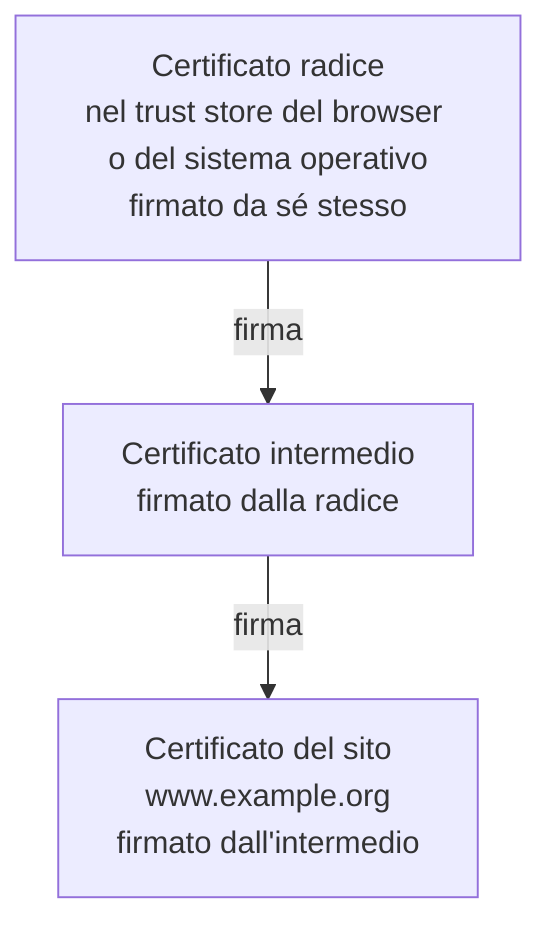
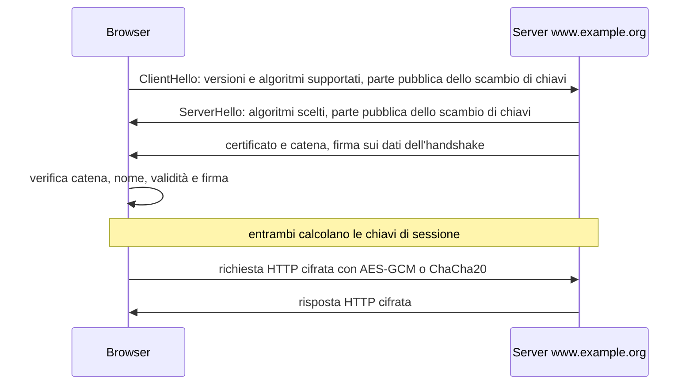

# Lezione 3.3: Certificati e HTTPS

> Contenuto originale. Riferimenti: guida di Mozilla sui certificati dei siti; pagine di Let's Encrypt sulla catena di certificati e sulla durata dei certificati; delibera SC-081 del CA/Browser Forum; RFC 9846 (TLS 1.3). Gli script sono nella cartella `laboratorio` di questa lezione.

Obiettivo: comprendere come un browser verifica l'identità di un sito, che cosa contiene un certificato, come funziona la catena di fiducia e che cosa garantisce, e che cosa non garantisce, il lucchetto del browser.

## 3.3.1 Il problema: di chi è questa chiave pubblica?

La crittografia asimmetrica (lezione 3.2) permette di cifrare per un destinatario e di verificare firme, a condizione di avere la **chiave pubblica giusta**. Se un intermediario riesce a far credere al browser che la propria chiave pubblica sia quella della banca, può decifrare, leggere e modificare tutto il traffico, inoltrandolo poi al sito vero: è l'attacco **man in the middle** (MITM), possibile per esempio su una rete Wi-Fi controllata da chi attacca.

Serve quindi un modo affidabile per collegare una chiave pubblica a un'identità, come un nome di dominio: è il compito dei **certificati digitali**.

## 3.3.2 Il certificato

Un **certificato** (formato standard X.509) è un documento elettronico che associa una chiave pubblica a un'identità, firmato da un'**autorità di certificazione** (CA, Certification Authority). Campi principali:

- **Soggetto** (Subject)
  l'intestatario; per i siti web conta il nome di dominio.
- **Nomi alternativi del soggetto** (Subject Alternative Name, SAN)
  l'elenco dei nomi di dominio coperti, per esempio `example.org` e `www.example.org`, o un nome con carattere jolly come `*.example.org`; è il campo che il browser confronta con l'indirizzo visitato.
- **Emittente** (Issuer)
  la CA che ha firmato il certificato.
- **Periodo di validità**
  data di inizio (Not Before) e di fine (Not After).
- **Chiave pubblica**
  con l'algoritmo (RSA o curve ellittiche) e la dimensione.
- **Firma dell'emittente**
  calcolata dalla CA con la propria chiave privata su tutti i campi precedenti.

Riferimento: https://it.wikipedia.org/wiki/Certificato_digitale

## 3.3.3 Autorità di certificazione e catena di fiducia

Il browser non conosce in anticipo i certificati dei siti, ma contiene, insieme al sistema operativo, un elenco di alcune decine di **certificati radice** (root) di CA ritenute affidabili, il **trust store**. Le CA radice non firmano direttamente i certificati dei siti: firmano certificati **intermedi**, che a loro volta firmano i certificati dei siti. La chiave privata della radice può così restare custodita fuori linea.

Diagramma: catena di fiducia.



Il sito invia il proprio certificato e quello intermedio; il browser verifica ogni firma risalendo la catena fino a una radice presente nel trust store. Controlla inoltre che:

- il nome di dominio visitato compaia tra i nomi alternativi del certificato
- la data corrente sia compresa nel periodo di validità
- nessun certificato della catena sia stato revocato

Se uno solo dei controlli fallisce, il browser mostra un avviso a tutta pagina. Superare l'avviso significa rinunciare proprio alla protezione che HTTPS offre contro gli intermediari: salvo casi controllati, come un laboratorio con certificati di prova, l'avviso non va ignorato.

### Chi rilascia i certificati

Prima di firmare, la CA verifica che il richiedente controlli il dominio, per esempio chiedendogli di pubblicare un valore casuale sul sito o nel DNS. **Let's Encrypt**, CA senza scopo di lucro attiva dal 2015, rilascia certificati gratuiti con una procedura completamente automatica (protocollo ACME) e ha contribuito in modo decisivo alla diffusione di HTTPS. I suoi certificati risalgono alle radici **ISRG Root X1** (RSA) e **ISRG Root X2** (curve ellittiche): https://letsencrypt.org/certificates/

### Durata dei certificati

Certificati più brevi riducono il danno in caso di furto della chiave privata e obbligano ad automatizzare il rinnovo. Con la delibera SC-081 del CA/Browser Forum, l'organismo che riunisce CA e produttori di browser, la durata massima dei certificati dei siti si riduce per tappe: 398 giorni fino a marzo 2026, 200 giorni dal 15 marzo 2026, 100 giorni dal 15 marzo 2027, 47 giorni dal 15 marzo 2029 (https://cabforum.org/2025/04/11/ballot-sc081v3-introduce-schedule-of-reducing-validity-and-data-reuse-periods/). Let's Encrypt, che rilascia certificati da 90 giorni, prevede di arrivare a 45 giorni entro il 2028 (https://letsencrypt.org/2025/12/02/from-90-to-45).

## 3.3.4 HTTPS e TLS

**HTTPS** è HTTP trasportato all'interno di una connessione **TLS** (Transport Layer Security), il protocollo che unisce i meccanismi delle lezioni precedenti. La versione attuale, TLS 1.3, è stata pubblicata nel 2018 con la RFC 8446 ed è oggi descritta dalla RFC 9846 (2026), che la aggiorna senza cambiare il numero di versione: https://www.rfc-editor.org/rfc/rfc9846 Il vecchio nome SSL indica versioni ormai abbandonate, ma è ancora usato nel linguaggio comune.

Diagramma: apertura semplificata di una connessione TLS 1.3 (handshake).



Ruolo di ciascun meccanismo:

- **scambio di chiavi** (Diffie-Hellman su curve ellittiche, oggi spesso in forma ibrida con ML-KEM, lezione 3.2): produce le chiavi di sessione, nuove per ogni connessione; anche chi in futuro ottenesse la chiave privata del server non potrebbe decifrare le connessioni registrate in passato (**segretezza in avanti**, forward secrecy)
- **certificato e firma**: dimostrano che il server possiede la chiave privata corrispondente al certificato per quel dominio
- **cifratura simmetrica autenticata** (AES-GCM o ChaCha20-Poly1305): protegge riservatezza e integrità dei dati

## 3.3.5 Che cosa garantisce il lucchetto

HTTPS garantisce che:

- la connessione è cifrata: chi si trova sulla rete non legge né modifica i dati
- il browser sta comunicando con un server che controlla il dominio indicato nella barra degli indirizzi

HTTPS **non** garantisce che:

- il sito sia onesto: anche i siti di phishing ottengono certificati validi per i propri domini, per esempio un dominio che imita quello di una banca con una lettera diversa
- il sito protegga bene i dati ricevuti, una volta arrivati sul server
- il dominio sia quello che l'utente intendeva visitare: l'indirizzo va letto con attenzione

Poiché ormai quasi tutti i siti usano HTTPS, Chrome dalla versione 117 (2023) ha sostituito il lucchetto con un'icona neutra di impostazioni, per evitare che venga interpretato come un segnale di affidabilità del sito (https://blog.chromium.org/2023/05/an-update-on-lock-icon.html). Il browser segnala invece in modo evidente i siti **senza** HTTPS e i problemi di certificato.

### Ispezione TLS nelle reti aziendali e scolastiche

Alcune organizzazioni usano sistemi di filtraggio che aprono e ispezionano il traffico HTTPS: il sistema si comporta come un intermediario, presentando al browser certificati generati al momento e firmati da una CA dell'organizzazione, che viene installata nel trust store dei dispositivi gestiti. Tecnicamente è un intermediario dichiarato e autorizzato dall'amministratore dei dispositivi; in questo caso l'emittente del certificato di un sito è la CA dell'organizzazione, non quella pubblica. L'ispezione è possibile solo sui dispositivi in cui quella CA è stata installata: su un dispositivo personale, senza la CA, il browser mostra un avviso di certificato non valido.

## 3.3.6 Laboratorio

Tempo indicativo: 40 minuti. Cartella di lavoro `C:\corso-cyber\lab33`, con i file della cartella `laboratorio` di questa lezione.

### Parte 1: ispezione dei certificati nel browser

Procedura in Firefox (https://support.mozilla.org/it/kb/secure-website-certificate):

1. fare clic sull'icona a sinistra della barra degli indirizzi
2. fare clic su **Connessione sicura**, poi su **Ulteriori informazioni**
3. nella finestra Informazioni sulla pagina, fare clic su **Visualizza certificato**: si apre la pagina `about:certificate`, con una scheda per il certificato del sito, una per l'intermedio e una per la radice

In Chrome ed Edge: icona a sinistra della barra degli indirizzi, voce sulla connessione sicura, poi voce sul certificato valido.

Compilare una tabella per almeno quattro siti: il sito della scuola, https://www.wikipedia.org , https://letsencrypt.org e un sito scelto dallo studente.

| Campo | Sito 1 | Sito 2 | Sito 3 | Sito 4 |
|---|---|---|---|---|
| Nomi alternativi (SAN) | | | | |
| Emittente (intermedio) | | | | |
| Radice | | | | |
| Valido dal / fino al | | | | |
| Durata in giorni | | | | |
| Algoritmo della chiave pubblica | | | | |

Domande:

1. Quali siti usano certificati con carattere jolly (`*.`)? Quali vantaggi e rischi comporta un certificato che copre molti nomi?
2. Quale durata hanno i certificati osservati? È coerente con le regole della sezione 3.3.3?
3. L'emittente osservato dalla rete della scuola è lo stesso osservato da casa? Se è diverso, perché? (sezione 3.3.5)

### Parte 2: gli avvisi del browser, in sicurezza

Il sito https://badssl.com/ è gestito a scopo di test e offre sottodomini con certificati volutamente errati. Aprire, senza superare gli avvisi:

- https://expired.badssl.com/ (certificato scaduto)
- https://wrong.host.badssl.com/ (nome non corrispondente)
- https://self-signed.badssl.com/ (certificato firmato da sé stesso)
- https://untrusted-root.badssl.com/ (radice non presente nel trust store)

Per ciascuno annotare il messaggio del browser e il controllo della sezione 3.3.3 che non è stato superato.

### Parte 3: lettura del certificato con Python

Lo script `info_certificato.py` apre una connessione HTTPS con il modulo `ssl` della libreria standard e mostra i dati verificati:

```powershell
python info_certificato.py www.wikipedia.org
```

```text
Sito:               www.wikipedia.org
Intestatario (CN):  ...
Nomi coperti:       ...
Emesso da:          ...
Valido dal:         ...
Valido fino al:     ...  (durata ... giorni, ne restano ...)
Protocollo:         TLSv1.3
Suite crittografica: TLS_AES_256_GCM_SHA384
```

Nucleo dello script:

```python
contesto = ssl.create_default_context()          # trust store del sistema, verifica attiva
with socket.create_connection((host, porta), timeout=timeout) as sock:
    with contesto.wrap_socket(sock, server_hostname=host) as tls:
        cert = tls.getpeercert()                  # certificato già verificato
```

- `ssl.create_default_context()` attiva la verifica della catena e del nome, come fa un browser; se la verifica fallisce viene sollevata l'eccezione `ssl.SSLCertVerificationError`, che lo script intercetta e descrive
- `server_hostname=host` indica il sito richiesto: serve al server per scegliere il certificato e al client per controllare il nome
- `tls.version()` e `tls.cipher()` restituiscono la versione di TLS e la suite crittografica negoziate

Provare lo script anche con i siti di badssl.com della parte 2.

Per il docente: il file `test_info_certificato.py` crea con il comando `openssl` una piccola CA di prova e un server TLS locale su `127.0.0.1`, e verifica che lo script accetti il certificato corretto e rifiuti una CA sconosciuta e un nome non corrispondente. Non richiede Internet. Il comando `openssl` è incluso in Git for Windows, nella cartella `usr\bin` (per esempio `C:\strumenti\PortableGit\usr\bin`), da aggiungere temporaneamente al PATH.

```text
OK      connessione verificata con la CA di prova
...
OK      nome non corrispondente rifiutato
Test superati: 8, falliti: 0
```

## 3.3.7 Aspetti orientativi (discussione)

- La gestione dei certificati (emissione, rinnovo automatico, revoca, inventario) è un compito tipico degli amministratori di sistema e degli specialisti di infrastruttura; con certificati sempre più brevi, l'automazione diventa obbligatoria.
- Un certificato scaduto può bloccare un servizio aziendale o un'applicazione: sono casi frequenti di interruzione anche in grandi organizzazioni.
- Le CA e il CA/Browser Forum sono un esempio di governance di Internet, in cui aziende, browser e organizzazioni senza scopo di lucro stabiliscono regole comuni.
- Domanda: perché insegnare a riconoscere il lucchetto non basta a proteggere dal phishing?
