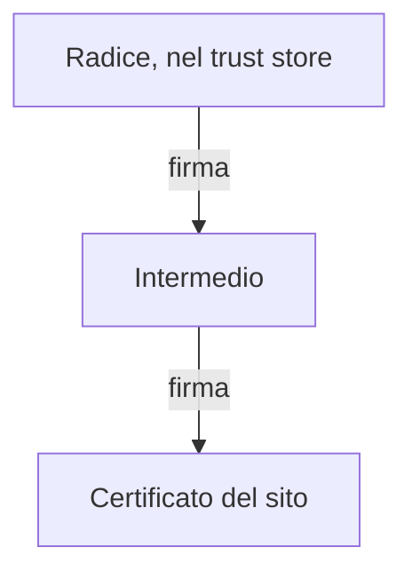
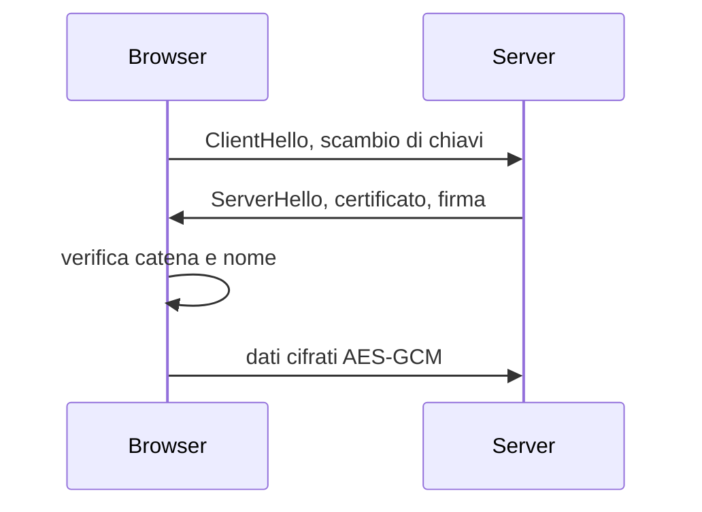

## Lezione 3.3: Certificati e HTTPS

Modulo 3: Crittografia pratica. Cybersecurity ed Ethical Hacking

---

## Di chi è questa chiave pubblica?

- Chiave pubblica sostituita da un intermediario: **man in the middle**
- Serve un legame affidabile tra chiave pubblica e nome di dominio
- Soluzione: **certificati digitali** firmati da **autorità di certificazione** (CA)

---

## Il certificato X.509

- **Soggetto** e **nomi alternativi** (SAN): domini coperti
- **Emittente**: la CA che firma
- **Periodo di validità**
- **Chiave pubblica** (RSA o curve ellittiche)
- **Firma dell'emittente**

---

## Catena di fiducia

Controlli: firme fino alla radice, nome di dominio, validità, revoca

Avviso del browser: non va ignorato

---

## CA e durata dei certificati

- Let's Encrypt (2015): certificati gratuiti, protocollo ACME automatico
- Radici ISRG Root X1 e X2
- Durata massima (CA/Browser Forum, SC-081): 398 giorni, poi 200 (15/3/2026), 100 (2027), 47 (2029)
- Let's Encrypt: da 90 a 45 giorni entro il 2028

---

## TLS 1.3 in breve

- Chiavi di sessione nuove: **forward secrecy**

---

## Che cosa garantisce il lucchetto

Sì:

- connessione cifrata
- server che controlla il dominio nella barra degli indirizzi

No:

- onestà del sito (anche il phishing ha certificati validi)
- protezione dei dati sul server
- correttezza del dominio digitato

Chrome 117: icona neutra al posto del lucchetto

---

## Ispezione TLS

- Proxy di filtraggio in aziende e scuole
- Certificati firmati da una CA dell'organizzazione, installata sui dispositivi gestiti
- Emittente diverso da quello pubblico
- Su dispositivi senza quella CA: avviso di certificato non valido

---

## Laboratorio

1. Firefox: icona, **Connessione sicura**, **Ulteriori informazioni**, **Visualizza certificato**
2. Tabella per quattro siti: SAN, emittente, radice, validità, durata, algoritmo
3. badssl.com: `expired`, `wrong.host`, `self-signed`, `untrusted-root`
4. `python info_certificato.py www.wikipedia.org`

Docente: `test_info_certificato.py`, CA di prova locale, 8 test

---

## Aspetti orientativi

- Gestione dei certificati: amministratori di sistema, automazione
- Certificati scaduti: causa frequente di interruzioni di servizio
- CA/Browser Forum: esempio di governance di Internet
- Perché il lucchetto non basta contro il phishing?
