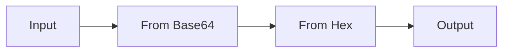

# Lezione 3.4: Laboratorio con CyberChef

> Contenuto originale. Strumento: CyberChef, GCHQ, licenza Apache 2.0, https://github.com/gchq/CyberChef . I file degli esercizi e il confronto con Python sono nella cartella `esercizi` di questa lezione; le soluzioni sono nel file `esercizi/soluzioni_docente.md`.

Obiettivo: distinguere in pratica codifica, hash e cifratura; riconoscere e decodificare le codifiche più comuni; cifrare e decifrare con AES; misurare la casualità apparente dei dati. Tutti i risultati attesi sono stati verificati con CyberChef 11.5.0 e, dove possibile, con Python.

## 3.4.1 Codifica, hash e cifratura a confronto

| | Codifica | Hash | Cifratura |
|---|---|---|---|
| Esempi | Base64, esadecimale, URL encoding | SHA-256, SHA-3 | AES, ChaCha20, RSA |
| Usa una chiave? | no | no (HMAC sì) | sì |
| Reversibile? | sì, da chiunque | no | sì, solo con la chiave |
| Lunghezza del risultato | proporzionale all'input | fissa (256 bit per SHA-256) | circa uguale all'input |
| Scopo | rappresentare dati binari come testo, trasportarli in sistemi che accettano solo certi caratteri | verificare integrità, confrontare senza conservare l'originale (password, lezione 2.2) | riservatezza, e con le modalità autenticate anche integrità |

**Base64** rappresenta ogni gruppo di 3 byte con 4 caratteri scelti tra 64 (A-Z, a-z, 0-9, `+` e `/`), con `=` come riempimento finale. Si usa per inserire dati binari in testo: allegati delle email, immagini incorporate nelle pagine web, chiavi e certificati nei file di testo. Riferimento: https://it.wikipedia.org/wiki/Base64

**Base64 non è cifratura.** Un testo in Base64 non si legge a colpo d'occhio, ma chiunque lo decodifica in un istante, senza alcun segreto. Errori frequenti nei sistemi reali:

- password "nascoste" in Base64 nei file di configurazione o nel codice sorgente
- credenziali inviate con l'autenticazione HTTP di base, che le trasmette codificate in Base64: senza HTTPS chiunque sulla rete le legge
- dati personali "offuscati" in Base64 nei cookie o negli indirizzi delle pagine

Segni di riconoscimento: Base64 contiene solo lettere, cifre, `+`, `/` e spesso termina con `=` o `==`; la lunghezza è un multiplo di 4. L'esadecimale contiene solo cifre e lettere da `a` a `f`, a coppie.

## 3.4.2 L'interfaccia di CyberChef

CyberChef è installato in versione offline nella lezione 3.1 (`C:\strumenti\CyberChef`). La versione offline è da preferire quando si lavora con dati reali: la versione online elabora comunque i dati nel browser, ma l'indirizzo della pagina può contenere ricetta e input, e finire così nella cronologia o in un collegamento condiviso.

- **Operations**: elenco delle oltre 500 operazioni, con casella di ricerca
- **Recipe**: la ricetta, sequenza di operazioni applicate in ordine; ogni operazione ha i propri parametri; il pulsante con l'icona di pausa disattiva temporaneamente un'operazione
- **Input** e **Output**: dati di partenza e risultato, aggiornato automaticamente
- **Magic**: operazione che prova a riconoscere codifiche e formati e suggerisce la ricetta per decodificarli
- **Save recipe** e **Load recipe**: salvataggio e caricamento delle ricette

Diagramma: una ricetta è una catena di trasformazioni.



## 3.4.3 Esercizi guidati

Tempo indicativo: 50 minuti. Lavoro individuale; gli esercizi 6 e 7 a coppie. I dati degli esercizi si copiano da questa pagina o dai file della cartella `esercizi`. Svuotare la ricetta (icona del cestino) all'inizio di ogni esercizio.

### Esercizio 1: codifiche

1. Scrivere `Ciao` in Input e aggiungere l'operazione **To Hex**. Annotare il risultato: ogni carattere diventa un byte, rappresentato da due cifre esadecimali.
2. Sostituire l'operazione con **To Base64** e annotare il risultato.
3. Aggiungere dopo To Base64 l'operazione **From Base64**: l'output torna uguale all'input.
4. Ripetere con `Ciao!` e `Ciao!!`: come cambia il carattere `=` finale?

### Esercizio 2: una password "protetta"

Il file `esercizi/config_esempio.ini` contiene la configurazione di un'applicazione fittizia:

```ini
[wifi_ospiti]
ssid = Scuola-Ospiti
; la password e' "protetta" per non essere leggibile a colpo d'occhio
password_b64 = UGFzc3dvcmQgZGVsIFdpLUZpIG9zcGl0aTogQXVsYS1NYWduYS0yMDI2
```

1. Decodificare il valore con **From Base64**.
2. Discutere: che cosa dovrebbe fare l'applicazione per proteggere davvero la password? (Spunti: permessi del file, archivi di segreti, cifratura con una chiave conservata altrove.)

### Esercizio 3: Magic

La stringa seguente è stata codificata due volte:

```text
NTY2NTcyNjk2NjY5NjM2MTIwNjQ2OTIwNjk2ZTY2NmY3MjZkNjE3NDY5NjM2MTIwNzM3MDZmNzM3NDYxNzQ2MTIwNjEyMDY3Njk2Zjc2NjU2NGMzYWM=
```

1. Osservarla e formulare un'ipotesi sulla prima codifica da togliere.
2. Applicare **Magic**: l'output è una tabella di ricette possibili, con un'anteprima del risultato e alcune proprietà (lingua probabile, entropia). Fare clic sulla ricetta migliore per caricarla.
3. Ricostruire la stessa ricetta a mano, con le singole operazioni, e verificarne l'ordine.

### Esercizio 4: hash

1. Calcolare con **SHA2** (dimensione 256) l'impronta di `ciao` e poi di `Ciao`. Confrontare i due risultati: quanti caratteri hanno in comune?
2. Confrontare l'impronta di `ciao` con quella calcolata in Python nella lezione 2.2: deve coincidere.
3. Calcolare l'impronta di un testo di una pagina intera: la lunghezza dell'impronta cambia?
4. Aggiungere **From Hex** dopo SHA2: è possibile risalire al testo originale? Perché?

### Esercizio 5: cifrari storici

1. Decifrare `Dssxqwdphqwr lq eleolrwhfd dooh txlqglfl` con **ROT13**, provando i valori di **Amount** finché il testo diventa leggibile. Quanti tentativi al massimo sono necessari?
2. Decifrare con **Vigenère Decode** e la chiave `CHIAVE`:

```text
Ks klpf fp qnasttitdgc zq rdyppacz mp hclv hqkqcd ensm qpmpkqcd
```

### Esercizio 6: AES, decifratura

Un messaggio è stato cifrato con AES-128 in modalità CBC. Dati:

```text
Chiave (hex): 8f3a1c5e9b2d4f60718293a4b5c6d7e8
IV (hex):     0a1b2c3d4e5f60718293a4b5c6d7e8f9
Cifrato (hex):
392decb59451874e032d269c673357bc244389953703859256da22a3924fe958d8d651ccc0e589cae266606cacf0e691512be827e349cf5bf583b73bce42583f
```

1. Incollare il cifrato in Input e aggiungere **AES Decrypt**.
2. Inserire chiave e IV nei campi **Key** e **IV**, lasciando il formato **HEX** nel menu accanto a ciascun campo; lasciare **Mode** CBC, **Input** Hex, **Output** Raw.
3. Leggere il messaggio.
4. Cambiare l'ultima cifra della chiave da `8` a `9`: che cosa succede? CyberChef segnala che non riesce a decifrare perché il riempimento finale (padding PKCS#7) non risulta valido: con una chiave sbagliata non si ottiene nemmeno un testo "quasi giusto".
5. Ripristinare la chiave e cambiare invece la prima cifra dell'IV da `0` a `1`: quale parte del messaggio si altera, e quale resta corretta? Il risultato si spiega con il funzionamento della modalità CBC (lezione 3.1): il primo blocco decifrato viene combinato con XOR con l'IV.

### Esercizio 7: AES, cifratura a coppie

1. Ogni studente sceglie una chiave di 16 byte, scritta come 32 cifre esadecimali, e un IV di 16 byte. Per generarli si può usare l'operazione **Pseudo-Random Number Generator** con 16 byte e output Hex, oppure in Python `secrets.token_hex(16)`.
2. Cifrare un breve messaggio con **AES Encrypt** (Input Raw, Output Hex) e consegnare al compagno solo il cifrato.
3. Il compagno deve decifrarlo: per farlo gli servono chiave e IV. Come trasmetterli? Con quali rischi, se si usa lo stesso canale del cifrato?
4. Cifrare due volte lo stesso messaggio con la stessa chiave e lo stesso IV: i cifrati sono uguali? Che cosa potrebbe dedurre chi osserva la comunicazione? Perché l'IV deve cambiare a ogni messaggio?

### Esercizio 8: entropia

L'**entropia di Shannon** misura quanto i byte di un dato sono imprevedibili, in bit per byte: 0 se tutti i byte sono uguali, 8 al massimo. Il testo in una lingua naturale ha entropia bassa, perché alcune lettere sono molto più frequenti di altre; i dati cifrati o compressi hanno entropia vicina al massimo.

1. Calcolare con **Entropy** l'entropia del messaggio in chiaro dell'esercizio 6.
2. Calcolarla dopo **To Base64**, e poi sul cifrato AES (ricetta **From Hex**, poi **Entropy**).
3. Confrontare i tre valori. Nota: con 64 byte l'entropia non può superare log2(64) = 6, perché possono comparire al massimo 64 valori diversi; per dati cifrati di qualche kilobyte il valore si avvicina a 8.

Uso professionale: un file con entropia vicina a 8 è quasi certamente cifrato o compresso; gli strumenti di analisi usano questo indicatore, per esempio, per individuare file cifrati da un ransomware o dati nascosti.

## 3.4.4 Confronto con Python

Lo script `esercizi/verifica_con_python.py` rifà gli esercizi 1, 2, 3, 4 e 8 con la libreria standard di Python:

```powershell
python verifica_con_python.py
```

I risultati devono coincidere con quelli di CyberChef. La libreria standard non offre AES: per gli esercizi 6 e 7 servirebbe una libreria esterna come `cryptography`. Funzione per l'entropia:

```python
def entropia_shannon(dati):
    """Entropia di Shannon in bit per byte: 0 = tutti i byte uguali, 8 = massimo possibile."""
    if not dati:
        return 0.0
    totale = len(dati)
    return -sum(n / totale * math.log2(n / totale) for n in Counter(dati).values())
```

`Counter(dati)` conta quante volte compare ciascun valore di byte; per ogni valore, `n / totale` è la sua frequenza relativa.

### Attività conclusiva

Tempo indicativo: 10 minuti. Salvare con **Save recipe** la ricetta dell'esercizio 3 e quella dell'esercizio 6, e rispondere per iscritto:

1. Tre differenze tra codifica e cifratura.
2. Perché una funzione di hash non si può "decifrare"?
3. Un collega sostiene che i dati di un'applicazione sono al sicuro perché "sono in Base64 e poi in esadecimale". Come rispondere?

## 3.4.5 Aspetti orientativi (discussione)

- CyberChef è usato ogni giorno negli analisti dei centri operativi di sicurezza (SOC), nei gruppi di risposta agli incidenti e nell'informatica forense, per decodificare dati trovati nei log, negli allegati sospetti e nel traffico di rete (moduli 4 e 6).
- Le competizioni di tipo Capture The Flag (CTF) propongono spesso esercizi di codifica e crittografia simili a quelli di questa lezione; la partecipazione, facoltativa, è un modo diffuso per allenarsi e farsi conoscere.
- Domanda: in quali altri ambiti, oltre alla sicurezza, è utile saper riconoscere e convertire formati di dati?
