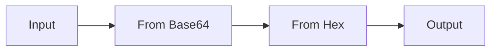

## Contenuti

- Codifica, hash, cifratura
- L'interfaccia
- Esercizi 1-4
- Esercizi 5-6
- Esercizi 7-8
- Confronto con Python
- Aspetti orientativi

Strumento: CyberChef, GCHQ, licenza Apache 2.0, https://github.com/gchq/CyberChef

## Codifica, hash, cifratura

| | Codifica | Hash | Cifratura |
|---|---|---|---|
| Chiave | no | no | sì |
| Reversibile | da chiunque | no | con la chiave |
| Lunghezza | proporzionale | fissa | circa uguale |
| Esempi | Base64, hex | SHA-256 | AES |

**Base64 non è cifratura**

## L'interfaccia



- **Operations**, **Recipe**, **Input**, **Output**
- **Magic**: riconosce codifiche e propone ricette
- Versione offline per i dati reali

## Esercizi 1-4

1. `Ciao`: **To Hex**, **To Base64**, **From Base64**
2. Password "protetta" in `config_esempio.ini`: **From Base64**
3. Stringa codificata due volte: **Magic**
4. **SHA2** 256 di `ciao` e `Ciao`: effetto valanga

## Esercizi 5-6

5. **ROT13** con Amount variabile; **Vigenère Decode**, chiave `CHIAVE`
6. **AES Decrypt**, CBC

```text
Key: 8f3a1c5e9b2d4f60718293a4b5c6d7e8
IV:  0a1b2c3d4e5f60718293a4b5c6d7e8f9
```

- Chiave errata di una cifra: decifratura impossibile
- IV errato: si altera solo l'inizio del messaggio

## Esercizi 7-8

7. **AES Encrypt** a coppie: come trasmettere la chiave? Stesso IV, stesso cifrato
8. **Entropy**: testo 3,84; Base64 4,85; cifrato AES 5,77 (massimo 6 con 64 byte)

Entropia vicina a 8: dati cifrati o compressi

## Confronto con Python

```powershell
python verifica_con_python.py
```

- Esercizi 1, 2, 3, 4, 8 con la libreria standard
- AES: non incluso nella libreria standard

## Aspetti orientativi

- CyberChef nei SOC, nella risposta agli incidenti, nell'informatica forense
- Competizioni Capture The Flag: allenamento facoltativo
- Formati di dati: dove serve riconoscerli, oltre alla sicurezza?
