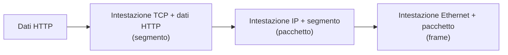
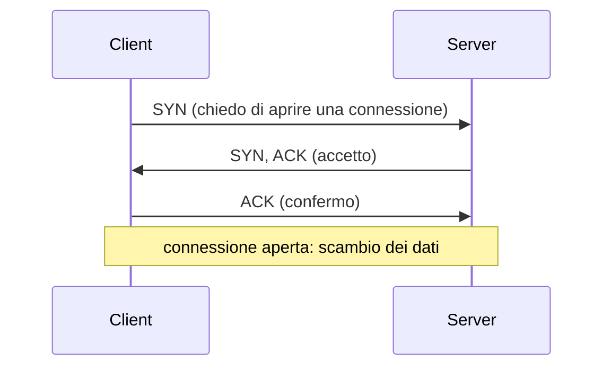

# Lezione 4.1: Protocolli e superficie esposta

> Fonte delle sezioni 4.1.1-4.1.3: adattamento da Microsoft, "Security-101", lezione "Networking key concepts", licenza CC0 1.0, https://github.com/microsoft/Security-101/blob/main/3.1%20Networking%20key%20concepts.md . Il resto della lezione è contenuto originale. Gli script sono nella cartella `laboratorio` di questa lezione.

Obiettivo: ripassare i concetti di rete necessari all'analisi della sicurezza (livelli, indirizzi, TCP e UDP, porte), definire la superficie di attacco e individuare i servizi in ascolto sul proprio PC.

## 4.1.1 Modelli a livelli

La comunicazione in rete è organizzata in **livelli**: ogni livello offre servizi a quello superiore e usa quelli del livello inferiore. Il **modello OSI** ha sette livelli ed è il riferimento teorico; il **modello TCP/IP**, usato in Internet, ne ha quattro.

| TCP/IP | OSI corrispondente | Funzione | Esempi |
|---|---|---|---|
| Applicazione | 7 Applicazione, 6 Presentazione, 5 Sessione | servizi per l'utente e i programmi | HTTP, HTTPS, DNS, SMTP, FTP, SSH |
| Trasporto | 4 Trasporto | comunicazione tra programmi, porte | TCP, UDP |
| Internet (rete) | 3 Rete | indirizzamento e instradamento tra reti | IP, ICMP |
| Accesso alla rete | 2 Collegamento dati, 1 Fisico | trasmissione sul mezzo fisico locale | Ethernet, Wi-Fi |

Ogni livello aggiunge ai dati una propria **intestazione** (incapsulamento); chi riceve la toglie livello per livello. Wireshark (lezione 4.3) mostra proprio questa struttura, un livello per riga.

Diagramma: incapsulamento di una richiesta web.



## 4.1.2 Indirizzi

- **Indirizzo MAC**
  identifica la scheda di rete nella rete locale (48 bit, per esempio `3c:52:82:4e:10:23`).
- **Indirizzo IP**
  identifica un dispositivo tra reti diverse; IPv4 usa 32 bit (per esempio `192.168.10.23`), IPv6 128 bit (per esempio `2001:db8::17`).
- **Indirizzi privati IPv4**
  riservati alle reti interne e non instradati su Internet: `10.0.0.0/8`, `172.16.0.0/12`, `192.168.0.0/16`. Il router della scuola o di casa li traduce in un indirizzo pubblico (NAT).
- **Notazione CIDR**
  `192.168.10.0/24` indica la rete in cui i primi 24 bit sono fissi: 256 indirizzi, da `192.168.10.0` a `192.168.10.255`.
- **Loopback**
  `127.0.0.1` (IPv4) e `::1` (IPv6) indicano il computer stesso; il traffico non esce dalla macchina.

## 4.1.3 TCP, UDP e porte

- **TCP** (Transmission Control Protocol)
  orientato alla connessione: prima dello scambio dei dati apre una connessione con la **stretta di mano in tre passi** (three-way handshake); garantisce consegna, ordine e ritrasmissione dei dati persi. Usato dal web, dalla posta, dal trasferimento di file.
- **UDP** (User Datagram Protocol)
  senza connessione: invia messaggi indipendenti, senza garanzie di consegna; più semplice e veloce. Usato da DNS, streaming, videochiamate, giochi in rete.

Diagramma: apertura di una connessione TCP.



Una **porta** è un numero da 0 a 65535 che identifica un programma all'interno di un dispositivo. Un servizio **in ascolto** (listening) attende connessioni su una porta; il client usa una porta temporanea scelta dal sistema. Una connessione è identificata da indirizzo e porta di entrambe le parti. Intervalli definiti dalla IANA (https://www.iana.org/assignments/service-names-port-numbers/service-names-port-numbers.xhtml):

- **porte di sistema** (0-1023): servizi standard, per esempio 80 per HTTP e 443 per HTTPS
- **porte registrate** (1024-49151): applicazioni registrate presso la IANA
- **porte dinamiche** (49152-65535): uso temporaneo da parte dei client e usi privati

Servizi frequenti e loro protezione:

| Porta | Servizio | Dati in chiaro? | Alternativa cifrata |
|---|---|---|---|
| 20, 21 TCP | FTP | sì, credenziali comprese | SFTP (su SSH, 22) o FTPS |
| 22 TCP | SSH | no | |
| 23 TCP | Telnet | sì, credenziali comprese | SSH |
| 25 TCP | SMTP (posta tra server) | dipende dalla configurazione | STARTTLS |
| 53 UDP e TCP | DNS | sì | DNS over HTTPS o over TLS |
| 80 TCP | HTTP | sì | HTTPS |
| 443 TCP | HTTPS | no | |
| 445 TCP | SMB (condivisione di file Windows) | dipende dalla versione e configurazione | SMB 3 con cifratura |
| 3389 TCP | Desktop remoto (RDP) | no, ma bersaglio frequente | accesso solo tramite VPN |

## 4.1.4 Superficie di attacco

La **superficie di attacco** è l'insieme dei punti attraverso cui qualcuno potrebbe tentare di interagire con un sistema senza autorizzazione: servizi di rete in ascolto, applicazioni web, account, dispositivi USB, persone (ingegneria sociale). La **superficie esposta sulla rete** è la parte raggiungibile via rete: ogni servizio in ascolto è una porta aperta verso un programma, che può contenere vulnerabilità o essere configurato male.

Principi di riduzione:

- **disattivare ciò che non serve**: ogni servizio non necessario è rischio senza beneficio
- **limitare l'ascolto**: un servizio usato solo sul PC stesso deve ascoltare su `127.0.0.1`, non su tutte le interfacce
- **filtrare**: il firewall (lezione 4.2) consente l'accesso solo da chi ne ha bisogno
- **preferire protocolli cifrati**: HTTPS, SSH, SFTP al posto di HTTP, Telnet, FTP
- **aggiornare**: i servizi esposti vanno mantenuti aggiornati
- **inventariare**: non si protegge ciò che non si sa di avere

Chi attacca, per prima cosa, cerca di scoprire quali servizi sono esposti; la tecnica è descritta nel catalogo MITRE ATT&CK come "Network Service Discovery", insieme alle contromisure: https://attack.mitre.org/techniques/T1046/ . L'inventario dei propri servizi, oggetto del laboratorio, è la stessa conoscenza vista dal lato di chi difende. La ricerca di servizi su sistemi altrui senza autorizzazione è vietata (lezione 1.2): nel laboratorio si analizza solo il proprio PC.

## 4.1.5 Laboratorio

Tempo indicativo: 35 minuti. Cartella di lavoro `C:\corso-cyber\lab41`, con i file della cartella `laboratorio` di questa lezione.

### Parte 1: servizi in ascolto

In PowerShell:

```powershell
Get-NetTCPConnection -State Listen |
  Select-Object LocalAddress, LocalPort, OwningProcess,
    @{Name="Processo"; Expression={(Get-Process -Id $_.OwningProcess -ErrorAction SilentlyContinue).ProcessName}} |
  Sort-Object LocalPort
```

- `Get-NetTCPConnection -State Listen` elenca le porte TCP in ascolto, con l'indirizzo locale e il numero del processo proprietario (PID): https://learn.microsoft.com/en-us/powershell/module/nettcpip/get-nettcpconnection
- la proprietà calcolata `Processo` ricava il nome del programma dal PID con `Get-Process`
- per le porte UDP il comando corrispondente è `Get-NetUDPEndpoint`

Alternativa disponibile in ogni versione di Windows: `netstat -ano`, che mostra le connessioni con il PID; il nome del processo si ricava con `tasklist /FI "PID eq numero"`.

Interpretazione dell'indirizzo locale:

- `0.0.0.0` o `::`: il servizio ascolta su tutte le interfacce, quindi potenzialmente dalla rete
- `127.0.0.1` o `::1`: il servizio è raggiungibile solo dal PC stesso
- un indirizzo specifico: il servizio ascolta solo su quella scheda di rete

### Parte 2: analisi con Python

Esportare l'elenco in un file CSV:

```powershell
Get-NetTCPConnection -State Listen |
  Select-Object LocalAddress, LocalPort, OwningProcess,
    @{Name="Processo"; Expression={(Get-Process -Id $_.OwningProcess -ErrorAction SilentlyContinue).ProcessName}} |
  Export-Csv ascolto.csv -NoTypeInformation -Encoding UTF8
python servizi_in_ascolto.py ascolto.csv
```

Output con il file di esempio `ascolto_esempio.csv` (i risultati reali dipendono dal PC):

```text
 Porta  In ascolto per                   Processo             Descrizione
   135  tutte le interfacce              svchost              RPC di Windows
   139  solo l'interfaccia 192.168.1.23  System               NetBIOS, condivisione di file e stampanti (versioni vecchie)  <- da verificare
   445  tutte le interfacce              System               SMB, condivisione di file e stampanti di Windows  <- da verificare
  3389  tutte le interfacce              svchost              Desktop remoto (RDP)  <- da verificare
...
  8080  solo questo PC                   python               server web di sviluppo o proxy
...
Servizi: 10; in ascolto sulle interfacce di rete: 8; solo locali: 2
```

Funzione principale:

```python
def portata(indirizzo):
    """Da quali reti è raggiungibile un servizio in ascolto su 'indirizzo'."""
    ip = ipaddress.ip_address(indirizzo.split("%")[0])
    if ip.is_unspecified:
        return "tutte le interfacce"
    if ip.is_loopback:
        return "solo questo PC"
    return f"solo l'interfaccia {ip}"
```

Il modulo `ipaddress` riconosce gli indirizzi speciali sia IPv4 sia IPv6; la parte dopo `%`, presente negli indirizzi IPv6 locali, indica la scheda di rete e va tolta prima dell'analisi. I test si eseguono con `python test_servizi_in_ascolto.py` (13 test).

### Parte 3: verifica pratica

1. Avviare un piccolo server web solo locale e verificare che compaia nell'elenco con portata "solo questo PC":

```powershell
python -m http.server 8000 --bind 127.0.0.1
```

2. In un'altra finestra ripetere l'analisi; poi fermare il server con `Ctrl+C`. Che cosa cambierebbe senza `--bind 127.0.0.1`? Windows potrebbe chiedere di consentire l'accesso nel firewall: perché?

### Attività

Tempo indicativo: 15 minuti.

1. Per ogni porta in ascolto sulle interfacce di rete del proprio PC, individuare il programma e ipotizzare se sia necessario.
2. Confrontare i risultati con quelli di un compagno: quali servizi sono comuni a tutti i PC del laboratorio, e perché?
3. Classificare i servizi della tabella della sezione 4.1.3 in base al rischio in caso di esposizione su Internet, motivando.

## 4.1.6 Aspetti orientativi (discussione)

- L'inventario dei servizi esposti è la prima attività di ogni valutazione della sicurezza, interna o affidata a specialisti (vulnerability assessment e penetration test, sempre con autorizzazione scritta).
- Le competenze di rete sono alla base di molti ruoli: amministratore di rete, sistemista, analista SOC, cloud engineer; certificazioni diffuse sono Cisco CCNA e CompTIA Network+.
- Domanda: perché un servizio in ascolto solo su `127.0.0.1` è molto meno rischioso dello stesso servizio in ascolto su tutte le interfacce?
