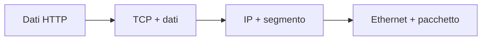
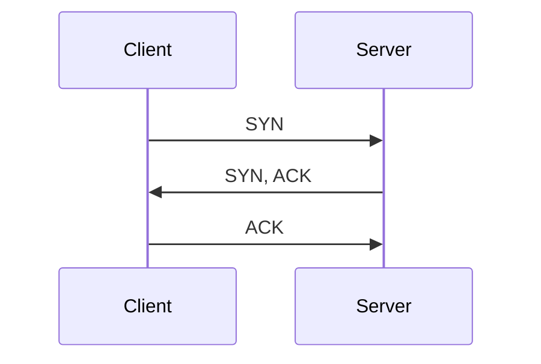

## Lezione 4.1: Protocolli e superficie esposta

Modulo 4: Reti e analisi del traffico. Cybersecurity ed Ethical Hacking

Fonte sezioni 4.1.1-4.1.3: Microsoft, "Security-101", licenza CC0 1.0
https://github.com/microsoft/Security-101

---

## Modelli a livelli

| TCP/IP | Esempi |
|---|---|
| Applicazione | HTTP, HTTPS, DNS, SSH |
| Trasporto | TCP, UDP |
| Internet | IP, ICMP |
| Accesso alla rete | Ethernet, Wi-Fi |



---

## Indirizzi

- **MAC**: scheda di rete, rete locale
- **IP**: IPv4 32 bit, IPv6 128 bit
- Privati: `10.0.0.0/8`, `172.16.0.0/12`, `192.168.0.0/16`
- CIDR: `192.168.10.0/24` = 256 indirizzi
- Loopback: `127.0.0.1`, `::1`

---

## TCP, UDP e porte



- Porte 0-65535: sistema (0-1023), registrate, dinamiche (49152-65535)
- Servizio **in ascolto** su una porta

---

## Servizi in chiaro e cifrati

| Porta | Servizio | Alternativa cifrata |
|---|---|---|
| 21 | FTP | SFTP, FTPS |
| 23 | Telnet | SSH (22) |
| 80 | HTTP | HTTPS (443) |
| 53 | DNS | DNS over HTTPS/TLS |
| 3389 | RDP | solo tramite VPN |

---

## Superficie di attacco

- Insieme dei punti di interazione non autorizzata
- Ridurla: disattivare, limitare l'ascolto, filtrare, cifrare, aggiornare, inventariare
- MITRE ATT&CK T1046, Network Service Discovery
- In laboratorio: solo il proprio PC

---

## Laboratorio

```powershell
Get-NetTCPConnection -State Listen |
  Select-Object LocalAddress, LocalPort, OwningProcess, ... |
  Export-Csv ascolto.csv -NoTypeInformation -Encoding UTF8
python servizi_in_ascolto.py ascolto.csv
```

- `0.0.0.0` / `::`: tutte le interfacce
- `127.0.0.1` / `::1`: solo questo PC
- Prova: `python -m http.server 8000 --bind 127.0.0.1`; 13 test

---

## Aspetti orientativi

- Inventario dei servizi: primo passo di ogni valutazione
- Amministratore di rete, sistemista, analista SOC, cloud engineer
- Certificazioni: Cisco CCNA, CompTIA Network+
- Perché `127.0.0.1` riduce il rischio?
