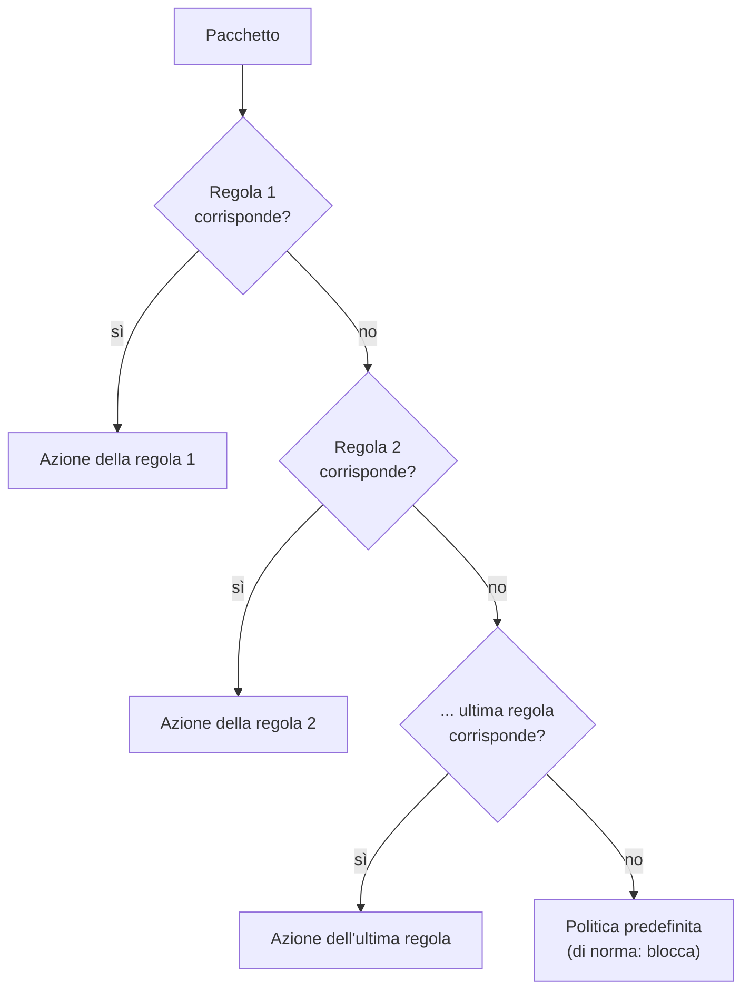
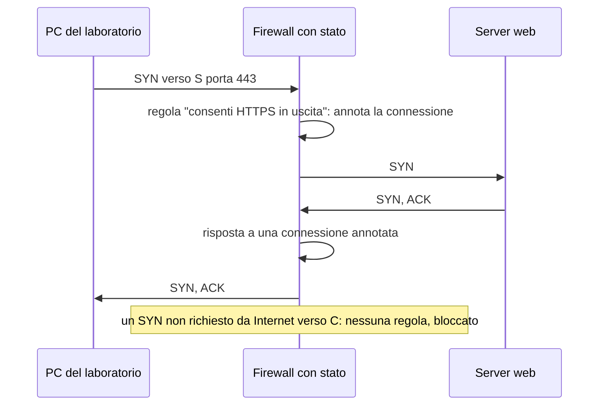

# Lezione 4.2: Firewall e regole

> Fonte della sezione 4.2.1: adattamento da Microsoft, "Security-101", lezione "Network security capabilities", licenza CC0 1.0, https://github.com/microsoft/Security-101/blob/main/3.3%20Network%20security%20capabilities.md . Il resto della lezione è contenuto originale. Gli script sono nella cartella `laboratorio` di questa lezione.

Obiettivo: comprendere come un firewall decide quali pacchetti far passare, progettare un insieme di regole ordinato secondo il principio della negazione predefinita e verificarlo con un simulatore.

## 4.2.1 Il firewall e gli strumenti affini

- **Firewall**
  dispositivo o programma che controlla il traffico in ingresso e in uscita sulla base di regole predefinite; separa reti con livelli di fiducia diversi, per esempio la rete interna da Internet.
- **Firewall personale** (host firewall)
  in esecuzione sul singolo computer, come Windows Defender Firewall; protegge il dispositivo anche all'interno della rete locale.
- **Web Application Firewall** (WAF)
  analizza le richieste HTTP dirette a un'applicazione web e blocca attacchi tipici come l'SQL injection (modulo 5).
- **Gruppi di sicurezza nel cloud** (per esempio i Network Security Group di Azure)
  firewall virtuali che regolano il traffico da e verso le risorse cloud.
- **VPN**
  crea un tunnel cifrato tra il dispositivo e una rete remota; permette l'accesso ai servizi interni senza esporli su Internet.
- **Bastion host**
  server isolato e protetto, unico punto di accesso amministrativo ai sistemi interni.

## 4.2.2 Filtraggio dei pacchetti

Un firewall a **filtraggio di pacchetti** esamina le intestazioni di ogni pacchetto e le confronta con le regole. Campi usati tipicamente:

- protocollo (TCP, UDP, ICMP)
- indirizzo IP di origine e di destinazione, o intere reti in notazione CIDR
- porta di destinazione (il servizio) e, meno spesso, di origine
- direzione (in ingresso o in uscita) e interfaccia di rete

Ogni regola indica un'**azione**: consentire o bloccare. Molti firewall distinguono anche tra **bloccare in silenzio** (drop: il pacchetto viene scartato senza risposta) e **rifiutare** (reject: il mittente riceve una notifica di rifiuto).

### Ordine delle regole

Le regole si esaminano **dall'alto verso il basso** e si applica la **prima** che corrisponde al pacchetto; le successive non vengono considerate. Conseguenze:

- le regole specifiche vanno prima di quelle generali; una regola generale posta prima "oscura" le regole più specifiche che la seguono, che non verranno mai applicate
- se nessuna regola corrisponde si applica la **politica predefinita**

Diagramma: valutazione di un pacchetto.



### Negazione predefinita

La **negazione predefinita** (default deny) blocca tutto ciò che non è esplicitamente consentito: le regole elencano solo ciò che serve. È l'applicazione alle reti del principio del minimo privilegio (lezione 2.4). L'approccio opposto, consentire tutto e bloccare solo ciò che è noto come pericoloso, lascia passare ogni servizio dimenticato o nuovo.

Windows Defender Firewall applica per il traffico in ingresso la negazione predefinita: un programma che vuole ricevere connessioni dalla rete ha bisogno di una regola che lo consenta, ed è per questo che Windows chiede conferma quando un programma si mette in ascolto per la prima volta.

## 4.2.3 Firewall con stato

Una connessione TCP coinvolge pacchetti nei due versi. Un firewall **senza stato** (stateless) valuta ogni pacchetto da solo: per consentire la navigazione servirebbe anche una regola che faccia entrare le risposte, cioè pacchetti provenienti dalla porta 443 di qualsiasi server verso porte alte dei client, una regola molto ampia.

Un firewall **con stato** (stateful) ricorda le connessioni consentite in uscita e lascia passare automaticamente le risposte corrispondenti, e solo quelle. È il comportamento dei firewall moderni, compreso quello di Windows.

Diagramma: firewall con stato.



Esistono inoltre firewall "di nuova generazione" che riconoscono le applicazioni e analizzano il contenuto del traffico, e sistemi di prevenzione delle intrusioni (IPS) che bloccano schemi di attacco noti.

## 4.2.4 Laboratorio

Tempo indicativo: 45 minuti. Cartella di lavoro `C:\corso-cyber\lab42`, con i file della cartella `laboratorio` di questa lezione.

### Parte 1: il firewall di Windows, in sola lettura

Aprire **Sicurezza di Windows**, **Firewall e protezione rete**: osservare quale profilo di rete è attivo (dominio, privato o pubblico) e se il firewall è attivo. Da **Impostazioni avanzate** si apre la console con l'elenco delle regole in ingresso e in uscita; sui PC del laboratorio le regole non vanno modificate.

In PowerShell, se consentito sui PC del laboratorio, lo stesso stato si legge con:

```powershell
Get-NetFirewallProfile | Select-Object Name, Enabled, DefaultInboundAction, DefaultOutboundAction
```

Riferimento: https://learn.microsoft.com/en-us/powershell/module/netsecurity/get-netfirewallprofile

### Parte 2: il simulatore

Il file `firewall.py` contiene:

- `Regola(nome, azione, protocollo, sorgente, destinazione, porte)`: una regola; sorgente e destinazione sono reti CIDR, `porte` una tupla di porte di destinazione (vuota: qualsiasi)
- `Pacchetto(protocollo, sorgente, destinazione, porta_src, porta_dst)`
- `Firewall(regole, predefinita="blocca", stato=True)` con i metodi `valuta(pacchetto)`, che restituisce azione e motivo, e `regole_oscurate()`, che segnala le regole che non verranno mai applicate

Nucleo della valutazione:

```python
def valuta(self, p):
    if self.stato and (p.protocollo, p.destinazione, p.porta_dst, p.sorgente, p.porta_src) in self.connessioni:
        return "consenti", "risposta a una connessione consentita"
    for r in self.regole:
        if r.corrisponde(p):
            if r.azione == "consenti" and self.stato and p.protocollo in ("tcp", "udp"):
                self.connessioni.add((p.protocollo, p.sorgente, p.porta_src, p.destinazione, p.porta_dst))
            return r.azione, f"regola '{r.nome}'"
    return self.predefinita, "politica predefinita"
```

- la tabella `connessioni` registra le connessioni consentite; una risposta ha indirizzi e porte scambiati, per questo la ricerca avviene con destinazione e sorgente invertite
- il ciclo `for` realizza la regola della prima corrispondenza: `return` interrompe l'esame alla prima regola che corrisponde
- l'appartenenza di un indirizzo a una rete si verifica con il modulo `ipaddress`: `ip_address("192.168.20.14") in ip_network("192.168.20.0/24")`

```powershell
python firewall.py
python test_firewall.py
```

```text
tcp 192.168.20.14:51000 -> 192.168.10.5:443  CONSENTI  (regola 'web del server')
tcp 192.168.10.5:443 -> 192.168.20.14:51000  CONSENTI  (risposta a una connessione consentita)
tcp 192.168.20.14:51001 -> 192.168.10.5:3389  BLOCCA    (regola 'desktop remoto vietato')
tcp 192.168.20.14:51002 -> 192.168.10.5:445  BLOCCA    (politica predefinita)
tcp 203.0.113.50:443 -> 192.168.20.14:51003  BLOCCA    (politica predefinita)
...
Test superati: 15, falliti: 0
```

L'ultimo pacchetto simula una "risposta" da Internet per la quale non esiste alcuna connessione aperta: senza stato corrispondente viene bloccata.

### Parte 3: progetto delle regole

Tempo indicativo: 25 minuti, a coppie. Scenario: la rete della scuola ha queste reti e questi server.

| Rete o sistema | Indirizzi |
|---|---|
| Laboratorio informatico | 192.168.20.0/24 |
| Rete dei docenti | 192.168.30.0/24 |
| Segreteria | 192.168.40.0/24 |
| Server del registro (web) | 192.168.10.5, porte 80 e 443 |
| Server dei file della segreteria (SMB) | 192.168.10.8, porta 445 |
| Server DNS interno | 192.168.10.2, porta 53 UDP |

Requisiti:

1. tutte e tre le reti usano il DNS interno e il registro, solo in HTTPS
2. solo la segreteria accede al server dei file
3. il laboratorio e i docenti navigano su Internet in HTTP e HTTPS; la segreteria solo in HTTPS
4. tutto il resto è bloccato

Scrivere le regole in un file `regole_scuola.py` che crei un `Firewall` e verificarle con almeno otto pacchetti di prova, scelti in modo che ogni requisito sia verificato sia nel caso consentito sia in quello bloccato. Controllare infine con `regole_oscurate()` che nessuna regola sia inutile. Domanda: dove conviene posizionare una regola che blocca una singola postazione del laboratorio, e perché?

Per il docente: una soluzione possibile, verificata con dieci pacchetti di prova, è nel file `soluzione_regole_scuola.py`. La regola "altro traffico interno", posta prima delle regole di navigazione, impedisce che queste ultime, scritte con destinazione `0.0.0.0/0`, consentano anche l'accesso ai server interni sulle porte 80 e 443.

## 4.2.5 Aspetti orientativi (discussione)

- La progettazione e la manutenzione delle regole dei firewall sono attività tipiche di amministratori di rete e specialisti di sicurezza delle reti; con il tempo le regole si accumulano, e la loro revisione periodica è parte del lavoro.
- Nel cloud gli stessi concetti si applicano ai gruppi di sicurezza, spesso definiti come codice (infrastructure as code) e verificati con test automatici, come nel laboratorio.
- Domanda: perché la negazione predefinita è più sicura, e quali difficoltà comporta per chi deve gestire la rete?
