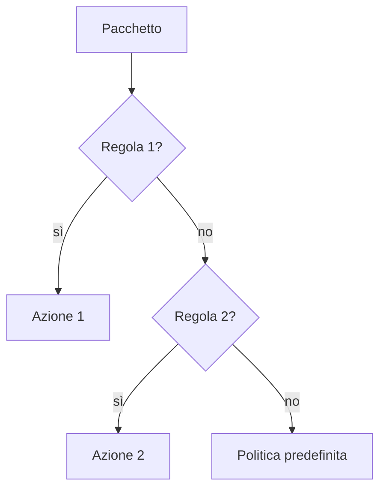

## Lezione 4.2: Firewall e regole

Modulo 4: Reti e analisi del traffico. Cybersecurity ed Ethical Hacking

Fonte sezione 4.2.1: Microsoft, "Security-101", licenza CC0 1.0
https://github.com/microsoft/Security-101

---

## Firewall e strumenti affini

- **Firewall** di rete e **firewall personale**
- **WAF**: protezione delle applicazioni web
- **Gruppi di sicurezza** nel cloud
- **VPN**, **bastion host**

---

## Filtraggio dei pacchetti

- Campi: protocollo, indirizzi, porte, direzione
- Azioni: consenti, blocca (drop o reject)
- **Prima corrispondenza**: regole specifiche prima di quelle generali
- **Negazione predefinita**: si consente solo ciò che serve

---

## Valutazione di un pacchetto



---

## Firewall con stato

- Senza stato: servono regole ampie per le risposte
- Con stato: le risposte alle connessioni consentite passano, le altre no
- Firewall di nuova generazione, IPS

---

## Laboratorio

- Sicurezza di Windows, Firewall e protezione rete: profili, stato (sola lettura)
- `firewall.py`: `Regola`, `Pacchetto`, `Firewall.valuta`, `regole_oscurate`
- 15 test

```text
tcp 192.168.20.14:51000 -> 192.168.10.5:443  CONSENTI
tcp 192.168.10.5:443 -> 192.168.20.14:51000  CONSENTI  (risposta)
tcp 192.168.20.14:51002 -> 192.168.10.5:445  BLOCCA    (predefinita)
```

---

## Progetto delle regole

- Laboratorio, docenti, segreteria; registro, file, DNS
- Quattro requisiti; almeno otto pacchetti di prova
- Nessuna regola oscurata
- Dove va la regola per una singola postazione?

---

## Aspetti orientativi

- Progettazione e revisione periodica delle regole
- Cloud: regole come codice, verificate con test
- Negazione predefinita: vantaggi e difficoltà di gestione
