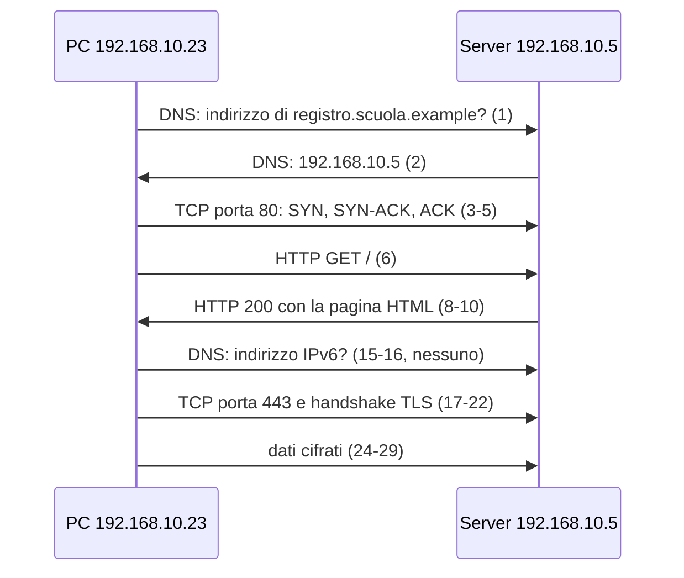

# Lezione 4.3: Wireshark, primi passi

> Contenuto originale. Riferimenti: Wireshark User's Guide, https://www.wireshark.org/docs/wsug_html_chunked/ . Le catture sono nella cartella `catture` di questa lezione; le soluzioni degli esercizi sono nel file `soluzioni_docente.md`.

Obiettivo: aprire e leggere una cattura di rete con Wireshark, riconoscere i livelli di un pacchetto e i principali protocolli, usare i filtri di visualizzazione e ricostruire una conversazione.

## 4.3.1 Catture di rete

Una **cattura** (packet capture) è la registrazione dei pacchetti transitati su un'interfaccia di rete, con l'istante di arrivo di ciascuno. I formati più diffusi sono **pcap**, il più vecchio, e **pcapng**, che aggiunge commenti e informazioni sulle interfacce.

**Wireshark** è l'analizzatore di protocolli più diffuso, open source (licenza GPLv2): riconosce migliaia di protocolli e mostra ogni pacchetto campo per campo. È usato da amministratori di rete, sviluppatori, analisti di sicurezza e docenti di reti.

Catturare il traffico e analizzarlo sono attività distinte:

- **cattura dal vivo**: richiede un driver di cattura (su Windows Npcap), diritti di amministratore e, soprattutto, l'autorizzazione di chi gestisce la rete; catturare il traffico di altre persone senza autorizzazione è illecito (lezione 1.2)
- **analisi di catture registrate**: non richiede diritti particolari; è l'attività del corso, su catture preparate per il laboratorio

## 4.3.2 Installazione della versione portatile

1. Dalla pagina https://www.wireshark.org/download.html scaricare, nella sezione della versione stabile (4.6.9 a settembre 2026), la voce **Windows x64 PortableApps**.
2. Eseguire il file scaricato e scegliere come destinazione `C:\strumenti\WiresharkPortable64`; non servono diritti di amministratore.
3. Avviare `WiresharkPortable64.exe`. Un eventuale messaggio sull'assenza di Npcap riguarda solo la cattura dal vivo e si può ignorare.

## 4.3.3 L'interfaccia

La finestra principale ha tre pannelli:

- **elenco dei pacchetti** (Packet List): una riga per pacchetto, con numero, tempo, origine, destinazione, protocollo, lunghezza e informazioni riassuntive; i colori distinguono i tipi di traffico
- **dettagli del pacchetto** (Packet Details): i livelli del pacchetto selezionato, uno per riga, espandibili fino ai singoli campi
- **byte del pacchetto** (Packet Bytes): il contenuto grezzo in esadecimale e in caratteri; selezionando un campo nei dettagli si evidenziano i byte corrispondenti

Nel pannello dei dettagli di una richiesta web si riconoscono i livelli della lezione 4.1:

```text
Frame 6: 152 bytes on wire (1216 bits), ...                                          (cattura)
Ethernet II, Src: HewlettPacka_4e:10:23 (3c:52:82:4e:10:23), Dst: Intel_3a:5c:05 (00:1b:21:3a:5c:05)   (accesso alla rete)
Internet Protocol Version 4, Src: 192.168.10.23, Dst: 192.168.10.5 (rete)
Transmission Control Protocol, Src Port: 56926, Dst Port: 80 ...  (trasporto)
Hypertext Transfer Protocol                                       (applicazione)
    GET / HTTP/1.1\r\n
    Host: registro.scuola.example\r\n
    User-Agent: curl/8.5.0\r\n
```

Wireshark sostituisce la prima metà dell'indirizzo MAC con il nome del produttore della scheda di rete, ricavato da un registro pubblico. Il campo `User-Agent` indica il programma che ha fatto la richiesta: in questa cattura `curl`, un programma a riga di comando, invece di un browser.

## 4.3.4 Filtri di visualizzazione

I **filtri di visualizzazione** (display filter) mostrano solo i pacchetti che soddisfano una condizione; si scrivono nella barra sopra l'elenco e si applicano con Invio. La barra diventa verde se il filtro è valido, rossa se contiene errori. Guida: https://www.wireshark.org/docs/wsug_html_chunked/ChWorkBuildDisplayFilterSection.html

| Filtro | Significato |
|---|---|
| `dns` | solo pacchetti DNS |
| `http` | solo HTTP |
| `tls` | solo TLS |
| `ip.addr == 192.168.10.5` | pacchetti con quell'indirizzo come origine o destinazione |
| `ip.src == 192.168.10.23` | pacchetti con quell'indirizzo come origine |
| `tcp.port == 443` | pacchetti TCP con porta 443, di origine o di destinazione |
| `tcp.flags.syn == 1 and tcp.flags.ack == 0` | richieste di apertura di connessioni TCP |
| `http.request` | solo le richieste HTTP |
| `http.request.method == "POST"` | solo le richieste HTTP di tipo POST |
| `frame contains "password"` | pacchetti che contengono il testo indicato in un punto qualsiasi |
| `not dns` oppure `!dns` | tutto tranne il DNS |

Operatori: `==`, `!=`, `>`, `<`, `contains`, `matches` (espressioni regolari); si combinano con `and`, `or`, `not` e con le parentesi. Un modo rapido per costruire un filtro: fare clic con il tasto destro su un campo nei dettagli e scegliere **Apply as Filter**, **Selected**.

I filtri di visualizzazione non vanno confusi con i **filtri di cattura**, che hanno una sintassi diversa e decidono che cosa registrare durante una cattura dal vivo.

## 4.3.5 Seguire una conversazione

**Analyze**, **Follow**, **TCP Stream** (scorciatoia `Ctrl+Alt+Shift+T`) ricompone i dati di una connessione TCP e li mostra come testo: in rosso ciò che invia il client, in blu ciò che invia il server. Contestualmente applica il filtro `tcp.stream eq N`, dove N è il numero progressivo della connessione nella cattura. Per il traffico TLS mostra solo byte cifrati.

## 4.3.6 Statistiche

Il menu **Statistics** offre viste d'insieme, utili soprattutto con catture grandi (https://www.wireshark.org/docs/wsug_html_chunked/ChStatistics.html):

- **Protocol Hierarchy**: percentuale di pacchetti e byte per ogni protocollo
- **Conversations**: coppie di indirizzi o di punti terminali (indirizzo e porta) che hanno comunicato, con pacchetti, byte e durata
- **Endpoints**: elenco degli indirizzi presenti, con il traffico di ciascuno
- **I/O Graphs**: andamento del traffico nel tempo

## 4.3.7 Laboratorio

Tempo indicativo: 45 minuti. Aprire con **File**, **Open** il file `catture\cattura1_navigazione.pcapng`.

La cattura è stata registrata in un ambiente di laboratorio: un PC (`192.168.10.23`) consulta il sito di un registro elettronico fittizio, `registro.scuola.example`, su un server della scuola (`192.168.10.5`) che fa anche da server DNS. Il dominio `example` è riservato agli esempi e non esiste in Internet. La cattura contiene 30 pacchetti.

Diagramma: le fasi della cattura.



Esercizi:

1. Individuare i pacchetti 1 e 2: qual è il nome richiesto, di che tipo è la richiesta, quale indirizzo contiene la risposta? Che cosa rispondono invece i pacchetti 15 e 16?
2. Applicare il filtro `tcp.flags.syn == 1 and tcp.flags.ack == 0`: quante connessioni TCP apre il PC, e verso quali porte?
3. Selezionare il pacchetto 3 ed espandere i livelli nei dettagli: annotare indirizzi MAC, indirizzi IP, porte di origine e di destinazione. Perché la porta di origine è un numero alto?
4. Applicare il filtro `http` e seguire la conversazione del pacchetto 6 con **Follow**, **TCP Stream**: qual è il titolo della pagina restituita dal server? La pagina contiene un modulo di accesso: con quale metodo HTTP verrebbe inviato?
5. Applicare il filtro `tls`. Nel pacchetto 20 (Client Hello) cercare l'estensione `server_name`: quale nome contiene? Nel pacchetto 22 (Server Hello) individuare la versione di TLS e la suite crittografica scelte.
6. Seguire la conversazione TLS con **Follow**, **TCP Stream**: che cosa si vede, e perché?
7. Aprire **Statistics**, **Protocol Hierarchy** e **Statistics**, **Conversations**, scheda TCP: quante conversazioni TCP ci sono e quanti byte ha trasferito ciascuna?
8. Applicare `frame contains "password"`: quale pacchetto viene mostrato? Contiene davvero una password, o solo la parola?

## 4.3.8 Aspetti orientativi (discussione)

- La lettura dei pacchetti è una competenza trasversale: serve per diagnosticare guasti di rete, lentezze delle applicazioni, errori di configurazione, e per analizzare incidenti di sicurezza.
- Nei centri operativi di sicurezza le catture si analizzano con Wireshark e con strumenti che elaborano automaticamente grandi volumi di traffico, come Zeek e Suricata.
- Domanda: quali informazioni restano visibili a chi osserva la rete anche quando si usa HTTPS?
