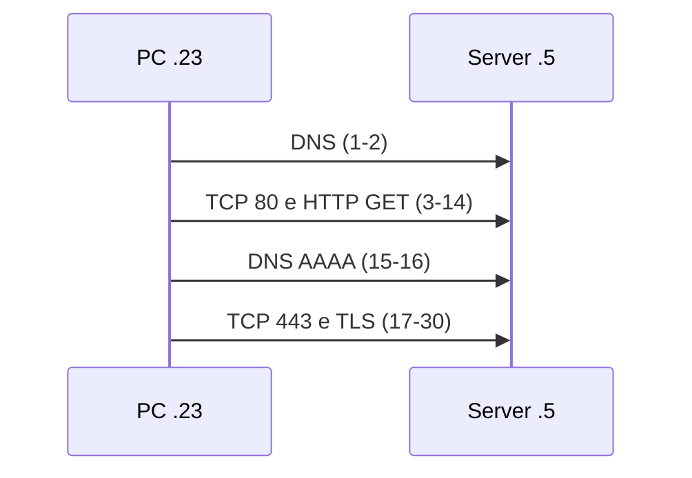

## Contenuti

- Catture di rete
- Installazione e interfaccia
- Filtri di visualizzazione
- Conversazioni e statistiche
- La cattura 1
- Esercizi
- Aspetti orientativi

## Catture di rete

- Formati **pcap** e **pcapng**
- **Wireshark**: open source, migliaia di protocolli
- Cattura dal vivo: Npcap, diritti di amministratore, **autorizzazione**
- Nel corso: analisi di catture registrate

## Installazione e interfaccia

- https://www.wireshark.org/download.html , Windows x64 PortableApps (4.6.9)
- Pannelli: **Packet List**, **Packet Details**, **Packet Bytes**
- Livelli: Frame, Ethernet II, IPv4, TCP, HTTP

## Filtri di visualizzazione

| Filtro | Significato |
|---|---|
| `dns`, `http`, `tls` | per protocollo |
| `ip.addr == 192.168.10.5` | indirizzo |
| `tcp.port == 443` | porta |
| `tcp.flags.syn == 1 and tcp.flags.ack == 0` | aperture di connessione |
| `http.request.method == "POST"` | richieste POST |
| `frame contains "testo"` | contenuto |

## Conversazioni e statistiche

- **Analyze, Follow, TCP Stream**: client in rosso, server in blu
- **Statistics**: Protocol Hierarchy, Conversations, Endpoints, I/O Graphs

## La cattura 1

## Esercizi

1. DNS: nome, tipo, risposta
2. Aperture di connessione e porte
3. Livelli del pacchetto 3
4. Follow TCP Stream: la pagina HTML
5. Client Hello: `server_name`; Server Hello: versione e suite
6. Follow sulla connessione TLS
7. Protocol Hierarchy, Conversations
8. `frame contains "password"`: che cosa trova davvero?

## Aspetti orientativi

- Diagnosi di rete, prestazioni, incidenti di sicurezza
- SOC: Wireshark, Zeek, Suricata
- Che cosa resta visibile con HTTPS?
