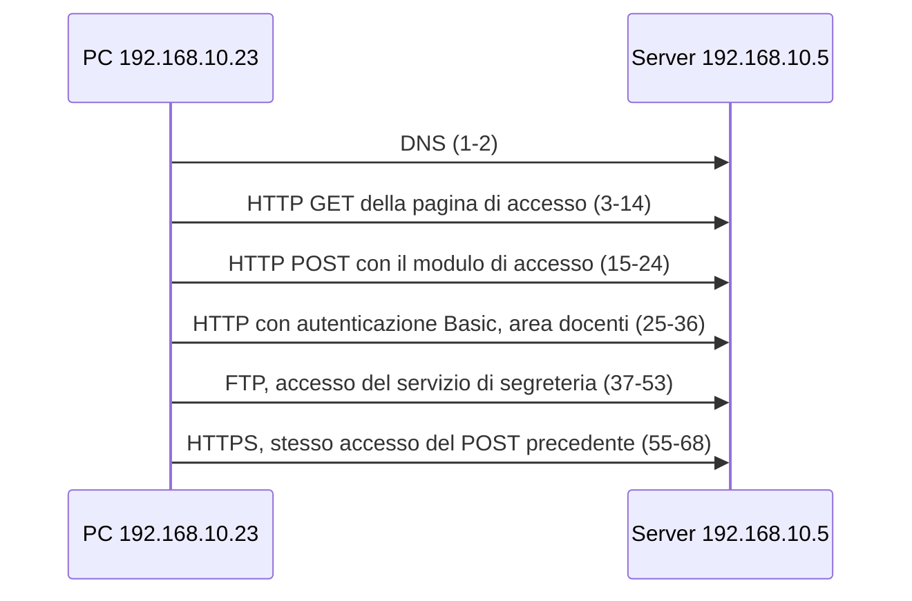

# Lezione 4.4: Laboratorio: analisi di catture

> Contenuto originale. Riferimenti: Wireshark User's Guide; catalogo MITRE ATT&CK; OWASP Authentication Cheat Sheet. La cattura è nella cartella `catture` della lezione 4.3; gli script sono nella cartella `laboratorio` di questa lezione; le soluzioni sono nel file `soluzioni_docente.md`.

Obiettivo: verificare quali dati sono esposti quando si usano protocolli in chiaro, confrontarli con gli stessi dati trasmessi in HTTPS, e conoscere gli indicatori con cui si riconoscono nel traffico alcune attività anomale.

## 4.4.1 Protocolli in chiaro e protocolli cifrati

Con un protocollo **in chiaro** tutto ciò che viene trasmesso, credenziali comprese, è leggibile da chiunque possa osservare il traffico: su una rete Wi-Fi aperta, su un dispositivo di rete compromesso, su un PC collegato a una porta di mirroring. Casi tipici:

- **moduli HTTP**: nome utente e password viaggiano nel corpo della richiesta POST, codificati come `utente=...&password=...`
- **autenticazione HTTP Basic**: le credenziali viaggiano nell'intestazione `Authorization` codificate in Base64, che non è cifratura (lezione 3.4)
- **FTP e Telnet**: i comandi `USER` e `PASS` di FTP, e tutto ciò che si digita in una sessione Telnet, viaggiano come testo
- **cookie di sessione** in HTTP: chi li legge può presentarsi al sito come l'utente, senza conoscerne la password

Con **TLS** (HTTPS, FTPS, SMTP con STARTTLS) chi osserva la rete vede solo i **metadati**: indirizzi, porte, tempi, quantità di dati e, di norma, il nome del sito nel Client Hello. Il contenuto e le credenziali sono cifrati.

## 4.4.2 Laboratorio, parte 1: credenziali in chiaro con Wireshark

Tempo indicativo: 35 minuti. Aprire `cattura2_accessi.pcapng` (cartella `catture` della lezione 4.3): 68 pacchetti registrati nello stesso ambiente di laboratorio della lezione 4.3. Tutti gli account sono fittizi e usati solo per questa cattura.

Diagramma: le fasi della cattura.



Esercizi:

1. Applicare il filtro `http.request` e annotare metodo e percorso di ogni richiesta.
2. Seguire con **Follow**, **TCP Stream** la connessione della richiesta POST: quali credenziali contiene? Quale codice restituisce il server, e che cosa contiene l'intestazione `Set-Cookie`?
3. Applicare `http.authorization` e, nei dettagli del pacchetto, espandere l'intestazione `Authorization`: Wireshark mostra già decodificate le credenziali Basic. Verificarle decodificando il valore Base64 con CyberChef.
4. Applicare `ftp` e ricostruire la sessione: messaggio di benvenuto del server, nome utente, password, esito dell'accesso.
5. Applicare `tcp.port == 443` e seguire la conversazione: è possibile trovare le stesse credenziali? Quali informazioni restano visibili?
6. Applicare `frame contains "Girasole"`: in quali pacchetti compare la password del registro? Perché non compare nei pacchetti da 55 a 68, pur trattandosi dello stesso accesso?
7. Per ogni problema trovato, indicare la correzione: quale protocollo o configurazione avrebbe evitato l'esposizione?

## 4.4.3 Laboratorio, parte 2: verifica automatica con Python

Tempo indicativo: 20 minuti. Lo script `analizza_cattura.py` legge i file pcapng e pcap con la sola libreria standard e riporta conversazioni, richieste DNS, nomi dei siti nelle connessioni TLS e dati sensibili in chiaro. È uno strumento di verifica del proprio traffico, per esempio per controllare che un'applicazione in sviluppo non trasmetta password in chiaro.

```powershell
python analizza_cattura.py ..\..\lez03_wireshark_primi_passi\catture\cattura2_accessi.pcapng
```

```text
Pacchetti letti: 68

Conversazioni (protocollo, client, server, porta del servizio, pacchetti):
  tcp   192.168.10.23 -> 192.168.10.5    porta 21      18 pacchetti
  udp   192.168.10.23 -> 192.168.10.5    porta 53       2 pacchetti
  tcp   192.168.10.23 -> 192.168.10.5    porta 80      34 pacchetti
  tcp   192.168.10.23 -> 192.168.10.5    porta 443     14 pacchetti

Richieste DNS:
  pacchetto    1  192.168.10.23  registro.scuola.example

Connessioni TLS (nome del sito, visibile anche se il contenuto è cifrato):
  pacchetto   58  192.168.10.23  registro.scuola.example

DATI SENSIBILI IN CHIARO:
  pacchetto   18  192.168.10.23  HTTP: campo 'password' del modulo: Girasole-73
  pacchetto   28  192.168.10.23  HTTP: autenticazione HTTP Basic: prof.rossi:Lavagna!2026
  pacchetto   42  192.168.10.23  FTP: USER segreteria
  pacchetto   45  192.168.10.23  FTP: PASS Estate2026
```

Struttura dello script:

- `leggi_pacchetti` riconosce il formato dai primi quattro byte del file ("numero magico") e legge i blocchi: in pcapng ogni pacchetto è un Enhanced Packet Block, preceduto da tipo e lunghezza del blocco
- `decodifica` legge le intestazioni con `struct.unpack`: il tipo Ethernet `0x0800` indica IPv4; nell'intestazione IP il byte 9 indica il protocollo (6 TCP, 17 UDP); la lunghezza dell'intestazione IP è nei 4 bit bassi del primo byte, espressa in parole da 4 byte
- `sni_tls` percorre il Client Hello fino all'estensione `server_name`
- `dati_sensibili_http` cerca l'intestazione `Authorization: Basic` e i campi dei moduli con nomi come `password`

Esempio di lettura di un'intestazione:

```python
ip = frame[14:]                                   # dopo i 14 byte dell'intestazione Ethernet
ihl = (ip[0] & 0x0F) * 4                          # lunghezza dell'intestazione IP in byte
proto = ip[9]                                     # 6 = TCP, 17 = UDP
src = ".".join(map(str, ip[12:16]))               # indirizzo di origine
sport, dport = struct.unpack("!HH", seg[:4])      # porte: due interi senza segno da 16 bit, big-endian
```

Il formato `"!HH"` indica l'ordine dei byte di rete (big-endian, `!`) e due interi senza segno da 16 bit (`H`). Test: `python test_analizza_cattura.py` (13 test, confrontati con i risultati di Wireshark).

Attività: verificare con lo script anche `cattura1_navigazione.pcapng`; aggiungere il riconoscimento dei comandi `AUTH LOGIN` di SMTP, con un test su dati costruiti a mano.

## 4.4.4 Traffico anomalo: indicatori e contromisure

L'analisi del traffico serve anche a riconoscere attività sospette. Le catture del corso contengono solo traffico legittimo; le attività seguenti sono descritte a livello concettuale, con gli indicatori che un analista cerca e le contromisure. Per ciascuna è indicata la scheda del catalogo **MITRE ATT&CK**, la base di conoscenza pubblica delle tecniche di attacco osservate nella realtà, usata dai difensori per organizzare rilevamento e contromisure (https://attack.mitre.org/).

| Attività | Che cosa si osserva nel traffico | Strumenti di Wireshark utili | Contromisure | Scheda MITRE ATT&CK |
|---|---|---|---|---|
| **Ricerca di servizi** (scansione delle porte) | da uno stesso indirizzo, richieste di apertura di connessione (SYN) verso molte porte o molti host in poco tempo; molte risposte di rifiuto (RST) o nessuna risposta | Statistics, Conversations e Endpoints: un indirizzo con moltissime conversazioni brevi; I/O Graphs: picchi improvvisi | ridurre i servizi esposti; firewall con negazione predefinita; segmentazione; sistemi di rilevamento delle intrusioni | Network Service Discovery, https://attack.mitre.org/techniques/T1046/ |
| **Tentativi ripetuti di accesso** (forza bruta, password spraying) | molte richieste di accesso ravvicinate verso lo stesso servizio, con risposte di errore; stessa password su molti utenti, o molte password su un utente | filtri sulle richieste di accesso e sui codici di risposta; Statistics, HTTP, Requests | autenticazione a più fattori; limitazione dei tentativi e blocco temporaneo; password robuste; avvisi al superamento di soglie | Brute Force, https://attack.mitre.org/techniques/T1110/ ; OWASP, sezione "Protect Against Automated Attacks", https://cheatsheetseries.owasp.org/cheatsheets/Authentication_Cheat_Sheet.html |
| **Uso anomalo del DNS** (canali di comando o trasferimento di dati nascosti nelle richieste) | richieste DNS molto frequenti verso uno stesso dominio sconosciuto, con sottodomini lunghi e dall'aspetto casuale; tipi di record inconsueti | Statistics, DNS; colonna con il nome richiesto e ordinamento per lunghezza | DNS interno obbligatorio per tutti i dispositivi; blocco delle richieste DNS dirette verso l'esterno; filtri sui domini | Application Layer Protocol: DNS, https://attack.mitre.org/techniques/T1071/004/ |
| **Trasferimento anomalo di dati verso l'esterno** (esfiltrazione) | volumi in uscita insoliti, in orari insoliti, verso destinazioni mai viste; protocolli non usati normalmente dal dispositivo | Statistics, Conversations ordinate per byte; Endpoints | classificazione e protezione dei dati (modulo 7); filtri in uscita; prevenzione della perdita di dati (DLP) | Exfiltration Over Alternative Protocol, https://attack.mitre.org/techniques/T1048/ |
| **Anomalie di protocollo** (pacchetti malformati, ritrasmissioni, connessioni interrotte) | errori e avvisi segnalati dagli analizzatori dei protocolli | Analyze, Expert Info, con i livelli Chat, Note, Warn, Error: https://www.wireshark.org/docs/wsug_html_chunked/ChAdvExpert.html | dipendono dalla causa: guasto, configurazione errata o attività malevola | |

Un indicatore isolato non dimostra un attacco: un aggiornamento automatico può produrre grandi volumi in uscita, un utente che ha dimenticato la password più accessi falliti. L'analista confronta il traffico con il comportamento normale della rete (**baseline**) e con altre fonti, come i log dei server (modulo 6, dove il rilevamento dei tentativi ripetuti di accesso è svolto in laboratorio sui log).

### Materiali esterni per approfondire

Le risorse seguenti contengono catture reali di attività anomale e malevole, con spiegazioni. Sono indicate per l'approfondimento del docente; le catture di traffico malevolo contengono a volte programmi dannosi e vanno aperte solo con Wireshark, su computer di laboratorio isolati, senza estrarre né eseguire i file contenuti.

- Wireshark, raccolta di catture di esempio, con sezioni dedicate a diversi protocolli e ad alcuni attacchi: https://wiki.wireshark.org/SampleCaptures
- Unit 42 (Palo Alto Networks), serie di tutorial sull'analisi con Wireshark di traffico di infezioni reali: https://unit42.paloaltonetworks.com/tag/wireshark-tutorial/
- Wireshark User's Guide, capitolo sulle statistiche: https://www.wireshark.org/docs/wsug_html_chunked/ChStatistics.html

### Attività di discussione

Tempo indicativo: 10 minuti. Per ciascuna riga della tabella, a gruppi:

1. descrivere con parole proprie quale comportamento "normale" della rete della scuola servirebbe come termine di confronto
2. individuare un possibile falso allarme, cioè un'attività legittima che produrrebbe lo stesso indicatore
3. indicare quale contromisura si applicherebbe per prima nella rete della scuola, e perché

## 4.4.5 Aspetti orientativi (discussione)

- L'analisi del traffico e il rilevamento delle anomalie sono il lavoro quotidiano degli analisti dei centri operativi di sicurezza (SOC); il livello di ingresso (analista SOC di primo livello) è uno degli sbocchi più frequenti per chi inizia nella sicurezza informatica.
- Il catalogo MITRE ATT&CK è un linguaggio comune tra analisti, fornitori di strumenti e gruppi di risposta agli incidenti: conoscerlo è richiesto in molti annunci di lavoro.
- Domanda: perché la cifratura del traffico, indispensabile per la riservatezza, rende più difficile il lavoro di chi analizza la rete per difenderla?
