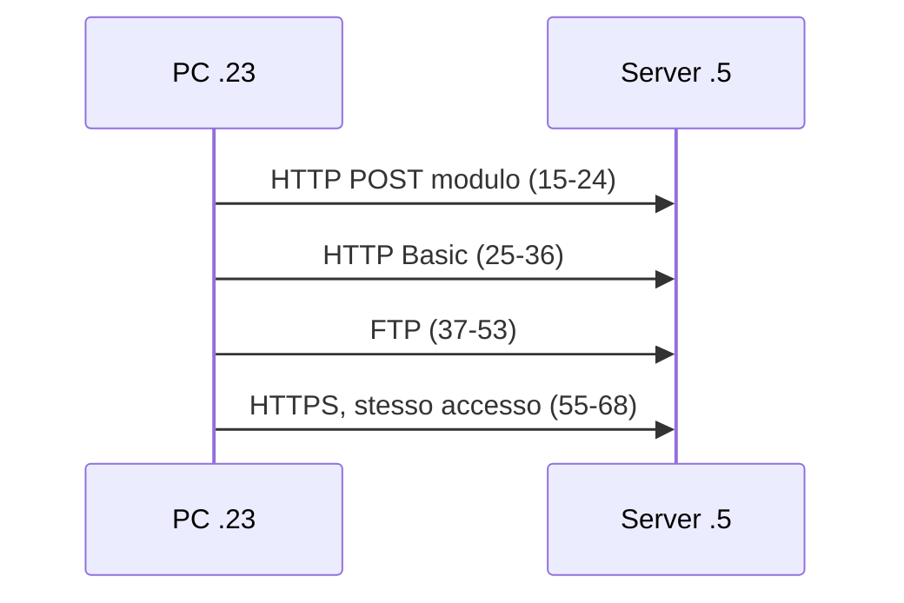

## Contenuti

- In chiaro e cifrato
- La cattura 2
- Verifica con Python
- Traffico anomalo: indicatori
- Approfondimenti esterni
- Aspetti orientativi

## In chiaro e cifrato

- Moduli HTTP: `utente=...&password=...`
- HTTP Basic: Base64, non cifratura
- FTP, Telnet: `USER`, `PASS` in testo
- Cookie di sessione in HTTP
- Con TLS restano visibili solo i **metadati**

## La cattura 2



Filtri: `http.request`, `http.authorization`, `ftp`, `tcp.port == 443`, `frame contains "Girasole"`

## Verifica con Python

```powershell
python analizza_cattura.py cattura2_accessi.pcapng
```

```text
DATI SENSIBILI IN CHIARO:
  pacchetto   18  HTTP: campo 'password' del modulo
  pacchetto   28  HTTP: autenticazione HTTP Basic
  pacchetto   45  FTP: PASS
```

- pcapng letto con `struct`; 13 test

## Traffico anomalo: indicatori

| Attività | Indicatore | MITRE ATT&CK |
|---|---|---|
| Ricerca di servizi | molti SYN verso molte porte | T1046 |
| Tentativi ripetuti di accesso | accessi falliti ravvicinati | T1110 |
| Uso anomalo del DNS | sottodomini lunghi e casuali | T1071.004 |
| Esfiltrazione | volumi insoliti in uscita | T1048 |

Confronto con la **baseline**; falsi allarmi

## Approfondimenti esterni

- https://attack.mitre.org/
- https://wiki.wireshark.org/SampleCaptures
- https://unit42.paloaltonetworks.com/tag/wireshark-tutorial/
- Catture malevole: solo con Wireshark, su computer isolati

## Aspetti orientativi

- Analista SOC di primo livello
- MITRE ATT&CK come linguaggio comune
- Cifratura: riservatezza per gli utenti, meno visibilità per chi difende
