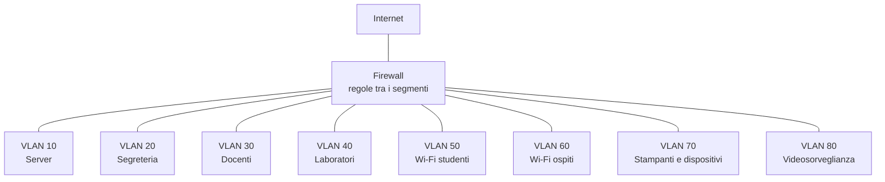

# Lezione 4.5: Wi-Fi e segmentazione

> Fonte della sezione 4.5.3: adattamento da Microsoft, "Security-101", lezione "Networking zero trust architecture", licenza CC0 1.0, https://github.com/microsoft/Security-101/blob/main/3.2%20Networking%20zero%20trust%20architecture.md . Il resto della lezione è contenuto originale. Gli script sono nella cartella `laboratorio` di questa lezione.

Obiettivo: conoscere i meccanismi di protezione delle reti senza fili e i criteri per sceglierli, comprendere la segmentazione delle reti e progettare la rete di una piccola scuola.

## 4.5.1 Protezione delle reti Wi-Fi

In una rete cablata, per intercettare il traffico bisogna collegarsi fisicamente; le onde radio del Wi-Fi invece si ricevono anche fuori dall'edificio. La protezione deve quindi garantire che solo i dispositivi autorizzati si colleghino e che il traffico radio sia cifrato.

Evoluzione dei protocolli:

| Protocollo | Anno | Cifratura | Stato |
|---|---|---|---|
| WEP | 1999 | RC4 | violato in pochi minuti dai primi anni 2000: da non usare |
| WPA | 2003 | TKIP (soluzione transitoria) | obsoleto |
| WPA2 | 2004 | AES (CCMP) | ancora diffuso; accettabile con una password robusta e dispositivi aggiornati |
| WPA3 | 2018 | AES, con scambio di chiavi SAE | raccomandato; obbligatorio per i dispositivi certificati dalla Wi-Fi Alliance |

Modalità di autenticazione:

- **Personal** (PSK, chiave precondivisa)
  una sola password per tutta la rete; adatta a case e piccoli uffici. Chi conosce la password può collegarsi, e con WPA2 chi l'ha registrata insieme al traffico può provare a indovinarla fuori linea: la password deve essere lunga e casuale. WPA3-Personal usa **SAE** (Simultaneous Authentication of Equals), uno scambio di chiavi che impedisce i tentativi fuori linea e garantisce la segretezza in avanti (lezione 3.3).
- **Enterprise** (802.1X)
  ogni utente accede con credenziali proprie, verificate da un server di autenticazione (RADIUS) collegato all'elenco degli utenti dell'organizzazione. Quando uno studente lascia la scuola si disattiva il suo account, senza cambiare la password per tutti; ogni accesso è riconducibile a una persona. È la modalità adatta a scuole e aziende; la rete universitaria internazionale **eduroam** ne è un esempio.
- **Enhanced Open** (OWE)
  per le reti aperte al pubblico: non richiede password, ma cifra comunque il traffico di ciascun dispositivo.

Altri elementi:

- **PMF** (Protected Management Frames): protegge i messaggi di gestione della rete radio, impedendo per esempio di scollegare a forza i dispositivi; obbligatorio con WPA3
- **WPS** (Wi-Fi Protected Setup): collegamento con un PIN o un pulsante; il metodo con PIN è vulnerabile e va disattivato
- nella banda a **6 GHz** (Wi-Fi 6E e Wi-Fi 7) la Wi-Fi Alliance ammette solo WPA3 o Enhanced Open: WPA2 non è consentito

Riferimenti: Wi-Fi Alliance, https://www.wi-fi.org/discover-wi-fi/security ; HPE Aruba, modalità di sicurezza e requisiti della banda a 6 GHz, https://arubanetworking.hpe.com/techdocs/aos/wifi-design-deploy/security/modes/

### Minacce tipiche, in sintesi

- **punti di accesso non autorizzati** (rogue access point): dispositivi collegati alla rete interna senza autorizzazione, che aprono un accesso senza controlli
- **reti gemelle** (evil twin): una rete con lo stesso nome di una rete nota, creata per attirare i dispositivi e osservarne il traffico
- **reti pubbliche aperte**: il traffico non cifrato di un dispositivo è visibile agli altri presenti

Contromisure per l'utente: preferire le reti con WPA2 o WPA3, usare solo siti in HTTPS, fare attenzione agli avvisi di certificato (lezione 3.3), disattivare la connessione automatica alle reti aperte, usare una VPN dell'organizzazione sulle reti pubbliche.

### Configurazione di un punto di accesso

Lista di controllo per un router o un punto di accesso:

1. cambiare la password di amministrazione predefinita e disattivare l'amministrazione da Internet
2. aggiornare il firmware, e verificare che il produttore rilasci ancora aggiornamenti
3. WPA3-Personal, oppure la modalità di transizione WPA2/WPA3 se ci sono dispositivi vecchi; mai WEP o reti aperte senza OWE
4. password della rete lunga e casuale (almeno 16 caratteri o una passphrase, lezione 2.1)
5. disattivare WPS
6. rete ospiti separata per visitatori e dispositivi non gestiti

## 4.5.2 Reti ospiti

Una **rete ospiti** è una rete Wi-Fi separata, con nome e password propri, che consente l'accesso a Internet ma non ai dispositivi della rete interna. Due meccanismi:

- **separazione dalla rete interna**: la rete ospiti è un segmento distinto (sezione 4.5.3), da cui il firewall blocca ogni accesso verso le reti interne
- **isolamento dei client** (client isolation): i dispositivi collegati alla rete ospiti non possono comunicare nemmeno tra loro, solo con Internet

Spesso si aggiunge un **captive portal**, la pagina di accesso che compare al collegamento, per accettare le condizioni d'uso o inserire un codice temporaneo.

## 4.5.3 Segmentazione

La **segmentazione** divide una rete in parti più piccole e isolate, i **segmenti**, con accessi controllati tra l'una e l'altra. Se un dispositivo viene compromesso, chi lo controlla può raggiungere solo il suo segmento e ciò che le regole consentono: si limita il **movimento laterale** e si riduce l'impatto dell'incidente.

Strumenti:

- **VLAN** (Virtual LAN, standard IEEE 802.1Q)
  reti logiche separate sugli stessi switch e punti di accesso: ogni porta dello switch o ogni rete Wi-Fi viene assegnata a una VLAN; i dispositivi di VLAN diverse non comunicano direttamente.
- **sottoreti IP**
  ogni VLAN ha la propria sottorete; il traffico tra VLAN passa da un router o da un firewall, dove si applicano le regole della lezione 4.2.
- **micro-segmentazione**
  regole fino al livello del singolo server o della singola applicazione, frequente nei centri dati e nel cloud.

La segmentazione applica alle reti il principio del minimo privilegio: utenti e dispositivi accedono solo alle risorse e ai servizi necessari. È uno dei cardini del modello **zero trust**, in cui la posizione nella rete non è mai sufficiente a ottenere fiducia: ogni accesso viene verificato in base all'identità e al dispositivo, e il traffico viene cifrato anche all'interno della rete.

Diagramma: rete segmentata di una piccola scuola.



Criteri per definire i segmenti:

- **fiducia**: dispositivi gestiti dalla scuola separati da quelli personali e degli ospiti
- **sensibilità dei dati**: la segreteria tratta dati personali di studenti e famiglie (modulo 7)
- **tipo di dispositivo**: stampanti, telecamere, lavagne interattive e altri dispositivi collegati (Internet of Things) sono spesso poco aggiornati, e vanno isolati
- **funzione**: i server in un segmento proprio, raggiungibile solo sulle porte dei servizi offerti

## 4.5.4 Laboratorio: progetto della rete di una piccola scuola

Tempo indicativo: 50 minuti, a gruppi di tre.

### Dati del problema

| Segmento | Dispositivi previsti |
|---|---|
| Server e apparati di rete | 12 |
| Segreteria | 15 |
| Docenti (PC e portatili della scuola) | 60 |
| Laboratori | 120 |
| Wi-Fi studenti (dispositivi personali) | 400 |
| Wi-Fi ospiti | 50 |
| Stampanti, lavagne interattive, altri dispositivi | 25 |
| Videosorveglianza | 16 |

Blocco di indirizzi disponibile: `10.20.0.0/20`.

### Parte 1: piano degli indirizzi

Lo script `piano_indirizzi.py` assegna a ogni segmento la sottorete più piccola sufficiente, con un margine di crescita del 50%, a partire dai segmenti più grandi:

```powershell
python piano_indirizzi.py
python test_piano_indirizzi.py
```

```text
VLAN  Segmento                 Disp. Sottorete          Gateway         Intervallo                        Capacità
  10  server e rete               12 10.20.6.128/27     10.20.6.129     10.20.6.130 - 10.20.6.158               29
  20  segreteria                  15 10.20.6.96/27      10.20.6.97      10.20.6.98 - 10.20.6.126                29
  30  docenti                     60 10.20.5.0/25       10.20.5.1       10.20.5.2 - 10.20.5.126                125
  40  laboratori                 120 10.20.4.0/24       10.20.4.1       10.20.4.2 - 10.20.4.254                253
  50  Wi-Fi studenti             400 10.20.0.0/22       10.20.0.1       10.20.0.2 - 10.20.3.254               1021
  60  Wi-Fi ospiti                50 10.20.5.128/25     10.20.5.129     10.20.5.130 - 10.20.5.254              125
  70  stampanti e dispositivi     25 10.20.6.0/26       10.20.6.1       10.20.6.2 - 10.20.6.62                  61
  80  videosorveglianza           16 10.20.6.64/27      10.20.6.65      10.20.6.66 - 10.20.6.94                 29
...
Test superati: 11, falliti: 0
```

Calcolo del prefisso:

```python
def prefisso_per(dispositivi, margine=MARGINE):
    necessari = math.ceil(dispositivi * (1 + margine)) + 3   # + gateway, rete, broadcast
    bit_host = max(2, math.ceil(math.log2(necessari)))
    return 32 - bit_host
```

Per 120 dispositivi: 180 + 3 = 183 indirizzi, che richiedono 8 bit (256 indirizzi), quindi il prefisso `/24`. Assegnare prima i blocchi più grandi garantisce che ogni sottorete inizi a un indirizzo allineato alla propria dimensione.

Domande:

1. Quanti indirizzi del blocco `/20` restano liberi? Dove conviene riservarli?
2. Rieseguire con 700 e poi con 1500 dispositivi per il Wi-Fi studenti: che cosa succede nei due casi, e quali soluzioni ci sono?

### Parte 2: matrice delle comunicazioni

Compilare una matrice in cui le righe sono i segmenti di origine e le colonne i segmenti di destinazione, più "Internet". In ogni cella indicare "no" oppure i soli servizi consentiti (per esempio "HTTPS verso il registro", "stampa, porta 9100"). Criteri:

- negazione predefinita (lezione 4.2)
- gli ospiti e il Wi-Fi studenti raggiungono solo Internet, e il Wi-Fi studenti anche i servizi didattici necessari
- la videosorveglianza non raggiunge Internet; il suo registratore è raggiungibile solo da un PC autorizzato
- la gestione degli apparati di rete è consentita solo da una postazione amministrativa

### Parte 3: schema e regole

1. Disegnare lo schema della rete progettata in Mermaid, partendo dal diagramma della sezione 4.5.3 e aggiungendo punti di accesso Wi-Fi, switch e server.
2. Tradurre almeno cinque celle della matrice in regole del simulatore `firewall.py` (lezione 4.2), con pacchetti di prova per i casi consentiti e bloccati.
3. Per le reti Wi-Fi indicare modalità di sicurezza (WPA3-Personal, WPA3-Enterprise o Enhanced Open), eventuale captive portal e isolamento dei client, motivando la scelta.

Una soluzione di riferimento per la parte 2 è nel file `laboratorio/soluzione_docente.md`.

## 4.5.5 Aspetti orientativi (discussione)

- La progettazione delle reti (network design) richiede di conciliare sicurezza, prestazioni, costi e facilità di gestione; è il lavoro di network engineer e architetti di rete.
- Nelle scuole e nelle piccole organizzazioni la rete è spesso gestita da tecnici interni o da fornitori esterni: saper valutare un progetto e porre le domande giuste è utile anche a chi non lo realizza.
- Il modello zero trust sta cambiando l'organizzazione delle reti aziendali, con un peso crescente dell'identità rispetto alla posizione nella rete.
- Domanda: quali problemi pratici nascerebbero in una scuola in cui tutti i dispositivi, compresi quelli personali degli studenti, fossero nella stessa rete?
