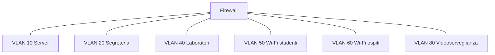

## Contenuti

- Protocolli Wi-Fi
- Modalità
- Minacce e reti ospiti
- Segmentazione
- Laboratorio: la rete della scuola
- Aspetti orientativi

Fonte sezione 4.5.3: Microsoft, "Security-101", licenza CC0 1.0, https://github.com/microsoft/Security-101

## Protocolli Wi-Fi

| Protocollo | Stato |
|---|---|
| WEP | violato: da non usare |
| WPA (TKIP) | obsoleto |
| WPA2 (AES) | accettabile con password robusta |
| WPA3 (SAE) | raccomandato |

6 GHz (Wi-Fi 6E e 7): solo WPA3 o Enhanced Open

## Modalità

- **Personal**: una password per tutti; SAE in WPA3
- **Enterprise** (802.1X, RADIUS): credenziali personali; eduroam
- **Enhanced Open**: reti aperte ma cifrate
- PMF obbligatorio in WPA3; WPS da disattivare

## Minacce e reti ospiti

- Punti di accesso non autorizzati, reti gemelle, reti pubbliche aperte
- Rete ospiti: separata dalla rete interna, isolamento dei client, captive portal
- Lista di controllo del punto di accesso

## Segmentazione

- VLAN 802.1Q, sottoreti, regole tra segmenti
- Limita il **movimento laterale**; zero trust

## Laboratorio: la rete della scuola

- Blocco `10.20.0.0/20`, otto segmenti
- `piano_indirizzi.py`: sottoreti con margine del 50%; 11 test
- Matrice delle comunicazioni con negazione predefinita
- Schema Mermaid e regole in `firewall.py`
- Scelta della modalità Wi-Fi per docenti, studenti, ospiti

## Aspetti orientativi

- Network engineer, architetto di rete
- Saper valutare il progetto di un fornitore
- Zero trust: l'identità conta più della posizione nella rete
- Che cosa succede se tutti i dispositivi sono nella stessa rete?
