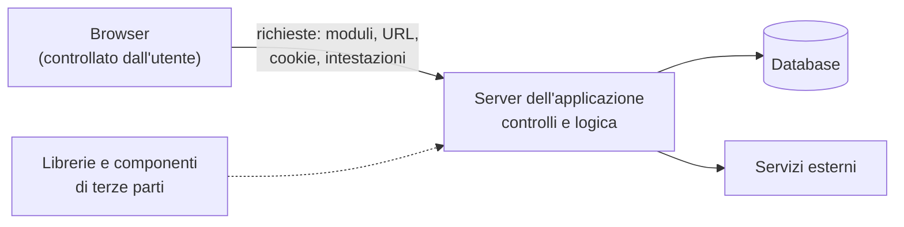

# Lezione 5.1: OWASP Top 10

> Fonti: la sezione 5.1.3 riassume e traduce OWASP Top 10:2025, OWASP Foundation, licenza Creative Commons Attribution 3.0, https://top10.owasp.org/2025/ ; la sezione 5.1.2 adatta Microsoft, "Security-101", lezione "AppSec key concepts", licenza CC0 1.0, https://github.com/microsoft/Security-101 . Il resto della lezione è contenuto originale. I casi dell'attività sono nella cartella `attivita`.

Obiettivo: comprendere perché gli errori di progettazione e di programmazione diventano vulnerabilità, conoscere le categorie della OWASP Top 10 e saper classificare un problema descritto.

## 5.1.1 Dall'errore alla vulnerabilità

- **Difetto** (bug)
  comportamento del programma diverso da quello voluto.
- **Vulnerabilità**
  difetto o debolezza che permette a qualcuno di violare riservatezza, integrità o disponibilità di dati e servizi (lezione 1.1).
- **Sfruttamento** (exploit)
  uso effettivo di una vulnerabilità.
- **CVE** (Common Vulnerabilities and Exposures)
  identificativo pubblico di una vulnerabilità specifica di un prodotto, per esempio `CVE-2021-44228`.
- **CWE** (Common Weakness Enumeration)
  catalogo dei tipi di debolezza del software, per esempio "CWE-89: SQL Injection"; le categorie della OWASP Top 10 raggruppano più CWE.

Un'applicazione web riceve dati da fonti che non controlla: moduli, parametri degli indirizzi, cookie, intestazioni, file caricati, altre applicazioni. Molte vulnerabilità nascono da un'assunzione implicita del programmatore: che questi dati abbiano sempre la forma prevista, che l'utente usi solo i pulsanti dell'interfaccia, che nessuno modifichi una richiesta prima di inviarla. Il browser è sotto il controllo dell'utente: tutto ciò che arriva al server va trattato come **non fidato** e verificato sul server, anche se l'interfaccia lo ha già controllato.

Diagramma: i confini di fiducia di un'applicazione web.

## 5.1.2 Principi dello sviluppo sicuro

- **sicurezza fin dalla progettazione** (secure by design): la sicurezza è un requisito dall'inizio, non un'aggiunta finale
- **validazione degli input** e **codifica dell'output** (lezione 5.2)
- **autenticazione e autorizzazione**: chi è l'utente, e che cosa può fare (modulo 2)
- **protezione dei dati**: cifratura a riposo e in transito (modulo 3)
- **gestione delle sessioni**: identificativi casuali, cookie protetti (lezione 5.3)
- **dipendenze sicure**: librerie aggiornate e verificate (lezione 5.3)
- **gestione degli errori e registrazione degli eventi**: nessun dettaglio interno all'utente, eventi utili nei log
- **verifiche di sicurezza**: revisione del codice, test automatici, analisi con strumenti dedicati
- **ciclo di vita sicuro** (secure SDLC): attività di sicurezza in ogni fase, dai requisiti alla manutenzione

## 5.1.3 La OWASP Top 10:2025

L'**OWASP** (Open Worldwide Application Security Project) è una fondazione senza scopo di lucro che produce documenti, strumenti e guide aperte sulla sicurezza del software. La **Top 10** elenca le dieci categorie di rischio più rilevanti per le applicazioni web, sulla base dei dati di test di migliaia di applicazioni e di un'indagine tra professionisti. L'edizione 2025 è l'ottava; la precedente è del 2021.

| Codice | Categoria | Di che cosa si tratta | Contromisure principali |
|---|---|---|---|
| A01 | Broken Access Control (controllo degli accessi inefficace) | un utente può vedere o modificare dati o funzioni che non gli spettano, per esempio l'annuncio o il voto di un altro | controllo dei permessi sul server a ogni richiesta; negazione predefinita; verifica del proprietario della risorsa |
| A02 | Security Misconfiguration (configurazione errata) | impostazioni predefinite insicure, funzioni di debug attive, intestazioni di sicurezza mancanti, messaggi di errore troppo dettagliati | configurazioni minime e documentate; intestazioni di sicurezza; revisione periodica |
| A03 | Software Supply Chain Failures (catena di fornitura del software) | librerie e componenti vulnerabili, non aggiornati o compromessi, strumenti di compilazione e distribuzione non protetti | inventario delle dipendenze; aggiornamenti; verifica di provenienza e integrità (lezione 3.2) |
| A04 | Cryptographic Failures (errori crittografici) | dati sensibili non cifrati, algoritmi deboli, password conservate in chiaro, chiavi nel codice | HTTPS ovunque; algoritmi e librerie standard; hash lenti per le password (lezione 2.2) |
| A05 | Injection (iniezione) | dati dell'utente interpretati come comandi: SQL, comandi del sistema operativo, HTML e JavaScript nelle pagine (cross-site scripting) | query parametriche; codifica dell'output per il contesto; validazione (lezione 5.2) |
| A06 | Insecure Design (progettazione insicura) | mancanze che nessuna implementazione corretta può compensare, per esempio un recupero della password basato su domande con risposte facili da trovare | modellazione delle minacce; requisiti di sicurezza; casi d'uso di abuso |
| A07 | Authentication Failures (errori di autenticazione) | password deboli ammesse, tentativi illimitati, sessioni prevedibili o che non scadono | MFA; limiti ai tentativi; sessioni casuali con scadenza (modulo 2) |
| A08 | Software or Data Integrity Failures (integrità di software e dati) | aggiornamenti, dati o oggetti accettati senza verificarne l'integrità | firme digitali; verifica delle impronte; controllo dei dati serializzati |
| A09 | Security Logging and Alerting Failures (registrazione e allarmi insufficienti) | accessi, errori ed eventi importanti non registrati, o registrati senza che nessuno li esamini | log degli eventi di sicurezza; allarmi; conservazione adeguata (modulo 6) |
| A10 | Mishandling of Exceptional Conditions (gestione errata delle condizioni eccezionali) | errori non gestiti che lasciano l'applicazione in uno stato incoerente, la fanno "fallire in modo aperto" o mostrano dettagli interni | gestione esplicita degli errori; fallire in modo sicuro (negando l'operazione); messaggi generici all'utente |

Rispetto al 2021 sono nuove le categorie A03 (che estende la vecchia "Vulnerable and Outdated Components") e A10; la "Server-Side Request Forgery" è confluita in A01. La pagina di ogni categoria riporta descrizione, esempi, contromisure e CWE collegate: https://top10.owasp.org/2025/

La Top 10 è un documento di sensibilizzazione, non uno standard completo: per la verifica sistematica di un'applicazione l'OWASP pubblica l'**Application Security Verification Standard** (ASVS), con requisiti dettagliati per livelli.

## 5.1.4 Come si individuano le vulnerabilità

- **revisione del codice** (code review): lettura del codice da parte di un'altra persona, con attenzione ai punti in cui entrano dati non fidati (laboratorio 5.4)
- **analisi statica** (SAST): strumenti che esaminano il codice sorgente senza eseguirlo
- **analisi dinamica** (DAST): strumenti che interagiscono con l'applicazione in esecuzione, in un ambiente di prova
- **analisi delle dipendenze** (SCA): confronto delle librerie usate con le basi di dati delle vulnerabilità note (lezione 5.3)
- **test di sicurezza automatici**: test che verificano i requisiti di sicurezza, eseguiti a ogni modifica (laboratori 5.2 e 5.4)
- **penetration test**: verifica condotta da specialisti, sempre con autorizzazione scritta e su un perimetro concordato

## 5.1.5 Attività: classificare i casi

Tempo indicativo: 30 minuti, a coppie. Il file `attivita/casi.md` descrive dodici situazioni in applicazioni fittizie. Per ciascuna:

1. indicare la categoria della OWASP Top 10:2025 più adatta (in alcuni casi ne sono ammissibili due, motivando)
2. indicare quale proprietà è violata: riservatezza, integrità o disponibilità
3. proporre almeno una contromisura

Discussione finale: quali casi si sarebbero evitati in fase di progettazione, e quali solo con una programmazione attenta?

## 5.1.6 Aspetti orientativi (discussione)

- La sicurezza delle applicazioni (application security) è un'area con forte domanda: application security engineer, specialisti di revisione del codice, penetration tester web, e sviluppatori con competenze di sviluppo sicuro.
- Molte aziende adottano l'approccio DevSecOps: controlli di sicurezza automatici nel processo di sviluppo e distribuzione del software.
- I programmi di bug bounty premiano chi segnala vulnerabilità in modo responsabile, secondo regole pubblicate dall'organizzazione (lezione 1.2).
- Domanda: perché i controlli eseguiti solo nel browser, con JavaScript, non bastano a proteggere un'applicazione?
