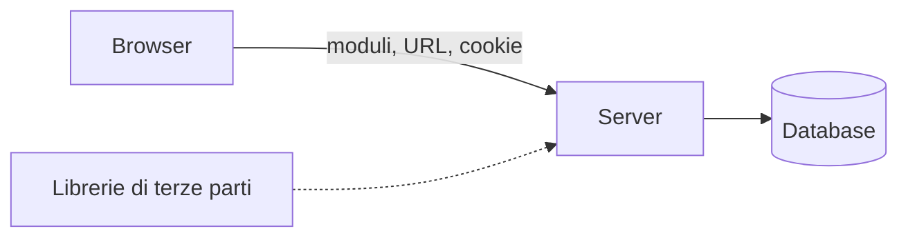

## Lezione 5.1: OWASP Top 10

Modulo 5: Sicurezza delle applicazioni web. Cybersecurity ed Ethical Hacking

Fonte: OWASP Top 10:2025, OWASP Foundation, licenza CC BY 3.0
https://top10.owasp.org/2025/

---

## Dall'errore alla vulnerabilità

- **Difetto**, **vulnerabilità**, **sfruttamento**
- **CVE**: vulnerabilità specifica; **CWE**: tipo di debolezza
- Tutto ciò che arriva dal browser è **non fidato**
- I controlli si fanno sul server

---

## Confini di fiducia

---

## OWASP Top 10:2025 (1)

| Codice | Categoria |
|---|---|
| A01 | Broken Access Control |
| A02 | Security Misconfiguration |
| A03 | Software Supply Chain Failures |
| A04 | Cryptographic Failures |
| A05 | Injection |

---

## OWASP Top 10:2025 (2)

| Codice | Categoria |
|---|---|
| A06 | Insecure Design |
| A07 | Authentication Failures |
| A08 | Software or Data Integrity Failures |
| A09 | Security Logging and Alerting Failures |
| A10 | Mishandling of Exceptional Conditions |

Nuove nel 2025: A03 (estesa) e A10; SSRF confluita in A01

---

## Come si trovano le vulnerabilità

- Revisione del codice
- Analisi statica (SAST) e dinamica (DAST)
- Analisi delle dipendenze (SCA)
- Test di sicurezza automatici
- Penetration test, con autorizzazione scritta

---

## Attività

- Dodici casi in `attivita/casi.md`
- Per ciascuno: categoria, proprietà violata, contromisura
- Progettazione o programmazione?

---

## Aspetti orientativi

- Application security engineer, penetration tester web
- DevSecOps
- Bug bounty, con regole pubblicate
- Perché i controlli nel browser non bastano?
