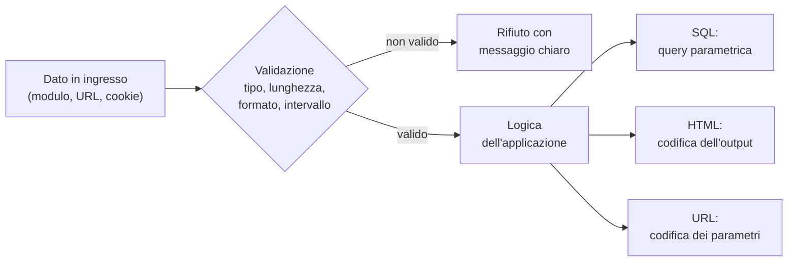
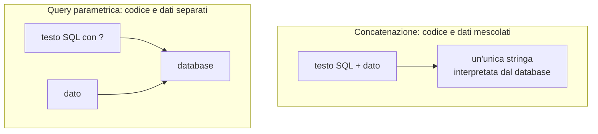

# Lezione 5.2: Validazione degli input

> Contenuto originale. Riferimenti: OWASP SQL Injection Prevention Cheat Sheet e Cross Site Scripting Prevention Cheat Sheet; documentazione dei moduli `sqlite3`, `html` e `urllib.parse` di Python; MDN Web Docs. Gli esercizi sono nella cartella `laboratorio`; le soluzioni nella cartella `laboratorio/soluzione_docente`.

Obiettivo: trattare correttamente i dati non fidati in ingresso e in uscita, con validazione, query parametriche e codifica dell'output, correggendo funzioni Python e JavaScript verificate da test.

## 5.2.1 Dati non fidati

Sono **non fidati** tutti i dati che provengono dall'esterno del programma: campi dei moduli, parametri degli indirizzi, cookie, intestazioni HTTP, file caricati, risposte di altri servizi, e anche dati già salvati nel database, se in origine li ha inseriti un utente. Due difese complementari:

- **validazione in ingresso**: si controlla che il dato abbia la forma attesa, e si rifiuta altrimenti
- **codifica in uscita**: quando il dato viene inserito in un altro linguaggio (SQL, HTML, URL, comandi del sistema), lo si trasforma in modo che resti un dato e non diventi codice

Diagramma: le due difese lungo il percorso di un dato.



## 5.2.2 Validazione

Criteri:

- **tipo**: numero, data, testo, valore booleano
- **lunghezza**: minima e massima, per esempio un titolo da 1 a 100 caratteri
- **formato**: per esempio un codice fiscale, un indirizzo email, un voto con al massimo due decimali
- **intervallo**: un voto tra 1 e 10, una data non nel passato
- **valori ammessi**: una scelta tra valori previsti, per esempio il campo di ordinamento tra "cognome", "classe" e "voto"

Due approcci:

- **lista di valori o caratteri ammessi** (allowlist): si accetta solo ciò che è previsto; è l'approccio raccomandato
- **lista di valori vietati** (blocklist): si rifiuta ciò che è noto come pericoloso; è fragile, perché è impossibile prevedere tutte le varianti

La validazione avviene **sul server**. I controlli nel browser (attributi HTML come `required` e `maxlength`, JavaScript) migliorano l'esperienza dell'utente ma non proteggono: chiunque può inviare richieste senza passare dall'interfaccia.

Validare non basta: un cognome come `D'Amico` è un dato valido, e deve essere accettato; la protezione dall'iniezione deve quindi avvenire nel punto in cui il dato viene usato, con le tecniche seguenti.

## 5.2.3 Iniezione e query parametriche

Si ha un'**iniezione** quando un dato viene inserito all'interno di un testo che un altro componente interpreta come codice, e il dato altera la struttura di quel codice. Nel caso di SQL:

```python
sql = f"SELECT cognome, nome FROM studenti WHERE cognome = '{cognome}'"
```

Con il cognome `D'Amico` la query diventa:

```sql
SELECT cognome, nome FROM studenti WHERE cognome = 'D'Amico'
```

L'apostrofo del cognome chiude la stringa SQL in anticipo e il resto non ha più senso per il database, che segnala un errore di sintassi. Lo stesso meccanismo permette, con dati costruiti apposta, di cambiare il significato della query: leggere, modificare o cancellare dati non previsti. La documentazione di Python lo indica esplicitamente e raccomanda di usare sempre i segnaposto: https://docs.python.org/3/library/sqlite3.html

La soluzione è la **query parametrica** (prepared statement): il codice SQL contiene un segnaposto, e il valore viaggia separatamente; il database non lo interpreta mai come codice.

```python
sql = "SELECT cognome, nome FROM studenti WHERE cognome = ?"
conn.execute(sql, (cognome,))          # la tupla contiene i valori dei segnaposto
```

Diagramma: concatenazione e query parametrica.



I segnaposto valgono solo per i **valori**; nomi di tabelle e colonne, e parole come `ASC` e `DESC`, non si possono passare come parametri. In quei casi si usa una **lista di valori ammessi**: il dato dell'utente sceglie tra alternative scritte dal programmatore.

```python
CAMPI_ORDINAMENTO = {"cognome": "cognome", "classe": "classe, cognome", "voto": "voto"}
if campo not in CAMPI_ORDINAMENTO:
    raise ValueError("campo di ordinamento non ammesso")
sql = f"SELECT ... ORDER BY {CAMPI_ORDINAMENTO[campo]}"   # nella query entra solo testo scritto dal programmatore
```

Lo stesso principio vale per gli altri interpreti: per eseguire comandi del sistema operativo si passano gli argomenti come lista (`subprocess.run(["programma", argomento])`) invece di comporre una stringa per la shell. Guida OWASP: https://cheatsheetseries.owasp.org/cheatsheets/SQL_Injection_Prevention_Cheat_Sheet.html

## 5.2.4 Codifica dell'output e cross-site scripting

Quando un'applicazione inserisce in una pagina HTML dati forniti da utenti, e il browser li interpreta come codice HTML o JavaScript, si ha un **cross-site scripting** (XSS): uno script eseguito nella pagina può leggere e modificare ciò che l'utente vede, inviare richieste a suo nome, sottrarre informazioni. È una forma di iniezione, classificata nella categoria A05.

La difesa principale è la **codifica dell'output**, specifica per il **contesto** in cui il dato viene inserito:

| Contesto | Codifica | Strumento |
|---|---|---|
| testo HTML | `<` diventa `&lt;`, `>` diventa `&gt;`, `&` diventa `&amp;`, virgolette e apostrofi codificati | Python: `html.escape(testo)` |
| parametro di un indirizzo | caratteri speciali in forma `%XX` | Python: `urllib.parse.urlencode`, `quote`; JavaScript: `encodeURIComponent` |
| DOM, da JavaScript | nessuna codifica manuale: si inserisce il dato come testo | `elemento.textContent = testo` invece di `innerHTML` |

Esempio in Python:

```python
import html
html.escape("Media < 6, poi > 7")          # 'Media &lt; 6, poi &gt; 7'
html.escape("D'Amico")                      # 'D&#x27;Amico'
```

Esempio in JavaScript:

```javascript
// testo interpretato come HTML: da evitare con dati degli utenti
voce.innerHTML = "<strong>" + autore + "</strong>: " + testo;

// testo inserito come testo: corretto
const nome = document.createElement("strong");
nome.textContent = autore;
voce.append(nome, ": " + testo);
```

Altri livelli di difesa:

- i **framework** moderni (sistemi di modelli come Jinja2, librerie come React) codificano automaticamente l'output; le funzioni che disattivano la codifica vanno usate solo con contenuti controllati
- quando gli utenti devono poter inserire HTML (per esempio in un editor di testo formattato) si usa una libreria di **sanificazione** che lascia solo gli elementi ammessi, come DOMPurify
- la **Content-Security-Policy** (lezione 5.3) limita gli script eseguibili nella pagina

Guida OWASP: https://cheatsheetseries.owasp.org/cheatsheets/Cross_Site_Scripting_Prevention_Cheat_Sheet.html

## 5.2.5 Laboratorio

Tempo indicativo: 50 minuti. Cartella di lavoro `C:\corso-cyber\lab52`, con i file della cartella `laboratorio` (non la sottocartella `soluzione_docente`). I test usano solo dati legittimi, come cognomi con apostrofo e commenti che contengono simboli matematici: i difetti emergono già con questi.

### Parte 1: Python

Il file `registro.py` contiene cinque funzioni di un piccolo registro, ognuna con un errore nel trattamento dei dati:

| Funzione | Compito | Tecnica da applicare |
|---|---|---|
| `cerca_studenti(conn, cognome)` | ricerca per cognome | query parametrica |
| `studenti_ordinati(conn, campo)` | elenco ordinato per un campo scelto dall'utente | lista di valori ammessi, `ValueError` negli altri casi |
| `valida_voto(testo)` | conversione del voto inserito in un modulo | formato con espressione regolare, poi intervallo da 1 a 10 |
| `riga_tabella_html(cognome, nome, commento)` | riga di tabella HTML | `html.escape` su ogni valore |
| `link_profilo(cognome, nome)` | collegamento con parametri | `urllib.parse.urlencode` |

```powershell
python test_registro.py
```

Situazione iniziale:

```text
OK      ricerca di un cognome semplice
ERRORE  ricerca di un cognome con apostrofo  [OperationalError: near "Amico": syntax error]
...
ERRORE  testo 'nan' rifiutato
...
Test superati: 8, falliti: 11
```

Obiettivo: 19 test superati su 19, modificando solo `registro.py`. Suggerimenti:

- `float("nan")` e `float("1e1")` sono conversioni valide per Python, ma non sono voti: il formato va controllato prima della conversione, per esempio con `re.fullmatch(r"\d{1,2}([.,]\d{1,2})?", testo)`
- `html.escape` codifica anche apostrofi e virgolette, necessario quando il valore finisce dentro un attributo HTML
- `urllib.parse.urlencode({"cognome": cognome, "nome": nome})` produce la parte dell'indirizzo dopo il `?`

### Parte 2: JavaScript

1. Aprire `commenti.html` con Live Preview (corso 1) o direttamente nel browser, e pubblicare il commento `Per il grassetto si usa <b>` seguito da altro testo: che cosa succede alla parte successiva del commento e all'anteprima?
2. Aprire `test_commenti.html`: la pagina esegue nove test su `commenti.js` e ne mostra l'esito (situazione iniziale: 4 superati, 5 falliti).
3. Correggere `aggiungiCommento` e `aggiornaAnteprima` in `commenti.js` usando `createElement`, `textContent` e `append`, fino a 9 test superati su 9.

### Attività di verifica

Tempo indicativo: 10 minuti. Un compagno legge il codice corretto e verifica, riga per riga, che nessun dato proveniente dall'utente venga concatenato a codice SQL, HTML o a un indirizzo. Annotare ogni punto in cui un dato non fidato entra in un altro linguaggio, e la tecnica usata.

## 5.2.6 Aspetti orientativi (discussione)

- Le vulnerabilità di iniezione sono note da oltre venticinque anni e continuano a comparire: la prevenzione dipende da abitudini di programmazione, che si acquisiscono presto.
- I colloqui per sviluppatori includono spesso domande sullo sviluppo sicuro; saper spiegare le query parametriche e la codifica dell'output è una competenza di base richiesta.
- Domanda: perché la regola "codificare in uscita" funziona meglio della regola "eliminare in ingresso i caratteri pericolosi"?
