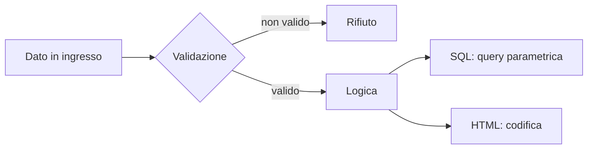

## Contenuti

- Due difese
- Iniezione SQL
- Codifica dell'output (XSS)
- Laboratorio Python
- Laboratorio JavaScript
- Aspetti orientativi

## Due difese



- Validazione: tipo, lunghezza, formato, intervallo, valori ammessi
- **Allowlist**, non blocklist; sempre sul server

## Iniezione SQL

```python
sql = f"SELECT ... WHERE cognome = '{cognome}'"      # da evitare
conn.execute("SELECT ... WHERE cognome = ?", (cognome,))   # corretto
```

- `D'Amico`: l'apostrofo chiude la stringa SQL
- Segnaposto solo per i valori; colonne e ordinamenti: lista di valori ammessi

## Codifica dell'output (XSS)

| Contesto | Strumento |
|---|---|
| testo HTML | `html.escape` |
| parametro URL | `urlencode`, `encodeURIComponent` |
| DOM | `textContent`, non `innerHTML` |

Framework con codifica automatica; sanificazione (DOMPurify); CSP

## Laboratorio Python

- `registro.py`: cinque funzioni da correggere
- `python test_registro.py`: da 8 a 19 test superati su 19
- Query parametriche, allowlist, espressione regolare, `html.escape`, `urlencode`

## Laboratorio JavaScript

- `commenti.html`: che cosa succede con `<b>` in un commento?
- `test_commenti.html`: da 4 a 9 test superati su 9
- `createElement`, `textContent`, `append`

## Aspetti orientativi

- Iniezione: nota da decenni, ancora frequente
- Domande di sviluppo sicuro nei colloqui
- Perché codificare in uscita invece di eliminare caratteri in ingresso?
