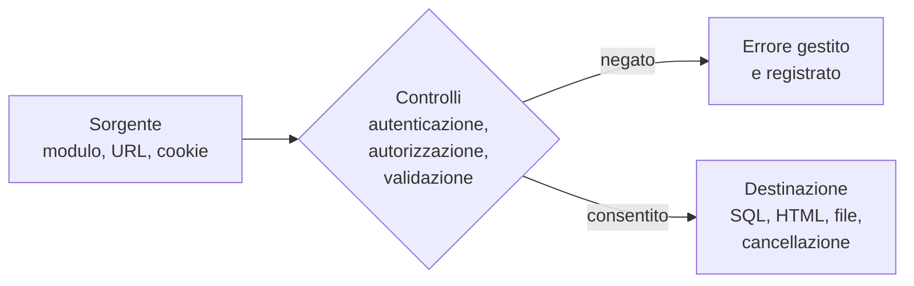

# Lezione 5.4: Laboratorio: correzione di codice vulnerabile

> Contenuto originale. Riferimenti: OWASP Top 10:2025; OWASP Code Review Guide; lezioni 2.2, 5.2 e 5.3. L'applicazione da correggere è nella cartella `laboratorio/app_da_correggere`; la soluzione per il docente in `laboratorio/soluzione_docente`, con l'elenco dei problemi nel file `problemi_trovati.md`.

Obiettivo: eseguire una revisione del codice orientata alla sicurezza su una piccola applicazione web, classificare i problemi trovati e correggerli, verificando le correzioni con test automatici.

## 5.4.1 La revisione del codice orientata alla sicurezza

Una **revisione del codice** (code review) è la lettura sistematica del codice scritto da altri, prima che venga messo in uso. Orientata alla sicurezza, segue il percorso dei dati e delle decisioni:

- **sorgenti**: da dove entrano i dati non fidati (moduli, parametri, cookie, intestazioni, file)
- **destinazioni** (sink): dove i dati vengono usati in un altro linguaggio o in un'operazione sensibile (query SQL, pagine HTML, comandi, file, cancellazioni)
- **controlli**: chi può eseguire ogni operazione, e dove viene verificato
- **segreti e dati sensibili**: come vengono conservati e trasmessi
- **errori**: che cosa succede quando qualcosa va storto
- **tracce**: quali eventi vengono registrati

Diagramma: percorso di un dato da seguire durante la revisione.



Lista di controllo per la revisione:

| Area | Domande | Categoria OWASP |
|---|---|---|
| Accessi | Ogni operazione verifica chi è l'utente e se può agire su quella specifica risorsa? | A01 |
| Configurazione | Ci sono intestazioni di sicurezza? Il debug è disattivato? I messaggi di errore sono generici? | A02 |
| Dipendenze | Le librerie sono aggiornate e necessarie? | A03 |
| Crittografia | Password con hash lento e sale? Segreti fuori dal codice? | A04 |
| Iniezione | Ogni query è parametrica? Ogni dato inserito in HTML è codificato? | A05 |
| Progettazione | Le funzioni sensibili hanno le protezioni previste dai requisiti? | A06 |
| Autenticazione e sessioni | Identificativi di sessione casuali? Cookie con HttpOnly, Secure, SameSite? Stessa risposta per utente inesistente e password errata? | A07 |
| Integrità | I dati ricevuti sono verificati prima dell'uso? | A08 |
| Registrazione | Accessi riusciti e falliti, operazioni negate ed errori sono registrati? | A09 |
| Condizioni eccezionali | Dati non validi producono un errore gestito? In caso di errore l'operazione viene negata? | A10 |

Riferimento: OWASP Code Review Guide, https://owasp.org/www-project-code-review-guide/

## 5.4.2 L'applicazione da correggere

`bacheca.py` è una bacheca degli annunci della classe, realizzata con la sola libreria standard di Python (moduli `wsgiref`, `sqlite3`, `http.cookies`). Funzioni:

- `GET /`: elenco degli annunci, con ricerca per titolo (`/?q=parola`)
- `POST /login`: accesso con nome e password
- `POST /annunci`: pubblicazione di un annuncio (dopo l'accesso)
- `POST /elimina`: eliminazione di un annuncio

Utenti di prova: `anna` con password `tavolo-razzo-neve`, `bruno` con password `fiume-lampada-otto`.

Avvio, solo sul proprio PC, dopo aver copiato in `C:\corso-cyber\lab54` i file della cartella `app_da_correggere`:

```powershell
cd C:\corso-cyber\lab54
python bacheca.py
```

L'applicazione ascolta su `http://127.0.0.1:8000`, raggiungibile solo dal PC stesso (lezione 4.1). Si ferma con `Ctrl+C`. Il file `test_bacheca.py` verifica 21 requisiti di funzionamento e di sicurezza, chiamando l'applicazione direttamente, senza avviare il server:

```powershell
python test_bacheca.py
```

Situazione iniziale:

```text
OK      accesso con credenziali corrette
OK      pubblicazione di un annuncio
ERRORE  annuncio con apostrofo nel titolo pubblicato
ERRORE  ricerca con apostrofo: annuncio trovato
ERRORE  testo dell'annuncio codificato in HTML
...
ERRORE  un utente non può eliminare l'annuncio di un altro
...
Test superati: 4, falliti: 17
```

## 5.4.3 Svolgimento

Tempo indicativo: 60 minuti, a coppie. Le correzioni non completate in classe si concludono come attività successiva; se il calendario lo consente, il laboratorio può occupare due unità, con tempi raddoppiati.

### Fase 1: revisione, senza modificare il codice (15 minuti)

1. Leggere `bacheca.py` dall'inizio alla fine, individuando sorgenti, destinazioni e controlli con la lista della sezione 5.4.1.
2. Compilare una tabella dei problemi trovati:

| N. | Riga o funzione | Problema | Categoria OWASP | Conseguenza | Correzione proposta |
|---|---|---|---|---|---|
| 1 | | | | | |

3. Solo dopo, eseguire `test_bacheca.py` e confrontare i test falliti con la tabella: quali problemi erano stati trovati leggendo, e quali no? Ci sono problemi trovati leggendo che i test non verificano?

### Fase 2: correzione (35 minuti)

Correggere un problema alla volta, rieseguendo i test dopo ogni modifica. Ordine consigliato, dal più semplice:

1. **query parametriche** in tutte le funzioni che usano il database (lezione 5.2)
2. **codifica dell'output** con `html.escape` in `elenco_html` e in `pagina`
3. **intestazioni di sicurezza** aggiunte a tutte le risposte (lezione 5.3), per esempio con una lista `INTESTAZIONI_SICUREZZA` concatenata in `start_response`
4. **gestione degli errori**: identificativo non numerico rifiutato con codice 400; nessun `traceback` nella risposta, ma un messaggio generico, con i dettagli scritti nel log tramite il modulo `logging`
5. **controllo degli accessi** in `/elimina`: accesso obbligatorio, e cancellazione solo se l'autore dell'annuncio è l'utente corrente, altrimenti codice 403
6. **password**: hash con sale e PBKDF2, come nel laboratorio 2.2; la tabella `utenti` avrà le colonne `sale` e `hash` al posto di `password`
7. **sessioni**: una tabella `sessioni` con identificativi generati da `secrets.token_urlsafe(32)`; il cookie contiene solo l'identificativo, con `HttpOnly` e `SameSite=Lax`

Obiettivo: 21 test superati su 21.

### Fase 3: verifica incrociata (10 minuti)

Scambiare il codice con un'altra coppia, che:

- esegue i test
- ripete la revisione con la lista della sezione 5.4.1 sul codice corretto
- segnala eventuali problemi residui

## 5.4.4 Oltre i test

I test del laboratorio non coprono tutto. Problemi rimasti anche nella soluzione di riferimento, da discutere:

- **HTTPS**: in un'installazione reale l'applicazione va pubblicata solo in HTTPS, con cookie `Secure` e intestazione HSTS
- **protezione dalle richieste provenienti da altri siti** (CSRF): `SameSite=Lax` la riduce; un'applicazione reale aggiunge un token casuale nei moduli, verificato dal server
- **limiti ai tentativi di accesso** e scadenza delle sessioni (lezione 2.1, OWASP A07)
- **uscita** (logout) con cancellazione della sessione sul server
- **conservazione dei log** e loro esame (modulo 6)

In un progetto reale queste esigenze si scrivono come requisiti prima dello sviluppo, e i test si preparano insieme al codice.

## 5.4.5 Aspetti orientativi (discussione)

- La revisione del codice tra colleghi è una pratica standard nei gruppi di sviluppo: ogni modifica viene letta da almeno un'altra persona prima di essere accettata.
- Saper leggere codice scritto da altri, trovare problemi e spiegarli in modo chiaro e rispettoso è una competenza apprezzata quanto saper scrivere codice.
- Gli strumenti automatici (analisi statica, analisi delle dipendenze, test) trovano molti problemi, ma non i difetti di logica e di progettazione, come il controllo degli accessi mancante: serve il ragionamento di una persona.
- Domanda: quali problemi della bacheca sarebbero stati evitati usando un framework web maturo, e quali no?
