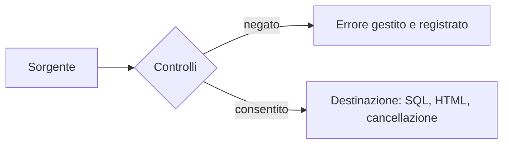

## Lezione 5.4: Laboratorio: correzione di codice vulnerabile

Modulo 5: Sicurezza delle applicazioni web. Cybersecurity ed Ethical Hacking

---

## Revisione orientata alla sicurezza

- Sorgenti, destinazioni, controlli, segreti, errori, tracce

---

## Lista di controllo

| Area | OWASP |
|---|---|
| Accessi | A01 |
| Configurazione | A02 |
| Crittografia | A04 |
| Iniezione | A05 |
| Autenticazione e sessioni | A07 |
| Registrazione | A09 |
| Condizioni eccezionali | A10 |

---

## La bacheca

- `bacheca.py`: annunci, ricerca, accesso, eliminazione
- Solo su `127.0.0.1:8000`
- `python test_bacheca.py`: 4 test superati su 21

---

## Svolgimento

1. Revisione senza modificare il codice; tabella dei problemi
2. Correzioni una alla volta: query parametriche, codifica, intestazioni, errori, accessi, password, sessioni
3. Verifica incrociata tra coppie

Obiettivo: 21 test superati su 21

---

## Oltre i test

- HTTPS, `Secure`, HSTS
- Token contro le richieste da altri siti (CSRF)
- Limiti ai tentativi, scadenza delle sessioni, uscita
- Esame dei log

---

## Aspetti orientativi

- Revisione tra colleghi: pratica standard
- Leggere e spiegare codice altrui
- Strumenti automatici e ragionamento umano
- Che cosa avrebbe evitato un framework maturo?
