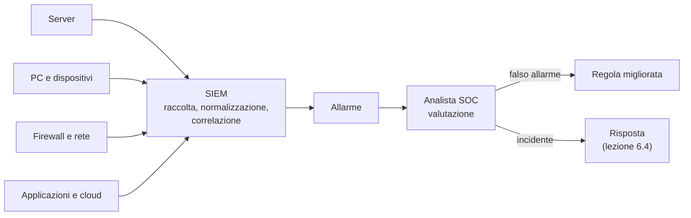

# Lezione 6.1: Log e monitoraggio

> Fonte della sezione 6.1.4: adattamento da Microsoft, "Security-101", lezioni "SecOps key concepts" e "SecOps capabilities", licenza CC0 1.0, https://github.com/microsoft/Security-101 . Il resto della lezione è contenuto originale. Gli script sono nella cartella `laboratorio`.

Obiettivo: comprendere che cosa registrare e perché, conoscere i principali formati di log e l'organizzazione del monitoraggio della sicurezza, e leggere i registri eventi di Windows.

## 6.1.1 Log

Un **log** (registro) è la sequenza cronologica degli **eventi** registrati da un sistema: sistema operativo, applicazioni, dispositivi di rete, servizi cloud. Ogni evento riporta almeno **quando** è avvenuto, **dove** (sistema, componente), **che cosa** (tipo di evento, esito) e, quando possibile, **chi** (utente, indirizzo).

Usi dei log:

- **diagnosi** di guasti e malfunzionamenti
- **rilevamento** di attività sospette, in tempo reale o quasi
- **indagine** dopo un incidente: che cosa è successo, da quando, con quale estensione
- **responsabilità e conformità**: dimostrare chi ha fatto che cosa, come richiesto da leggi e norme

Che cosa registrare, dal punto di vista della sicurezza:

- accessi riusciti e falliti, uscite, cambi di password, attivazione e disattivazione di account
- modifiche di permessi e di configurazione
- operazioni negate dal controllo degli accessi
- errori delle applicazioni e dei servizi
- operazioni su dati sensibili (lettura, esportazione, cancellazione)
- avvio e arresto di sistemi e servizi, compreso l'arresto della registrazione stessa

Che cosa **non** registrare: password, codici di accesso, identificativi di sessione, numeri di carte di pagamento; i dati personali vanno limitati al necessario, perché anche i log sono dati da proteggere (modulo 7).

Requisiti di un buon sistema di registrazione:

- **orologi sincronizzati** (protocollo NTP): senza un orario coerente non si ricostruisce la sequenza degli eventi tra sistemi diversi
- **raccolta centralizzata**: i log copiati su un sistema separato non possono essere cancellati da chi ha compromesso il sistema di origine
- **integrità e conservazione**: accesso ai log limitato, tempi di conservazione definiti
- **esame effettivo**: un log che nessuno legge non protegge (OWASP A09, lezione 5.1)

## 6.1.2 Formati

| Formato | Esempio | Uso |
|---|---|---|
| Testo con campi a posizione fissa | `192.0.2.10 - - [07/Oct/2026:09:12:03 +0200] "GET /orari HTTP/1.1" 200 5320` | log di accesso dei server web (formato Common o Combined) |
| Syslog | `Oct  7 09:12:03 server1 sshd[812]: Accepted publickey for admin` | sistemi Linux e dispositivi di rete |
| Registro eventi di Windows | evento 4625, "An account failed to log on", con campi strutturati | sistemi Windows |
| JSON, una riga per evento | `{"ora": "2026-10-07T09:12:03", "evento": "accesso fallito", "utente": "anna"}` | applicazioni moderne e servizi cloud |

I formati strutturati, con campi dal nome esplicito, sono molto più facili da analizzare automaticamente dei messaggi in testo libero.

## 6.1.3 I registri eventi di Windows

Windows registra gli eventi in più **registri** (log), consultabili con il **Visualizzatore eventi** (`eventvwr.msc`) o con il comando PowerShell `Get-WinEvent`:

- **Applicazione**: eventi dei programmi
- **Sistema**: eventi del sistema operativo, dei driver e dei servizi
- **Sicurezza**: accessi e uso dei privilegi, secondo i criteri di controllo configurati; è leggibile solo con diritti di amministratore

Ogni evento ha un **identificativo** (ID), un'**origine** (il componente che lo ha scritto), un **livello** (informazioni, avviso, errore, critico) e una descrizione. Alcuni ID frequenti:

| Registro | ID | Significato |
|---|---|---|
| Sistema | 6005 | avvio del servizio Registro eventi (avvio di Windows) |
| Sistema | 6006 | arresto del servizio Registro eventi (spegnimento regolare) |
| Sistema | 6008 | lo spegnimento precedente non è stato regolare |
| Sistema | 41 | il sistema si è riavviato senza uno spegnimento regolare (Kernel-Power) |
| Sicurezza | 4624 | accesso riuscito |
| Sicurezza | 4625 | accesso non riuscito, con il motivo e il tipo di accesso (locale, di rete, desktop remoto) |
| Sicurezza | 4740 | account bloccato |
| Sicurezza | 1102 | il registro di sicurezza è stato cancellato |

L'evento 4625 riporta, tra l'altro, il **tipo di accesso** (2 locale, 3 di rete, 10 desktop remoto) e un **codice di stato** che distingue, per esempio, un nome utente inesistente da una password errata. Documentazione: https://learn.microsoft.com/en-us/previous-versions/windows/it-pro/windows-10/security/threat-protection/auditing/event-4625

Con l'avvio rapido di Windows attivo, lo spegnimento è in parte un'ibernazione, e gli eventi 6005 e 6006 possono non comparire a ogni accensione e spegnimento: i log vanno interpretati conoscendo il funzionamento del sistema che li produce.

## 6.1.4 Monitoraggio: SOC e SIEM

- **Security operations** (SecOps)
  la funzione che monitora, rileva, analizza e gestisce le minacce e gli incidenti di sicurezza. Si differenzia dalle operazioni IT, che si occupano del funzionamento dei sistemi: le priorità e le competenze sono diverse.
- **SOC** (Security Operations Center)
  gruppo centralizzato che monitora gli eventi di sicurezza, spesso 24 ore su 24, analizza gli allarmi e avvia la risposta. Le organizzazioni piccole lo affidano spesso a fornitori esterni (MSSP).
- **SIEM** (Security Information and Event Management)
  sistema che raccoglie log ed eventi da molte fonti, li **normalizza** in un formato comune, li **correla** (per esempio accessi falliti su più sistemi dallo stesso indirizzo) e genera **allarmi**.
- **SOAR** (Security Orchestration, Automation and Response)
  automatizza parti della risposta, per esempio il blocco di un indirizzo o la disattivazione di un account.
- **EDR e XDR** (Endpoint / Extended Detection and Response)
  rilevano comportamenti sospetti sui dispositivi (EDR) e su più fonti insieme: dispositivi, rete, posta, cloud (XDR).

Diagramma: dal log all'allarme.



Un problema centrale del monitoraggio è l'equilibrio tra **falsi positivi** (allarmi per attività legittime, che fanno perdere tempo e abituano a ignorare gli avvisi) e **falsi negativi** (attività malevole non rilevate).

## 6.1.5 Laboratorio

Tempo indicativo: 35 minuti. Cartella di lavoro `C:\corso-cyber\lab61`, con i file della cartella `laboratorio`.

### Parte 1: Visualizzatore eventi

1. Aprire il Visualizzatore eventi (`Win+R`, `eventvwr.msc`), **Registri di Windows**, **Sistema**.
2. Con **Filtra registro corrente** mostrare solo gli eventi con ID `6005,6006,6008,41`.
3. Individuare l'ultima accensione del PC e verificare se l'ultimo spegnimento è stato regolare.
4. Tornare al registro completo, filtrare i livelli **Errore** e **Critico** degli ultimi sette giorni: quali componenti hanno generato errori? Scegliere un evento e cercarne il significato nella documentazione Microsoft.
5. Aprire il registro **Sicurezza**: con un account senza diritti di amministratore l'accesso è negato. Perché è corretto che sia così?

### Parte 2: ricostruzione delle sessioni con PowerShell e Python

```powershell
Get-WinEvent -FilterHashtable @{LogName='System'; Id=6005,6006,6008,41} -MaxEvents 300 |
  Select-Object @{Name='Quando'; Expression={$_.TimeCreated.ToString('s')}}, Id, ProviderName |
  Export-Csv eventi_sistema.csv -NoTypeInformation -Encoding UTF8
python sessioni_pc.py eventi_sistema.csv
```

- `-FilterHashtable` filtra gli eventi alla fonte, molto più rapidamente che filtrarli dopo averli letti tutti (https://learn.microsoft.com/en-us/powershell/module/microsoft.powershell.diagnostics/get-winevent)
- la proprietà calcolata `Quando` scrive la data nel formato standard ISO 8601 (`2026-10-05T08:03:55`), indipendente dalle impostazioni della lingua

Output con il file `eventi_esempio.csv`:

```text
Accensione           Spegnimento             Durata  Esito
03/10/2026 08:10     03/10/2026 13:05        4h 55m  regolare
04/10/2026 16:20     -                            -  non regolare
05/10/2026 08:03     05/10/2026 17:42        9h 38m  regolare
06/10/2026 08:01     -                            -  in corso

Sessioni: 4; terminate in modo non regolare: 1
```

Test: `python test_sessioni_pc.py` (7 test).

Per il docente: con diritti di amministratore, una dimostrazione sul registro Sicurezza, sul PC del docente:

```powershell
Get-WinEvent -FilterHashtable @{LogName='Security'; Id=4624,4625} -MaxEvents 20 |
  Select-Object TimeCreated, Id, @{Name='Messaggio'; Expression={($_.Message -split "`n")[0]}}
```

### Domande

1. Il PC del laboratorio è condiviso: che cosa si può dedurre, e che cosa no, dagli orari di accensione?
2. Quali eventi del registro Sicurezza sarebbero utili per capire se qualcuno ha usato il PC in un orario insolito?
3. Perché l'evento 1102 è considerato molto importante da chi analizza un incidente?

## 6.1.6 Aspetti orientativi (discussione)

- L'analista SOC di primo livello esamina gli allarmi, scarta i falsi positivi e inoltra i casi reali; è uno dei ruoli di ingresso più comuni nella sicurezza informatica.
- Esistono ruoli specializzati nella scrittura delle regole di rilevamento (detection engineer) e nella ricerca proattiva delle minacce (threat hunter).
- La conoscenza dei sistemi operativi e delle reti è la base su cui si costruisce la capacità di leggere i log.
- Domanda: perché un'organizzazione piccola, come una scuola, dovrebbe preoccuparsi di conservare i log, anche senza un SOC?
