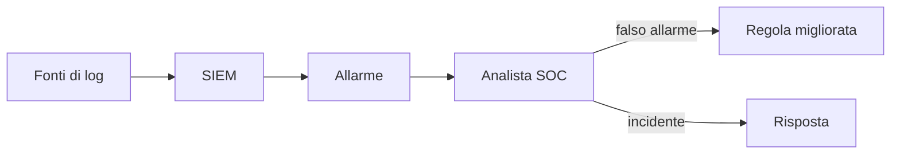

## Contenuti

- Log
- Formati
- Registri eventi di Windows
- SOC e SIEM
- Laboratorio
- Aspetti orientativi

Fonte sezione 6.1.4: Microsoft, "Security-101", licenza CC0 1.0, https://github.com/microsoft/Security-101

## Log

- Quando, dove, che cosa, chi
- Usi: diagnosi, rilevamento, indagine, responsabilità
- Registrare: accessi, permessi, operazioni negate, errori, dati sensibili
- Non registrare: password, codici, identificativi di sessione
- Orologi sincronizzati, raccolta centralizzata, integrità, esame effettivo

## Formati

| Formato | Uso |
|---|---|
| Common/Combined log | server web |
| Syslog | Linux, dispositivi di rete |
| Registro eventi di Windows | Windows |
| JSON per riga | applicazioni, cloud |

## Registri eventi di Windows

| ID | Significato |
|---|---|
| 6005 / 6006 | avvio / arresto regolare |
| 6008, 41 | spegnimento non regolare |
| 4624 / 4625 | accesso riuscito / non riuscito |
| 4740 | account bloccato |
| 1102 | registro di sicurezza cancellato |

Registro Sicurezza: solo con diritti di amministratore

## SOC e SIEM

- SOAR, EDR, XDR
- Falsi positivi e falsi negativi

## Laboratorio

1. Visualizzatore eventi: Sistema, filtro 6005, 6006, 6008, 41
2. Errori e critici degli ultimi sette giorni
3. `Get-WinEvent -FilterHashtable` ed export CSV
4. `python sessioni_pc.py eventi_sistema.csv`; 7 test

## Aspetti orientativi

- Analista SOC di primo livello
- Detection engineer, threat hunter
- Perché conservare i log anche senza un SOC?
