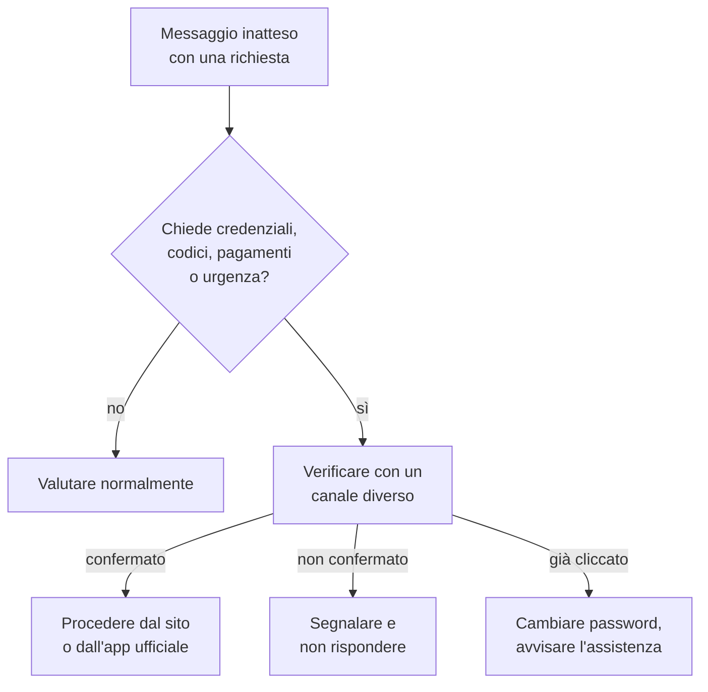

# Lezione 6.3: Phishing e ingegneria sociale

> Contenuto originale. Riferimenti: Wikipedia (SPF, DKIM, DMARC); lezioni 1.3, 2.3 e 3.3. I messaggi di esempio, i file .eml e lo script sono nella cartella `materiali`; tutte le organizzazioni e i domini sono fittizi.

Obiettivo: riconoscere le tecniche di manipolazione usate nell'ingegneria sociale e i segnali di un messaggio fraudolento, e verificare le intestazioni di un'email.

## 6.3.1 Ingegneria sociale

L'**ingegneria sociale** è l'insieme delle tecniche con cui si induce una persona a compiere un'azione contraria ai propri interessi o a quelli della sua organizzazione: rivelare una password, aprire un allegato, autorizzare un pagamento, far entrare qualcuno in un edificio. Sfrutta caratteristiche umane normali, non errori tecnici; per questo resta la via d'ingresso di una parte rilevante degli incidenti (lezione 1.3).

Leve psicologiche ricorrenti:

- **autorità**: il messaggio sembra venire da un dirigente, da un ente pubblico, dall'assistenza tecnica
- **urgenza**: una scadenza imminente ("entro 24 ore") riduce il tempo per riflettere
- **paura o perdita**: account sospeso, multa, dati cancellati
- **curiosità e guadagno**: premio, rimborso, pacco in arrivo, documento "riservato"
- **fiducia e familiarità**: un collega, un amico, un fornitore abituale, a volte con un account davvero compromesso
- **segretezza**: "non parlarne con nessuno", che impedisce il controllo da parte di altri

## 6.3.2 Forme del phishing

- **phishing**: messaggi inviati a molti destinatari, che imitano un servizio noto per ottenere credenziali o far aprire allegati
- **spear phishing**: messaggi mirati a una persona o a un gruppo, costruiti con informazioni raccolte in precedenza
- **BEC** (Business Email Compromise, frode del finto dirigente): richiesta di pagamenti o acquisti urgenti, apparentemente da un superiore o da un fornitore
- **smishing** e **vishing**: via SMS e via telefono, oggi anche con voci sintetiche
- **quishing**: collegamento nascosto in un codice QR, che sfugge a chi controlla i collegamenti nel testo
- **richiesta del codice MFA**: chi ha già una password chiede alla vittima il codice arrivato per SMS, fingendosi l'assistenza (lezione 2.3)

## 6.3.3 Segnali di riconoscimento

Nel contenuto:

- leve della sezione 6.3.1, soprattutto urgenza e segretezza
- richiesta di credenziali, codici, pagamenti, carte regalo: un servizio legittimo non chiede mai la password o il codice MFA per email, SMS o telefono
- saluto generico, errori o tono insolito per il mittente dichiarato
- canale insolito: il dirigente che scrive da un indirizzo personale, l'assistenza che contatta in chat

Nei collegamenti:

- testo visibile diverso dalla destinazione reale: si verifica passando il puntatore sul collegamento, senza fare clic (sul telefono: pressione prolungata)
- dominio simile a quello vero ma diverso: lettere sostituite (`scuo1a` invece di `scuola`), parole aggiunte (`scuola-segreteria.example`), nome vero usato come parte iniziale di un altro dominio (`scuola.example.verifica-account.example` appartiene al dominio `verifica-account.example`, lezione 4.1)

Il dominio di un indirizzo web si legge **da destra**: conta la parte che precede immediatamente il dominio di primo livello.

Negli allegati: tipi eseguibili o con macro, archivi protetti da password, file HTML che imitano pagine di accesso.

Il lucchetto non è un segnale di affidabilità: anche i siti fraudolenti usano HTTPS (lezione 3.3).

## 6.3.4 Le intestazioni di un'email

L'indirizzo del mittente mostrato dal programma di posta si può falsificare facilmente. Le **intestazioni** complete (in Outlook classico, con il messaggio aperto: **File**, **Proprietà**, **Intestazioni Internet**; in Thunderbird: **Visualizza**, **Sorgente messaggio**; nelle webmail di solito un comando per mostrare l'originale) contengono informazioni più affidabili, in particolare quelle aggiunte dal server che ha ricevuto il messaggio:

- **Received**: una riga per ogni server attraversato, da leggere dal basso verso l'alto; la più bassa indica l'origine
- **Return-Path**: l'indirizzo a cui tornano gli avvisi di mancata consegna
- **Reply-To**: l'indirizzo a cui andrebbe una risposta; se appartiene a un dominio diverso dal mittente è un segnale forte
- **Authentication-Results**: esito dei controlli eseguiti dal server ricevente:
  - **SPF** (Sender Policy Framework): il server che ha inviato il messaggio è autorizzato dal dominio? https://it.wikipedia.org/wiki/Sender_Policy_Framework
  - **DKIM** (DomainKeys Identified Mail): il messaggio porta una firma digitale valida del dominio (lezione 3.2)? https://it.wikipedia.org/wiki/DomainKeys_Identified_Mail
  - **DMARC**: il dominio visibile nel campo "Da" è coerente con SPF o DKIM superati, e che cosa chiede il proprietario del dominio in caso contrario? https://it.wikipedia.org/wiki/DMARC

Un esito `pass` dimostra che il messaggio proviene davvero dal dominio indicato, non che il dominio sia affidabile: un dominio registrato da un truffatore può superare tutti i controlli.

## 6.3.5 Che cosa fare

- non fare clic, non rispondere, non aprire allegati
- verificare **con un canale diverso**: telefonare al numero noto della segreteria, scrivere al collega con un nuovo messaggio, aprire il sito digitando l'indirizzo
- **segnalare** secondo le procedure dell'organizzazione (pulsante "Segnala" del programma di posta, indirizzo dell'assistenza): una segnalazione tempestiva protegge anche gli altri
- se si è già fatto clic o inserito la password: cambiarla subito da un dispositivo sicuro, avvisare l'assistenza, controllare gli accessi recenti; non vergognarsene, perché il ritardo aumenta il danno

Diagramma: decisione davanti a un messaggio sospetto.



## 6.3.6 Laboratorio

Tempo indicativo: 40 minuti. Cartella di lavoro `C:\corso-cyber\lab63`, con i file della cartella `materiali`.

### Parte 1: messaggi di esempio

A coppie, analizzare i sei messaggi del file `messaggi_esempio.md`: per ciascuno, legittimo o sospetto, segnali individuati, leve psicologiche, azione corretta. Confronto in classe.

### Parte 2: intestazioni con Python

```powershell
python analizza_email.py email_sospetta.eml
python analizza_email.py email_legittima.eml
```

Output per il messaggio sospetto (estratto):

```text
Autenticazione:    SPF=fail  DKIM=none  DMARC=fail
Collegamenti (destinazione reale e testo visibile):
  https://scuola.example.verifica-account.example/login  [https://www.scuola.example/posta]

SEGNALI DI ATTENZIONE:
  - SPF: fail
  - DKIM: none
  - DMARC: fail
  - le risposte andrebbero a un altro dominio: posta-gratuita.example
  - indirizzo di ritorno di un altro dominio: mailer.invii-massivi.example
  - il testo mostra www.scuola.example ma il collegamento porta a scuola.example.verifica-account.example
```

Lo script usa il modulo `email` della libreria standard per leggere intestazioni e parti del messaggio, e `html.parser` per estrarre i collegamenti con il loro testo; non apre collegamenti né allegati. Test: `python test_analizza_email.py` (10 test).

1. Aprire i due file .eml con un editor di testo e individuare a mano le intestazioni della sezione 6.3.4.
2. Leggere le righe `Received` dal basso verso l'alto: da quale server è partito il messaggio sospetto?
3. Facoltativo: salvare come .eml (Thunderbird, o comando per scaricare il messaggio della webmail) un messaggio legittimo ricevuto nella casella scolastica, per esempio una notifica della piattaforma, e analizzarlo. Che cosa riportano SPF, DKIM e DMARC? Non condividere il file, che contiene dati personali.

## 6.3.7 Aspetti orientativi (discussione)

- La formazione e la sensibilizzazione degli utenti (security awareness) sono un ambito professionale specifico, che unisce competenze tecniche, comunicative e didattiche.
- Le simulazioni di phishing interne, usate da molte organizzazioni, richiedono regole chiare e un approccio formativo, non punitivo.
- La configurazione di SPF, DKIM e DMARC è un compito degli amministratori dei sistemi di posta, e riduce l'uso del dominio dell'organizzazione per le truffe.
- Domanda: perché il messaggio D, senza collegamenti né allegati, può essere il più pericoloso dei sei?
